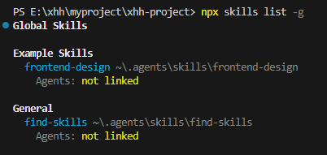

## skills

- 官方技能市场：https://skills.sh/

- 搜索社区技能（关键词匹配）

npx skills find "关键词"

- 安装技能
```
npx skills add <owner/repo> --skill <skill-name> -y -g
```
```
npx skills add <owner/repo@skill> -y -g
```

- find-skills 技能发现神器
```
npx skills add https://github.com/vercel-labs/skills --skill find-skills -g
```
触发场景：当你说 "有没有处理 docx 的技能" 时自动激活，搜索技能市场

- frontend-design 前端界面设计神器
```
npx skills add anthropics/skills --skill frontend-design -g
```
触发场景：当你说 "做一个五一促销活动的HTML页面" 时自动激活该技能（强调视觉风格、排版、色彩和动效）

- 查看已安装的全部技能
```
npx skills list -g
```


### 使用 openskills 管理技能
安装到当前项目 .claude/skills 目录下：
```
npx openskills install anthropics/skills
```

安装到用户 ~/.claude/skills/ 目录下：
```
npx openskills install anthropics/skills -g
```
列出已安装的技能：
```
openskills list
```