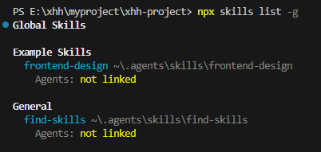

# AI

## Prompt

提示词

## LLM 

大语言模型(Large Language Model)，通过 Prompt 接收指令，生成文本或结构化内容

## Skills

- 官方技能市场：https://skills.sh/

- 搜索社区技能（关键词匹配）

npx skills find "关键词"

- 安装技能
```
npx skills add <owner/repo> --skill <skill-name> -y -g
```
```
npx skills add <owner/repo@skill> -y -g
```

- find-skills 技能发现神器
```
npx skills add https://github.com/vercel-labs/skills --skill find-skills -g
```
触发场景：当你说 "有没有处理 docx 的技能" 时自动激活，搜索技能市场

- frontend-design 前端界面设计神器
```
npx skills add anthropics/skills --skill frontend-design -g
```
触发场景：当你说 "做一个五一促销活动的HTML页面" 时自动激活该技能（强调视觉风格、排版、色彩和动效）

- 查看已安装的全部技能
```
npx skills list -g
```


### 使用 openskills 管理技能
安装到当前项目 .claude/skills 目录下：
```
npx openskills install anthropics/skills
```

安装到用户 ~/.claude/skills/ 目录下：
```
npx openskills install anthropics/skills -g
```
列出已安装的技能：
```
openskills list
```

## MCP

模型上下文协议(Model Context Protocol)

统一接入外部工具

[Cursor配置MCP](./cursor.md)


## 调用千问大模型API

申请 API key:

https://bailian.console.aliyun.com/cn-beijing?tab=model#/api-key

### 文字问答
```
async chatWithAI(message) {
    let url = 'https://dashscope.aliyuncs.com/api/v1/services/aigc/text-generation/generation'
    const response = await fetch(url, {
        method: 'POST',
        credentials: 'omit',
        headers: {
            'Authorization': 'Bearer YOURTOKEN',
            'Content-Type': 'application/json'
        },
        body: JSON.stringify({
            model: 'qwen-plus',
            input: { messages: [{ role: 'user', content: message }] }
        })
    })
    const data = await response.json()
    return data.output.text
}
```

<!--
```
// 流式读取是可选功能，需接口明确支持并正确配置才能使用
const reader = response.body.getReader()
const decoder = new TextDecoder('utf-8')
while (1) {
    const { done, value } = await reader.read()
    if (done) {
        console.log('Stream complete')
        break
    }
    const chunk = decoder.decode(value)
    return chunk
}
```
-->

### 文生图
```
async chatWithAI(message) {
    let url = 'https://dashscope.aliyuncs.com/api/v1/services/aigc/multimodal-generation/generation'
    const response = await fetch(url, {
        method: 'POST',
        credentials: 'omit',
        headers: {
            'Authorization': 'Bearer YOURTOKEN',
            'Content-Type': 'application/json'
        },
        body: JSON.stringify({
            model: 'qwen-image-2.0-pro',
            input: { messages: [{ role: 'user', content: [{ text: message }] }] }
        })
    })
    const data = await response.json()
    return data.output.choices[0].message.content[0].image
}
```