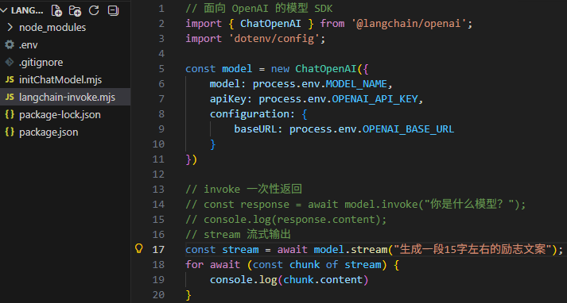
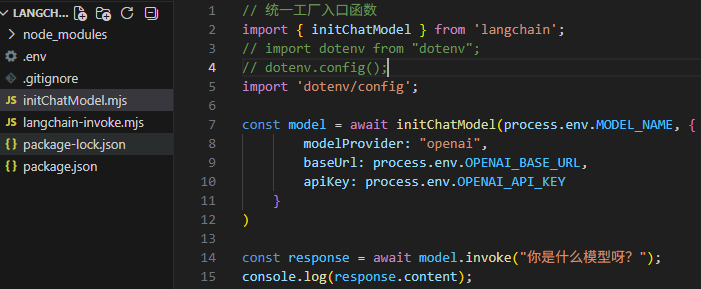

# AI

## Prompt

提示词

例：https://www.prompt123.cn/

## LLM 

大语言模型(Large Language Model)，通过 Prompt 接收指令，生成文本或结构化内容。

LangChain 是一个基于大型语言模型（LLM）的编程框架，统一调用模型。


| Model Class | initChatModel |
| ---- | ---- |
|  |  |

https://docs.langchain.com/oss/javascript/langchain/models

## Skills

- https://skills.sh/： Vercel 发布的可视化的 AI Skills 平台

- agent-skills： Agent 技能库（vercel‑labs/agent‑skills，github 仓库，一堆 SKILL.md 技能文件）
```
npx skills add vercel-labs/agent-skills --skill react-best-practices -g

GitHub真实源码页：
https://github.com/vercel-labs/agent-skills/tree/main/skills/react-best-practices

skills.sh预览页：
https://skills.sh/vercel-labs/agent-skills/react-best-practices
```

- 区分2个仓库
```
vercel‑labs/agent‑skills → 前端规范类

vercel‑labs/skills → 底层基础技能 fs/shell/find‑skills等
```

- 终端搜索社区技能
```
npx skills find "关键词"
```

- 安装整套agent‑skills
```
npx skills add vercel‑labs/agent‑skills -g
```
默认目录： `.agents/skills`，Cursor、Windsurf、Cline、OpenAI Codex **原生自动扫描读取**；
claude code 原生不会扫描，如需给 claude code 使用可加 `-a "*"`分发副本。

- 安装技能两种等价语法
```
npx skills add <owner/repo> --skill <skill> -g
```
```
npx skills add <owner/repo@skill> -g
```

- find-skills 技能发现神器(元技能，AI 对话内自动调用搜索市场)
```
Source: https://github.com/vercel-labs/skills.git

Details: https://skills.sh/vercel-labs/skills
```
```
npx skills add https://github.com/vercel-labs/skills --skill find-skills -g
```
触发场景：当你说 "有没有处理 docx 的技能" 时自动激活，搜索技能市场

- frontend-design 前端界面设计神器
```
Source: https://github.com/anthropics/skills.git

Details: https://skills.sh/anthropics/skills
```
```
npx skills add anthropics/skills --skill frontend-design -g
```
触发场景：当你说 "做一个五一促销活动的HTML页面" 时自动激活该技能（强调视觉风格、排版、色彩和动效）

- 查看已安装的全部技能
```
npx skills list
```
不带 ‑g：列出项目本地 + 全局；
带 -g：仅过滤输出全局已安装技能。

### 使用 openskills 管理技能

```
openskills install anthropics/skills -g
```
默认目录： `.claude/skills`，Claude Code 原生会**直接扫描此文件夹自动加载技能**。


如果携带 `--universal` 目录则为 `.agent/skills`；
该目录不会被 AI 原生扫描；每次增删技能都必须执行 sync；
扫描本机装好的技能，更新项目根目录的 `AGENTS.md` 文件：
```
openskills sync -y
```

列出已安装的技能：
```
openskills list
```


## MCP

模型上下文协议(Model Context Protocol)

统一接入外部工具

[cursor配置Figma MCP](./cursor.md)

[codex配置Figma MCP](./codex.md)

[copilot配置Figma MCP](./githubcopilot.md)