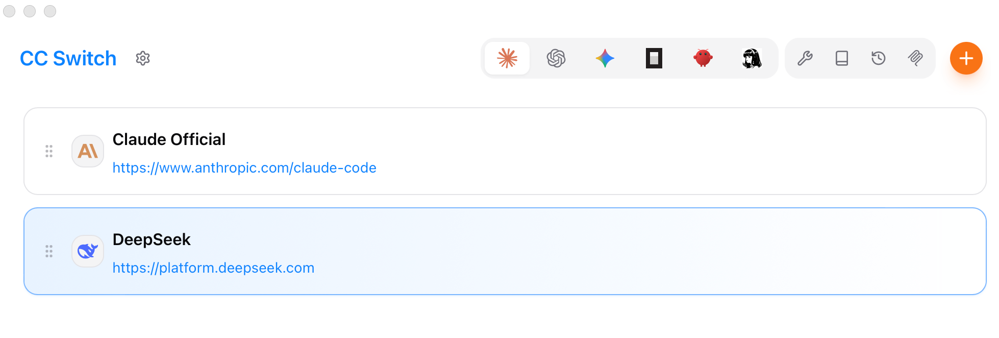
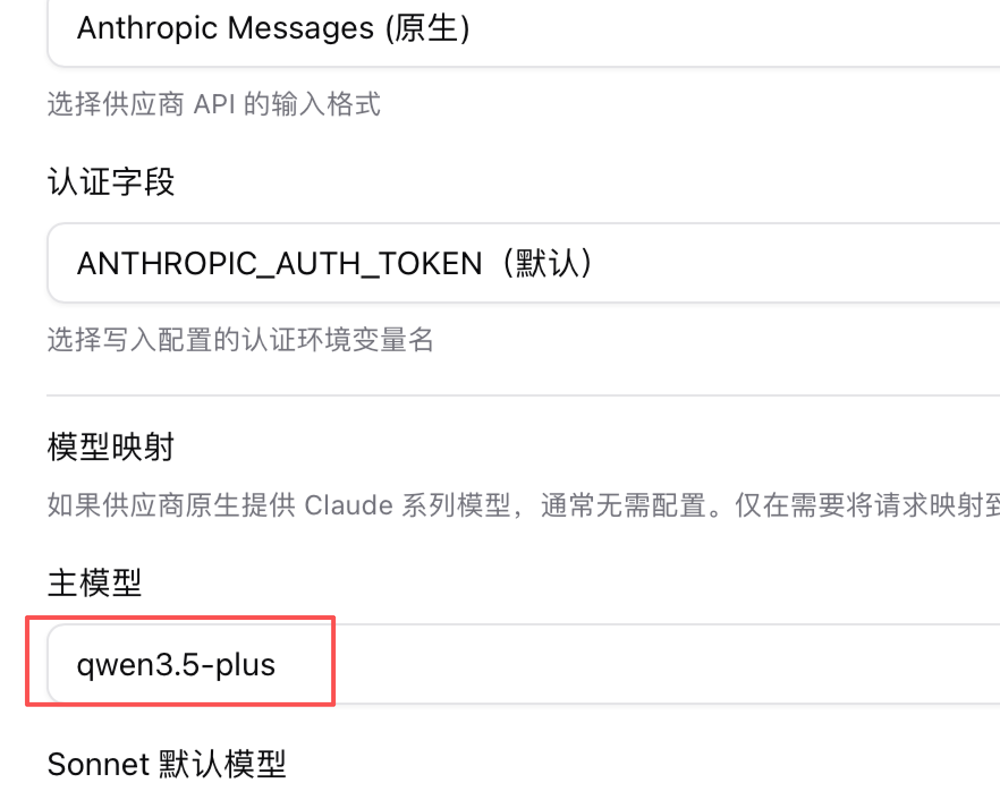
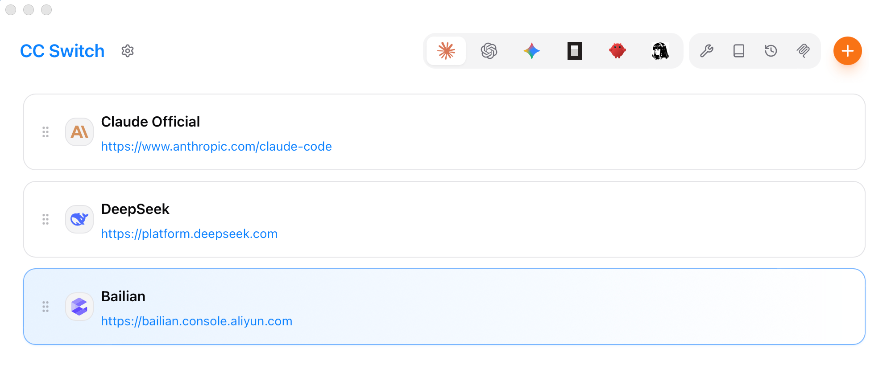
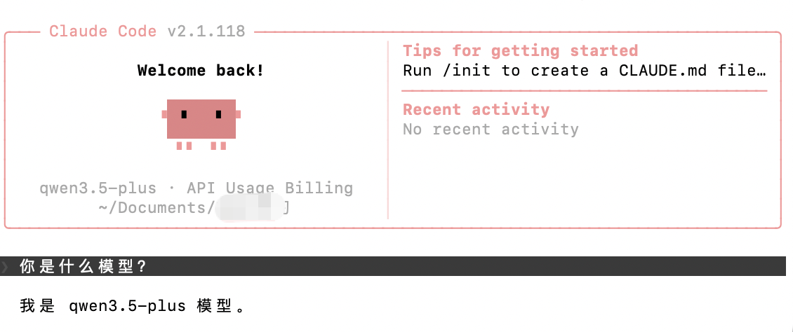
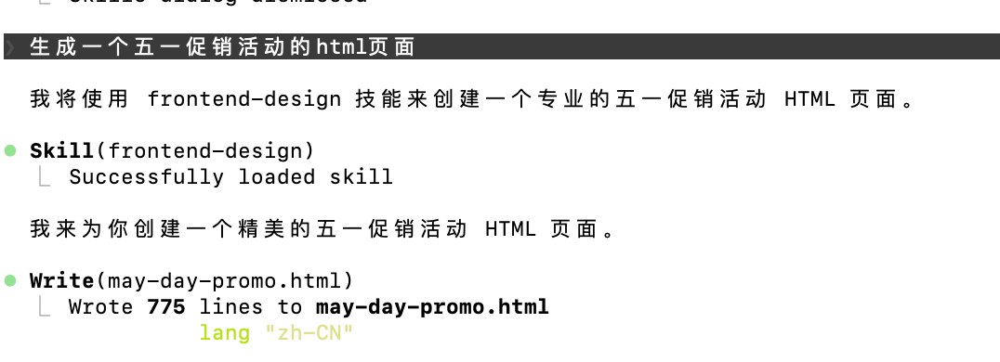

# [Claude Code](https://www.runoob.com/claude-code/claude-code-tutorial.html)

## Mac 安装 claude code，接入国产大模型

### Homebrew 安装 claude code

在终端输入：
```
brew install --cask claude-code
```

### 查看 claude code 版本
```
claude --version
```

### 安装 CC Switch
```
brew tap farion1231/ccswitch

brew install --cask cc-switch
```

### 接入 DeepSeek 大模型

获取 DeepSeek API key:

https://platform.deepseek.com/api_keys

打开 cc switch，添加新供应商，选择 DeepSeek，输入 API key，点添加即可。



### 接入千问大模型





注意：免费额度用完会自动扣费，先在后台设置用完即停。

### 启动 claude code

在终端输入 /claude，回车，就可以正常启动 claude code了；

第一次使用，会有一些初始化设置，比如颜色模式等，选中回车。后续可以输入 /theme 修改。



### 切换模型
```
/model
```

### 安装 skill
注册插件市场源
```
/plugin marketplace add anthropics/skills
```
安装插件：

/plugin => Marketplaces =>  选中 anthropic-agent-skills => Browse plugins => Discover => example skills

或

/plugin install example-skills@anthropic-agent-skills

查看插件： /skills



### 退出 claude code
```
/exit
```

### 手动更新 claude-code
```
brew upgrade claude-code
```

### 卸载 claude code
```
brew uninstall --cask claude-code
```

<!--
## 安装 claude code、接入 deepseek

### 需要工具：
1. nodejs
2. git
3. CC-Switch 一键轻松切换大模型API
4. VS Code 

### 安装 claudecode
```
npm i -g @anthropic-ai/claude-code
```
```
claude --version
```

### 配置 claudecode
进入用户目录下的 .claude.json 文件，新增：
```
"hasCompletedOnboarding": true
```

### 进入 cluade
```
claude
```
这时提示登录；我们先不登录，准备接入其他的国内大模型。

### 从 github 找到并安装 CC-Switch（windows 3.10.3）
cc-switch 是一个图形化工具‌

### 接入 deepseek 国产大模型
打开 deepseek 官网，API 开放平台，选择 API keys，创建 API key，然后复制该 API key 的密钥；

打开 cc-switch,点击右上角的+号,选择 DeepSeek 模型，填入API key，并保存，这时模型就启用成功了。

### 再次进入 cluade
这时不再提示登录了，输入
```
/model
```
选择 deepseek 模型回车，然后就可以对话了。

### vscode 使用 claudecode
1. 插件模式使用

安装 Claude Code for VS Code插件，右上角就会出来一个 claudecode 图标。

2. 命令行模式使用

打开终端，输入 claude

### cc-switch 接入第三方中转模型
不仅能告别封号风险，还能压缩使用成本。

打开 API 中转平台，创建 API 密钥，在“分组”里选择模型；

打开 cc-switch，添加新供应商（+号），选择自定义配置，粘贴密钥，保存。在模型列表启用当前模型。
-->
