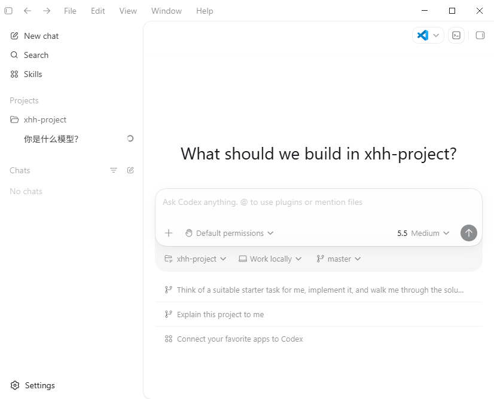
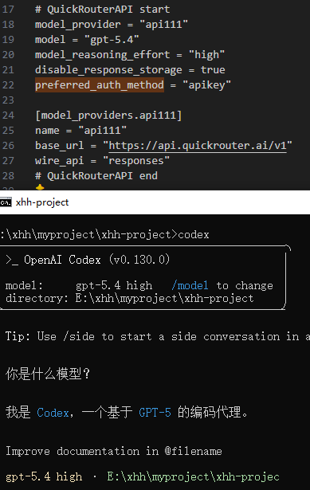
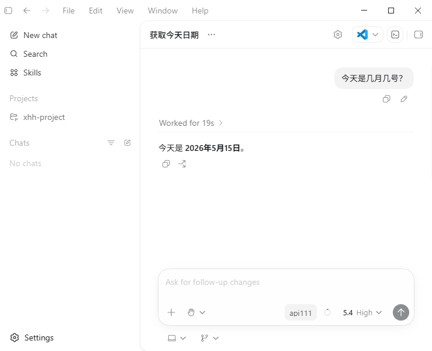
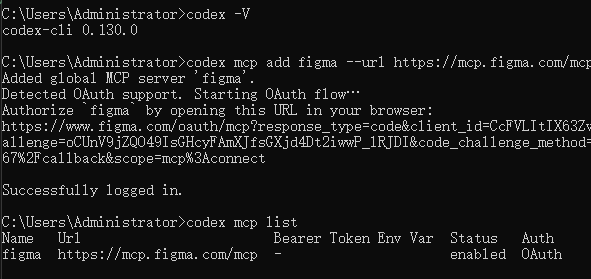
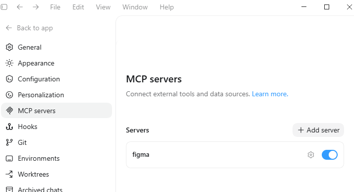
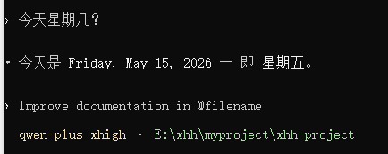
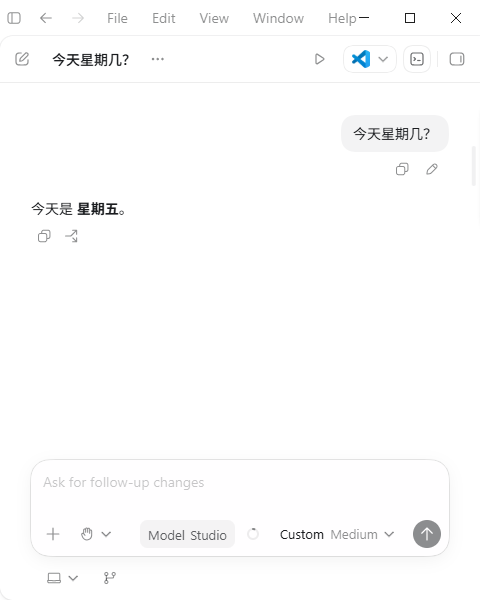

# [codex](https://openai.com/zh-Hans-CN/codex/?utm_source=Ai138.com)

## 安装 codex

cli 工具安装：
```
npm install -g @openai/codex

codex --version
```

或 桌面应用

## 配置文件
```
C:\Users\Administrator\.codex\config.toml

~/.codex/config.toml
```

## codex 使用 api 教程

### API 中转站1

https://jcn08oaqmm57.feishu.cn/docx/ExXAdFe5GonHrJxR49icUDEFnAg



### API 中转站2

https://quickrouter.ai/






## 使用 codex
```
codex
```
切换模型
```
/model
```
查看更多命令：

https://www.runoob.com/codex/codex-commands.html

## 添加 Figma MCP 服务器
```
codex mcp add figma --url https://mcp.figma.com/mcp
```
跳到授权页，同意即可
```
codex mcp list
```



## 配置千问模型
https://help.aliyun.com/zh/model-studio/codex?spm=a2c4g.11186623.help-menu-2400256.d_0_4_5.3c386fd113oSgO&scm=20140722.H_3031966._.OR_help-T_cn~zh-V_1#cdx-payg-win-cmd-h

.codex/config.toml文件配置当前模型：
```
# 使用千问模型
model_provider = "Model_Studio"
model = "qwen-plus"
```

终端：



桌面应用：



## AGENTS.md
```
/init
```
该命令让 Codex 通读当前文件夹。Codex 会把他学到的关于项目的信息保存到 AGENTS.md 文件中。

## 命令
新开一个对话，并且清除之前的对话记录：
```
/new
```
调整 Codex 的运行权限：
```
/approvals
```
列出所有安装过的 MCP 工具：
```
/mcp
```
...

## 上下文记忆
config.toml
```
[features]
memories = true
```
Codex 会把 Memories 存放在 Codex 主目录下，默认 ~/.codex


<!-- 使用 Codex 自带的 apply_patch 工具来修改文件 -->