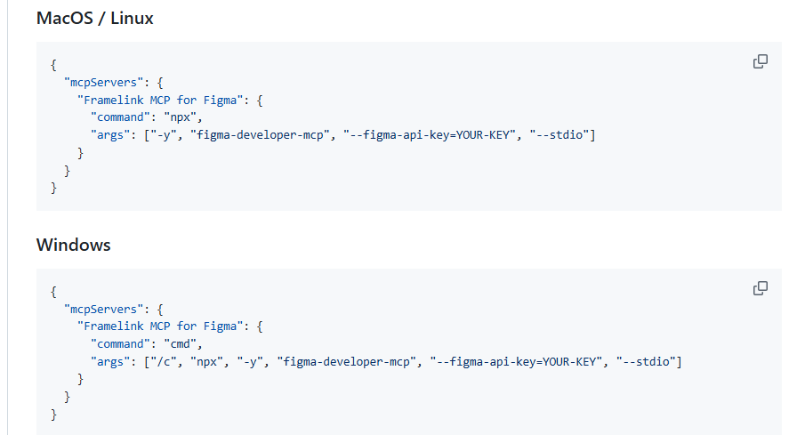
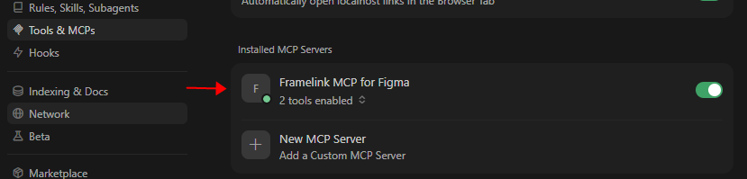
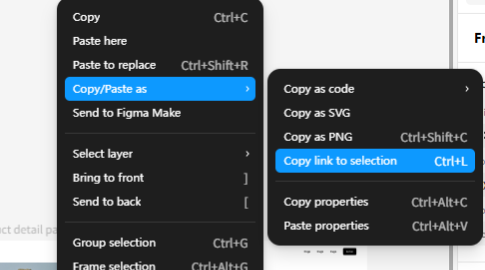
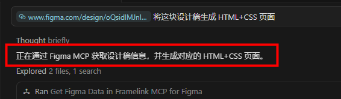
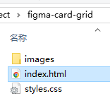

# [Cursor](https://cursor.com/cn/docs/agent/overview)

## rules

编写规则

- 项目根目录下创建 .cursor/rules 文件夹
- 新建规则文件，使用 .mdc（Markdown with Metadata）格式

## Ctrl + K

选中部分代码后按 Ctrl + K，调用 AI 功能‌生成或修改代码‌。

## Ctrl + L

AI 聊天；

选中代码 => Add to Chat

## @ 符号

@ 符号增加上下文

## Skills

- 内置 skill 所在目录： ~/.cursor/skills-cursor/，不要动

- 个人技能：~/.cursor/skills/技能名/SKILL.md

- 项目技能：项目根目录 .cursor/skills/技能名/SKILL.md

- 一键创建：/create-skill, 填写：名称、描述、指令等，自动生成

- 触发：自动激活相关技能；聊天框输入 /, 选择 skill，即可使用该技能


最小可用模板:
```
---
name: your-skill-name
description: Brief description of what this skill does and when to use it.
---

# Your Skill Name

## Instructions
Clear, step-by-step guidance for the agent.
```

## MCP

### 1. 获取 Figma 的 API Key

Figma => Settings => Security => Generate new token，勾选各类读取权限，将生成的 token 复制保存好。

### 2. 建立 Figma 与 Cursor 的 “数据通信桥梁”

打开 Figma GitHub 仓库：

https://github.com/GLips/Figma-Context-MCP

找到仓库中的 MCP 配置代码，根据本机设备系统直接复制全部内容



将刚才生成的 Figma API KEY 替换掉 MCP 配置代码中的 "YOUR-KEY"。

### 3. 在 Cursor 中配置 MCP

Cursor Settings => Tools & MCPs => New MCP Server

将上面 MCP 配置代码复制到 mcp.json 文件中。

然后重启 Cursor



出现绿灯就代表连接好了。

### 4. 调用 MCP 生成 html 页面

设计稿，右键选择 Copy as Code 或 Copy as link 


<!-- https://www.figma.com/design/oQsidlMJnlnIlYfMT4lboB/newfile1?node-id=1-1103&t=GUz1bbxKkzBN34J9-4 -->

将链接或代码粘贴到 Cursor 对话框中

生成的 html 页面如下

## .cursorignore

设置不让 AI 访问的文件或目录，和 .gitignore 语法一样。