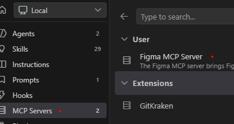
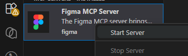

# Github Copilot

## 简介

GitHub Copilot 是 GitHub 与 OpenAI 合作推出的编程辅助工具。它基于大规模语言模型，为你在编辑器中提供自动补全、代码片段建议、整段实现和注释生成等能力，帮助你更快地编写代码、探索实现思路和生成文档示例。

## 安装
以 VS Code 为例

1. 打开 VS Code。
2. 在扩展市场（Extensions）中搜索 “GitHub Copilot”，或直接搜索 `Copilot` 并选择由 GitHub 发布的插件安装。
3. 安装完成后，你需要使用 GitHub 账号登录并完成授权（安装后通常会弹出登录引导窗口，按提示完成）。

## 使用

Ctrl+Alt+I‌ 打开聊天界面；

在输入代码或注释时，Copilot 会以灰色“ghost text”形式给出建议；

按 Tab 接受建议；按 ‌Esc‌ 忽略；

## Skills

项目级：
- .github/skills/
- .claude/skills/ 
- .agents/skills/

个人级：在用户主目录
- ~/.copilot/skills/
- ~/.claude/skills/
- ~/.agents/skills/

## MCP
连接 Figma MCP

### 第一种：使用本地运行的 MCP
项目根目录 .vscode 文件夹下 新建 mcp.json:
```
{
  "mcpServers": {
    "Framelink MCP for Figma": {
      "command": "cmd",
      "args": ["/c", "npx", "-y", "figma-developer-mcp", "--figma-api-key=YOUR-KEY", "--stdio"]
    }
  }
}
```
### 第二种：使用官方远程 MCP
Copilot 设置里找到 MCP Servers，安装 Figma MCP Server


启动服务



同意授权即可。

> 此方式对免费账号有调用次数限制（如每月仅 6 次）


## 参考文档

https://docs.github.com/zh/copilot

