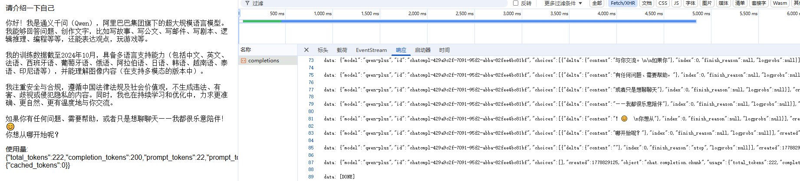
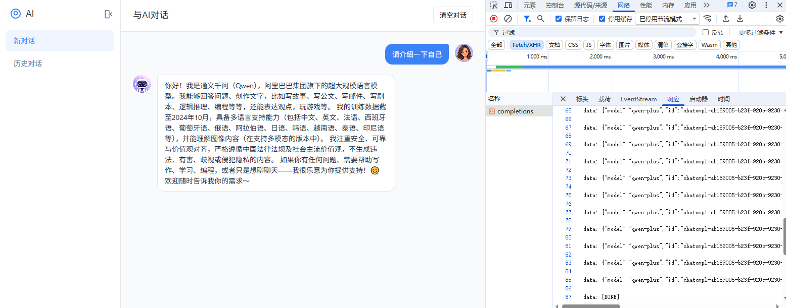

# 接入AI模型

## 调用千问大模型API

申请百炼 API key:

https://bailian.console.aliyun.com/cn-beijing?tab=model#/api-key

### 文字问答
```
async chatWithAI(message) {
    let url = 'https://dashscope.aliyuncs.com/api/v1/services/aigc/text-generation/generation'
    const response = await fetch(url, {
        method: 'POST',
        credentials: 'omit',
        headers: {
            'Authorization': 'Bearer YOURTOKEN',
            'Content-Type': 'application/json'
        },
        body: JSON.stringify({
            model: 'qwen-plus',
            input: { messages: [{ role: 'user', content: message }] }
        })
    })
    const data = await response.json()
    return data.output.text
}
```
### 流式输出
<!--
```
<div @click="chatWithAIFn">请介绍一下自己</div>

<div class="chat-stream">
    <div v-if="chatStreaming">接收中...</div>
    <pre class="chat-content">{{ chatContent }}</pre>
    <div v-if="chatError" class="error">错误: {{ chatError.message }}</div>
    <div v-if="chatUsageRaw" class="usage">使用量: {{ chatUsageRaw }}</div>
</div>

chatStreaming: false, // 是否正在流式接收
chatContent: '', //存放流式输出文本
chatError: null,
chatUsageRaw: '', // 存放 usage 原始 JSON 字符串
```
```
chatWithAIFn() {
  // 清空，开始接收
  this.chatContent = ''
  this.chatError = null
  this.chatStreaming = true
  this.chatWithAI().then(() => {
    this.chatStreaming = false
  }).catch(err => {
    this.chatStreaming = false
    this.chatError = err
    this.$message.error('聊天失败')
    console.error(err)
  })
},
async chatWithAI() {
  const url = 'https://dashscope.aliyuncs.com/compatible-mode/v1/chat/completions'
  const response = await fetch(url, {
    method: 'POST',
    credentials: 'omit',
    headers: {
      'Content-Type': 'application/json',
      'Authorization': `Bearer ******`
    },
    body: JSON.stringify({
      model: 'qwen-plus',
      messages: [
        { role: 'system', content: 'You are a helpful assistant.' },
        { role: 'user', content: '请介绍一下自己' }
      ],
      stream: true, // 流式请求
      stream_options: { include_usage: true }
    })
  })

  if (!response.ok) {
    const txt = await response.text()
    throw new Error(`请求失败: ${response.status} ${txt}`)
  }

  // 如果服务器不返回流，直接返回整体文本
  if (!response.body) {
    const text = await response.text()
    // 尝试从整体响应中解析 usage
    try {
      const j = JSON.parse(text)
      if (j.usage) {
        try { this.chatUsageRaw = JSON.stringify(j.usage) } catch (e) { this.chatUsageRaw = String(j.usage) }
      }
      if (j.choices && j.choices[0]) {
        const finalText = (j.choices[0].message && j.choices[0].message.content) || j.choices[0].text || ''
        this.chatContent += finalText
        return finalText
      }
    } catch (e) {
      // not JSON, treat as plain text
    }
    this.chatContent += text
    return text
  }

  const reader = response.body.getReader()
  const decoder = new TextDecoder('utf-8')
  let done = false; let value; let buffer = ''

  // 持续读取每个 chunk
  while (!done) {
    ({ done, value } = await reader.read())
    if (done) break
    const chunk = decoder.decode(value, { stream: true })
    buffer += chunk

    // 处理常见的 SSE / data: ... 行格式（按行解析）
    const lines = buffer.split('\n')
    buffer = lines.pop() // 最后一行可能不完整，保留到下一次

    for (const line of lines) {
      if (!line.trim()) continue
      // SSE 风格： data: {...}
      if (line.startsWith('data:')) {
        const dataStr = line.replace(/^data:\s*/, '')
        if (dataStr === '[DONE]') {
          // 完成信号
          done = true
          break
        }
        try {
          const json = JSON.parse(dataStr)
          // 如果包含 usage，保存为字符串（覆盖之前的）
          if (json.usage) {
            try {
              this.chatUsageRaw = JSON.stringify(json.usage)
            } catch (e) {
              this.chatUsageRaw = String(json.usage)
            }
          }
          // 根据常见的 stream JSON 结构提取文本（可根据实际接口调整）
          let delta = ''
          if (Array.isArray(json.choices)) {
            json.choices.forEach(c => {
              if (c.delta && c.delta.content) delta += c.delta.content
              if (c.text) delta += c.text
            })
          } else if (json.text) {
            delta = json.text
          }
          this.chatContent += delta
        } catch (e) {
          // 非 JSON，直接追加
          this.chatContent += dataStr
        }
      } else {
        // 不是 data: 行，直接追加
        this.chatContent += line
      }
    }
  }

  // 处理剩余 buffer（若为 JSON 或纯文本）
  if (buffer) {
    try {
      const json = JSON.parse(buffer)
      if (json.usage) {
        try { this.chatUsageRaw = JSON.stringify(json.usage) } catch (e) { this.chatUsageRaw = String(json.usage) }
      }
      if (json.choices && json.choices[0]) {
        const finalText = (json.choices[0].message && json.choices[0].message.content) || json.choices[0].text || ''
        this.chatContent += finalText
      } else if (json.text) {
        this.chatContent += json.text
      } else {
        this.chatContent += buffer
      }
    } catch (e) {
      this.chatContent += buffer
    }
    buffer = ''
  }

  return this.chatContent
}
```


-->
```
body: JSON.stringify({
  model: 'qwen-plus',
  messages: [
    { role: 'system', content: 'You are a helpful assistant.' },
    { role: 'user', content: '你的问题' }
  ],
  stream: true, // 流式请求
  stream_options: { include_usage: true }
})
```


文档：

https://bailian.console.aliyun.com/cn-beijing?spm=5176.support-home.nav-v2-dropdown-menu-0.d_main_2_0.25b0156fNIxxGV&tab=doc&scm=20140722.M_10944401._.V_1#/doc/?type=model&url=2866129

### 文生图
```
async chatWithAI(message) {
  let url = 'https://dashscope.aliyuncs.com/api/v1/services/aigc/multimodal-generation/generation'
  const response = await fetch(url, {
    method: 'POST',
    credentials: 'omit',
    headers: {
      'Authorization': 'Bearer YOURTOKEN',
      'Content-Type': 'application/json'
    },
    body: JSON.stringify({
      model: 'qwen-image-2.0-pro',
      input: { messages: [{ role: 'user', content: [{ text: message }] }] }
    })
  })
  const data = await response.json()
  return data.output.choices[0].message.content[0].image
}
```