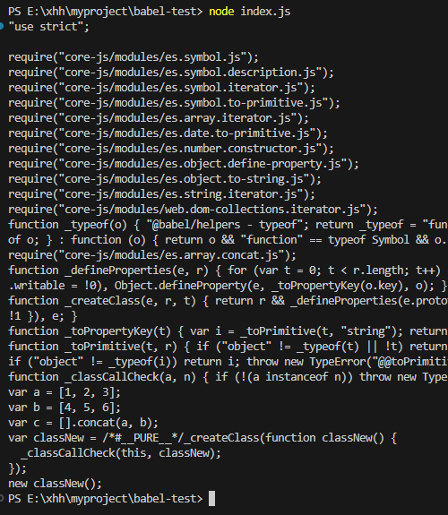
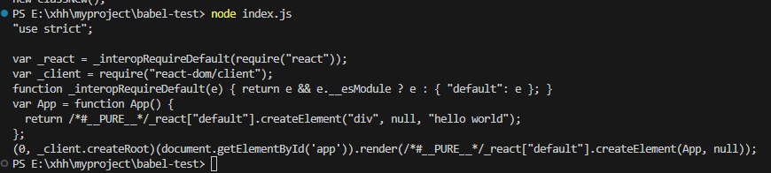

### 安装模块
```
npm i @babel/core @babel/cli @babel/preset-env corejs -S
```
### test.js
```
let a = [1,2,3]
let b = [4,5,6]
let c = [...a,...b]

class classNew {}
new classNew()
```

### index.js:
```
import babel from '@babel/core'
import presetEnv from '@babel/preset-env'

import fs from 'node:fs'

const code = fs.readFileSync('./test.js', 'utf-8')
const res = babel.transform(code, {
  presets: [
    [
      presetEnv, 
      {
        useBuiltIns: 'usage', // 引入需要的垫片, entry 手动引入
        corejs: 3 // 转换高级 js 语法糖
      }
    ]
  ]
})

console.log(res.code)
```
### 执行命令


### 转换 react 代码
安装模块
```
npm i react react-dom @babel/preset-react -S
```
### 新建app.jsx
```
import React from 'react';
import { createRoot } from 'react-dom/client';

const App = ()=> <div>hello world</div>
createRoot(document.getElementById('app')).render(<App />)
```

### 修改 index.js
```
import babel from '@babel/core'
import presetEnv from '@babel/preset-env'

import presetReact from '@babel/preset-react'

import fs from 'node:fs'

const code = fs.readFileSync('./app.jsx', 'utf-8')
const res = babel.transform(code, {
  presets: [
    [
      presetEnv, {
        useBuiltIns: 'usage', // 引入需要的垫片, entry 手动引入
        corejs: 3 // 转换高级 js 语法糖
      }
    ], 
    presetReact
  ]
})

console.log(res.code)
```

