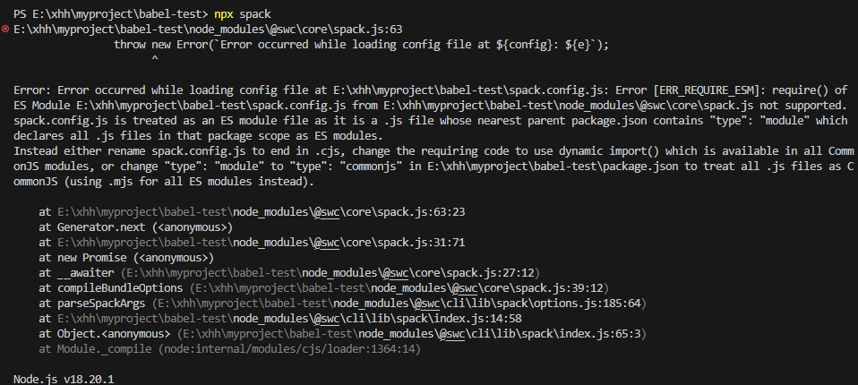
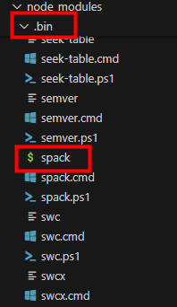

# [SWC](https://swc.rs/docs/usage/core)
swc既可用于编译，也可用于打包。底层使用编译型语言，比babel快。

### 编译
```
npm i @swc/core 
```

```
import swc from '@swc/core'

const res = swc.transformFileSync('./app.jsx', {
  jsc: {
    target: 'es5',
    parser: {
      syntax: 'ecmascript',
      jsx: true
    }
  }
})

console.log(res.code)
```

### 打包
新建 spack.config.js:
```
const { config } = require("@swc/core/spack");
 
module.exports = config({
  entry: {
    web: __dirname + "./test.js",
  },
  output: {
    path: __dirname + "/dist",
  },
});
```

安装 @swc/cli

注意：这时 package.json 不能加 type: "module"。


执行 npx spack


生成dist目录，里面是转换成es5打包后的代码。