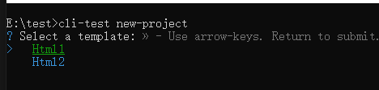

# cli工具

命令行敲命令快速创建项目。

以简单版的创建 html 页面为例：

### 安装模块
交互式命令行工具: prompts

终端加颜色：picocolors


### 项目目录


bin：把脚本变成命令行工具

### 入口文件 index.js

关键代码：
```
# 用 Node.js 执行这个文件
#!/usr/bin/env node

async function init() {
  // 项目名称（命令行可以输入默认值）
  const result = {}
  try {
    result.projectName = await prompts({
      type: 'text',
      name: 'projectName',
      message: reset('Project name:'),
      initial: targetDirectory,
      onState: (state) => {
        targetDirectory = formatTargetDirectory(state.value) || targetDirectory
      }
    })
  } catch (cancelled) {
    return
  }

  // 模板配置
  const TEMPLATES = [
    {
      name: 'html1',
      display: 'Html1',
      color: green
    },
    {
      name: 'html2',
      display: 'Html2',
      color: cyan
    }
  ]

  // 询问选择哪一个模板
  const templateResponse = await prompts({
    type: 'select',
    name: 'template',
    message: reset('Select a template:'),
    choices: TEMPLATES.map(template => ({
      title: template.color(template.display),
      value: template.name
    }))
  })

  template = templateResponse.template
  // ...

  // 创建目标目录
  fs.mkdirSync(rootDir, { recursive: true })

  // 写入模板文件
  const files = fs.readdirSync(templateDirectory)
  for (const file of files) {
    write(file)
  }

  // ...
}

init()
```

### 运行

#### 方式1


当前目录出现了 cli-test-project 文件夹，里面有 html2 模板文件。

#### 方式2
npm link 到全局，在其他文件目下输入命令 cli-test 即可。



<!-- 
### 源码
```
#!/usr/bin/env node
import fs from 'fs'
import path from 'path'
import { fileURLToPath } from 'url'
import prompts from 'prompts'
import colors from 'picocolors'

const { cyan, green, red, reset } = colors

// 工具函数
function formatTargetDir(targetDir) {
  return targetDir?.trim().replace(/\/+$/g, '')
}

function isEmpty(path) {
  const files = fs.readdirSync(path)
  return files.length === 0 || (files.length === 1 && files[0] === '.git')
}

function emptyDir(dir) {
  if (!fs.existsSync(dir)) return
  for (const file of fs.readdirSync(dir)) {
    if (file === '.git') continue
    fs.rmSync(path.resolve(dir, file), { recursive: true, force: true })
  }
}

function copy(src, dest) {
  const stat = fs.statSync(src)
  if (stat.isDirectory()) {
    copyDir(src, dest)
  } else {
    fs.copyFileSync(src, dest)
  }
}

function copyDir(srcDir, destDir) {
  fs.mkdirSync(destDir, { recursive: true })
  for (const file of fs.readdirSync(srcDir)) {
    const srcFile = path.resolve(srcDir, file)
    const destFile = path.resolve(destDir, file)
    copy(srcFile, destFile)
  }
}

// 主函数
async function init() {
  const args = process.argv.slice(2)
  const argTargetDir = formatTargetDir(args[0])

  let targetDir = argTargetDir || 'cli-test-project'

  // 询问项目名称
  const result = {}
  try {
    result.projectName = await prompts({
      type: argTargetDir ? null : 'text',
      name: 'projectName',
      message: reset('Project name:'),
      initial: targetDir,
      onState: (state) => {
        targetDir = formatTargetDir(state.value) || targetDir
      }
    })
  } catch (cancelled) {
    console.log('\n' + red('✖') + ' Operation cancelled')
    return
  }

  // 检查目录
  const root = path.join(process.cwd(), targetDir)
  if (fs.existsSync(root) && !isEmpty(root)) {
    const response = await prompts({
      type: 'select',
      name: 'overwrite',
      message: `Target directory "${targetDir}" is not empty. Please choose:`,
      choices: [
        { title: 'Cancel', value: 'no' },
        { title: 'Remove existing files', value: 'yes' }
      ]
    })

    if (response.overwrite === 'no') {
      console.log('\n' + red('✖') + ' Operation cancelled')
      return
    } else if (response.overwrite === 'yes') {
      console.log(`\nRemoving existing files in ${targetDir}...`)
      emptyDir(root)
    }
  }

  // 模板配置
  const TEMPLATES = [
    {
      name: 'html1',
      display: 'Html1',
      color: green
    },
    {
      name: 'html2',
      display: 'Html2',
      color: cyan
    }
  ]
  let TEMPLATESName = TEMPLATES.map(template => template.name)
  // 选择模板
  let template = ''
  if (!template || !TEMPLATESName.includes(template)) {
    const templateResponse = await prompts({
      type: 'select',
      name: 'template',
      message: reset('Select a template:'),
      choices: TEMPLATES.map(template => ({
        title: template.color(template.display),
        value: template.name
      }))
    })

    template = templateResponse.template

    if (!template) {
      console.log('\n' + red('✖') + ' Operation cancelled')
      return
    }
  }

 
  // 复制模板
  const currentDir = path.dirname(fileURLToPath(import.meta.url))
  const templateDir = path.resolve(currentDir, `template-${template}`)

  if (!fs.existsSync(templateDir)) {
    console.log(red(`✖ Template "${template}" not found!`))
    console.log(`Available templates: ${TEMPLATESName.join(', ')}`)
    return
  }

  const write = (file, content) => {
    const targetPath = path.join(root, file)
    if (content) {
      fs.writeFileSync(targetPath, content)
    } else {
      copy(path.join(templateDir, file), targetPath)
    }
  }

  // 创建目标目录
  fs.mkdirSync(root, { recursive: true })

  // 写入模板文件
  const files = fs.readdirSync(templateDir)
  for (const file of files.filter(f => f !== 'package.json')) {
    write(file)
  }


  console.log(green('✔') + ' Done!\n')
  if (root !== process.cwd()) {
    console.log(`  cd ${path.relative(process.cwd(), root)}`)
  }
}

init().catch((e) => {
  console.error(red('Error:'), e)
  process.exit(1)
})
``` 
-->
