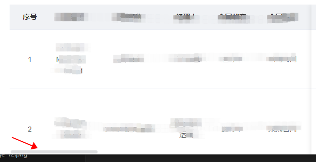

# el-table横向滚动条效果

应对场景：el-table 横向内容较多，想看到右侧内容还得滑到页面表格最下面，再拉动表格滚动条，看数据很不方便。

```
npm install el-table-horizontal-scroll

import horizontalScroll from 'el-table-horizontal-scroll'
Vue.use(horizontalScroll)

<el-table
    v-horizontal-scroll="'always'"
    ...
```
