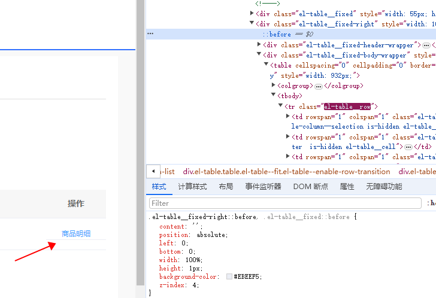
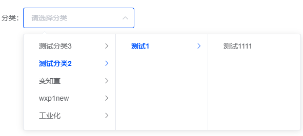

### el-table fixed固定列 偶现样式问题的解决方案
如下图，“商品明细”下面有个横线

问题原因：
代码里设置了：fixed="right"，并且在非首次渲染table组件（数据是第一次加载table的时候获取的）会出现这种问题。
```
<el-table-column
    label="操作"
    width="100"
    fixed="right"
    align="center"
    >
    <template slot-scope="scope">
        <el-button size="mini" type="text">商品明细<el-button>
    </template>
</el-table-column>
```
解决方案：
去掉 ```fixed="right"``` 或
```
::v-deep .el-table__fixed-right {
   height: 100% !important;
}
```
如果是设置的：fixed="left"，

解决方案：
去掉 ```fixed="left"``` 或
```
::v-deep .el-table__fixed {
   height: 100% !important;
}
```

### el-cascader 设置clearable清空后还有高亮选中样式

```
<el-cascader
    ref="typeCascader"
    v-model="searchGoodsType"
    filterable
    placeholder="请选择分类"
    :options="goodsTypeList"
    :props="goodsTypeProps"
    clearable
    @change="handleTypeChange"
/>

handleTypeChange(data) {
    if (!data || !data.length) {
        this.$refs.typeCascader.$refs.panel.checkedValue = [] // 清空选中值
        this.$refs.typeCascader.$refs.panel.clearCheckedNodes() // 清空级联选择器选中状态
        this.$refs.typeCascader.$refs.panel.activePath = [] // 清除高亮
        this.$refs.typeCascader.$refs.panel.syncActivePath() // 初始化（只展示一级节点）
    }
}
```
