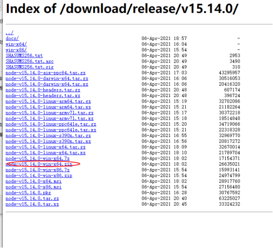
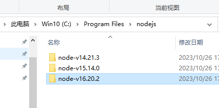
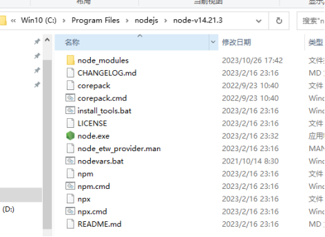
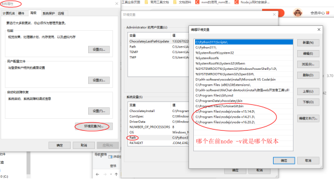
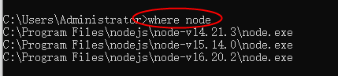
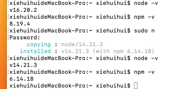

# node版本管理

## Windows


解压，放在各版本新建的安装目录：





### **推荐 NVM**

nvm：Node Version Manager，node的版本管理工具。在一台电脑上可以同时安装多个node版本，同时只能运行使用某个版本，而且可以随时切换到其他node版本。

- **安装前工作**：

卸载node：控制面板，直接找到node卸载即可

删除npm：C:\Users\登录账号\AppData\Roaming， 在这个目录里面找到npm与npm-cache文件夹，将这两个文件夹删掉

删除yarn：C:\Users\登录账号\AppData\Local，这个目录找到yarn文件夹，删掉

如果环境变量 path 中配置了npm或yarn，建议也删掉

- **安装时不建议修改默认路径，避免后续过多的麻烦**

- **nvm -v 检查是否安装成功**

- **常用命令**

列出当前已经安装的node版本
```
nvm list
```
查看当前可以使用node版本
```
nvm list available
```
安装node某一版本
```
nvm install 16.15.1
```
切换到某一版本
``` 
nvm use 16.15.1
```


## Mac

n是Mac下的node管理工具，可以在同一台电脑上安装多个Node.js版本灵活切换。

安装 n  可能需要输入password(开机密码)
```
sudo npm install n -g
```

查看 所有的node版本 
```
npm view node versions
```

安装稳定版本
```
sudo n stable
```

安装 16 的版本
```
sudo n 16.20.2
```

查看当前node版本 
```
node -v
```

查看已安装的node版本列表
```
n list 
```

切换node版本
```
sudo n 
```
&nbsp;&nbsp;&nbsp;&nbsp;<small>上下键切换，回车即可</small>

删除指定版本
```
sudo n rm 16.20.0
```

清除node.js的cache
```
sudo npm cache clean -f
```


