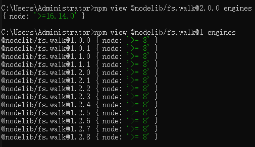

# npm常用命令

### npm init

初始化新项目，创建一个package.json文件

### npm install

安装npm仓库的任何包

### npm uninstall

从项目中移除依赖包

### npm update

更新项目中的依赖包

### npm list (npm ls)

列出当前项目中安装的包及其依赖关系

### npm view

查看指定包的详细信息

### npm help

获取npm命令的帮助信息

### npm login

登录npm账号

### npm publish

将包发布到npm仓库

npm publish --tag 命令为发布的包指定一个标签，例如latest或next

### npm unpublish

从npm仓库中删除一个包

### npm logout

退出 npm

### npm access

设置或修复包的访问权限

npm access public <package_name>

### npm run

运行在package.json文件的scripts部分定义的脚本

### npm test

package.json的scripts部分定义测试脚本后，使用此命令执行测试

### npm start

package.json的scripts部分定义启动脚本后，使用此命令运行应用程序

### npm outdated

检查项目中过时的依赖包

### npm audit

检查项目中的安全漏洞

运行 npm audit fix 可以自动修复一些已知的安全问题

### npm cache

清理npm缓存
```
npm cache clean --force  

npm cache verify
```


### 获取 npm 的代理设置
npm config get proxy

### 获取 npm 的 https 代理设置
npm config get https-proxy

### 查看 模块 需要的 Node.js 版本
npm view @nodelib/fs.walk@2.0.0 engines

