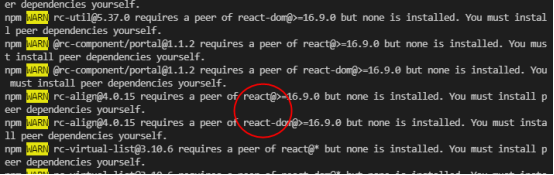

# npm 模块安装机制

## npm 不同版本之间的差异

### npm2
层层嵌套的方式递归遍历安装，会形成嵌套地狱
```
node_modules
├── A@1.0.0
│   └── node_modules
│       └── B@1.0.0
└── C@1.0.0
    └── node_modules
        └── B@1.0.0
        └── D@1.0.0
```

### npm3
扁平化安装，子依赖会尽可能平铺在主依赖所在的目录中。

那如果遇到相同包依赖不同的子模块又会怎样呢？
```
node_modules
├── A@1.0.0
├── B@1.0.0
└── C@1.0.0
     └── node_modules
         └── B@2.0.0
```
可以看到 A 的子依赖的 B@1.0 不会放在 A 的 node_modules 下了，而是与 A 同层级。

而 C 依赖的 B@2.0 因为版本号原因还是放到了 C 的 node_modules 下。

虽然扁平化一定程度上解决了依赖过深的问题，但也引发了新的问题：

-  隐式依赖风险

扁平化依赖会导致node_modules下多出来并未在package.json声明的包，这些多出来的包也可以在项目中导入使用，这就存在隐式依赖风险。

如果项目里引入这些多出来的包，宿主包被删除，对应的依赖也不会安装，就会出现报错。

- 依赖结构变化

相同包依赖不同的子模块也有可能这样安装
```
node_modules
├── A@1.0.0
│   └── node_modules
│       └── B@1.0.0
├── B@2.0.0
└── C@1.0.0
```

### npm5

npm5 新增了锁定依赖功能的package-lock.json文件，记录包版本信息及安装顺序，用来保证项目下次安装时依赖结构的一致性。

### npm7

npm v7 会自动安装 peerDependencies 里面的模块。

如果在 npm install 的时候加上 --legacy-peer-deps 参数，npm 就不会自动安装 peerDependencies 依赖，也就是让 npm v7 用旧的（v3~v6）的处理方式来。

## dependencies

运行时的依赖。发布后，即生产环境下需要用的模块（生产依赖）

npm install --production 指令，只会安装 dependencies 目录下的依赖；

引入npm发布的包时，包中有生产依赖dependencies和开发依赖devDependencies时只会下载dependencies中的依赖。

## devDependencies

开发时的依赖。

## peerDependencies

对等依赖，目的是提示宿主环境去安装满足插件peerDependencies所指定依赖的包。

举例（npm v3-v6）：

antd 是基于 react 构建的。
```
"peerDependencies": {
	"react": ">=16.9.0",
	"react-dom": ">=16.9.0"
}
```
如果环境中已经有 react (版本号>=16.9.0)的，那么就可以正常使用。

如果环境没 react，安装 antd 时，就会报类似下面的错：


这种情况要在项目的package.json文件指定安装react, react-dom依赖；如果是npm7，会自动安装peerDependencies里面的模块。

## optionalDependencies

某些场景下，依赖包可能不是强依赖的，这个依赖包的功能可有可无，一定要做好异常处理。

optionalDependencies 中的配置将会覆盖掉 dependencies，所以只需在一个地方进行配置。

## bundledDependencies

bundledDependencies 的值是一个数组，数组里可以指定一些模块，这些模块将在这个包发布时被一起打包。
"bundledDependencies": ["package1" , "package2"]


## 模块版本号

版本号格式：主版本号.次版本号.补丁版本号

版本号递增规则如下：

1.主版本号：不兼容的 API 修改

2.次版本号：向下兼容的功能性新增

3.补丁版本号：向下兼容的问题修复

- **^(插入符)** 

比如：^10.11.2	

版本范围：10.11.2 <= version < 11.0.0

主版本号不变

- **~(波浪符)**

比如：~10.11.2	

版本范围：10.11.2 <= version < 10.12.0	

主版本号和次版本号都不变

- **@**

安装特定版本，比如：
```
npm install express@4.17.1
或
"dependencies": {
  "express": "4.17.1"
}
```

- **> 或 >=**

安装大于（等于） 指定版本 的最新版本

- **< 或 <=**

安装小于（等于） 指定版本 的最新版本

- **星*符号**

任意版本


## 模块安装位置

- --save:（-S）package.json的dependencies节点。
- --save-dev:（-D）package.json的devDependencies节点。
- --save-optional：(-O) package.json的optionalDependencies节点。
- --global: (-g) 全局安装，不会将模块依赖记录在 dependencies或devDependencies中。


参考文档：
https://docs.npmjs.com/cli/v10/commands/npm-install/


## 使用建议

- 建议把项目package-lock.json文件提交到git仓库中，从而保证团队成员安装依赖包的一致性。

- 开发npm包时，不建议将package-lock.json文件上传（npm发布时默认是不上传package-lock.json文件的）。
