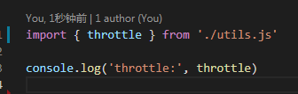
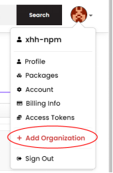
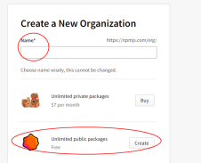

# 发布自己的包到npm

### npm init
根据提示输入，会自动生成package.json文件（name,version和main入口 三项必不可少）

### 新建utils.js 进行开发


### 新建test-utils.js测试功能


### 代码中使用import出现报错：
SyntaxError: Cannot use import statement outside a module

解决办法：在package.json中添加"type":"module"

### 新建readme.md文件说明

### 如果要引入第三方模块

注意点：

（1）npm i module-name --save（在dependencies下）

（2）新增.gitignore文件，不需要提交node_modules文件

### 压缩js代码
```
npm install uglify-js
uglifyjs utils.js -c -m -o utils-uglify.js
```

### 发布的文件
- files

package.json 设置 files，可以把需要发布的文件写进去
- .npmignore

排除不想发布上去的文件（.npmignore文件不会被发布到npm）

### 登录 <font color=red>npm login</font>
会提示输入用户名，密码，邮箱和邮箱一次性验证码

### 发布 <font color=red>npm publish</font>

### 如何发布作用域包?
1.创建组织



2.为组织取一个作用域名


比如取名:  web-xhh

3.创建代码与组织的联系

npm init --scope=web-xhh

备注：name必须取名在该作用域下 package name: (@web-xhh/...)

4.发布
```
npm publish --access public
```

发布成功后就可以在该组织下看到已发布的Packages

https://www.npmjs.com/settings/web-xhh/packages
