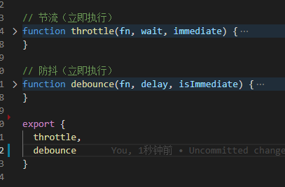

# 发布自己的包到npm

### npm init
根据提示输入，会自动生成package.json文件（name,version和main入口 三项必不可少）

### 新建utils.js 进行开发


### 新建test-utils.js测试功能


### 代码中使用import出现报错：
SyntaxError: Cannot use import statement outside a module

解决办法：在package.json中添加"type":"module"

### 新建readme.md文件说明

### 如果要引入第三方模块

注意点：

（1）npm i module-name --save（在dependencies下）

（2）新增.gitignore文件，不需要提交node_modules文件

### 压缩js代码
```
npm install uglify-js
uglifyjs utils.js -c -m -o utils-uglify.js
```

### 登录 npm login
会提示输入用户名，密码，邮箱和邮箱一次性验证码

### 发布 npm publish
https://www.npmjs.com/package/utils-xhh