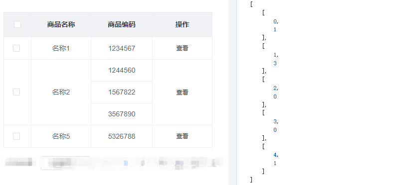

```
getTableSpanList(list = [], rowFlag) {
  for (let i = 0; i < list.length; i++) {
    let orderItem = list[i] || {}
    let rowspan = 1
    let firstId = orderItem[rowFlag]

    for (let j = 0; j < list.length; j++) {
      if (j >= 0 && j < i && list[j][rowFlag] === firstId) {
          rowspan = 0
          break
        } else if (j > i && list[j][rowFlag] === firstId) {
          rowspan++
        }
    }
    let itemList = [i, rowspan]
    this.tableSpanList.push(itemList)
  }
},
```

```
<el-table
  :span-method="objectSpanMethod"
>

objectSpanMethod({ row, column, rowIndex, columnIndex }) {
  let columnMergeList = [0, 1, 3]
  if (columnMergeList.indexOf(columnIndex) !== -1) {
    for (let i = 0; i < this.tableSpanList.length; i++) {
      let spanItemList = this.tableSpanList[i] || {}
      if (rowIndex === spanItemList[0]) {
        return {
          rowspan: spanItemList[1],
          colspan: 1
        }
      }
    }
  } else {
    return [1, 1]
  }
}
```

