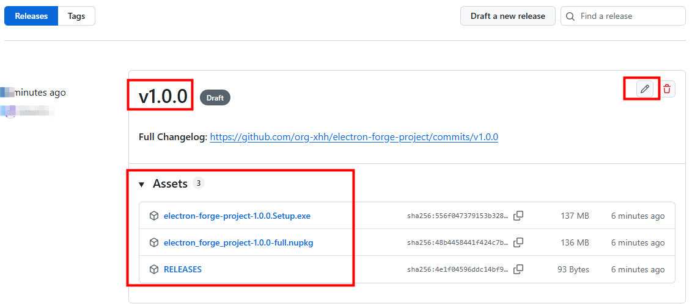

# [Electron Forge](https://www.electronforge.io/)

## 添加 vue3 支持
https://www.electronforge.io/guides/framework-integration/vue-3

## 添加 Tailwind.css

一、**Tailwindcss@3**
```
npm install tailwindcss@3 postcss autoprefixer -S
```
```
npx tailwindcss init -p
```
执行完该命令后，会自动生成 tailwind.config.js 和 postcss.config.js 文件

tailwind.config.js 文件的 content 添加：
```
content: [
  "./index.html",
  "./src/**/*.{vue,js,ts,jsx,tsx}"
]
```
index.css 文件引入：
```
@tailwind base;
@tailwind components;
@tailwind utilities;
```
VScode 安装插件
```
Tailwind CSS IntelliSense
```

二、**Tailwindcss@4**

https://tailwindcss.com/docs/installation/using-vite

要把 vite.renderer.config.ts 后缀改为 mjs

## 应用打包

https://www.electronforge.io/config/makers

```
npm run package
// 生成可执行程序，但还不是安装包，直接双击就可以使用

npm run make
// 生成完整的安装包，需要安装完后使用
```

**可执行程序 vs 安装包的系统关系**

一、**可执行程序**

只是一个文件夹，不与系统发生关系。

npm run package 后生成 out 文件夹：

命名规则

[应用名]-[平台]-[架构]/

平台标识:

• win32 = Windows

• darwin = macOS

• linux = Linux

架构标识:

• x64  = 64 位

• arm64 = ARM 架构

二、**安装包**

- 添加到程序列表
- 创建快捷方式
- 注册文件关联
- 添加卸载信息


三、**适用场景对比**

可执行程序适合：

- 测试版本
- 便携版
- 不需要安装的场景

安装包适合：

- 正式发布
- 面向普通用户
- 需要系统集成的场景

**特别注意跨平台限制**
- Windows 电脑一般只能打包 Windows 版本
- macOS 可以打包 macOS 和 Linux 版本
- Linux 可以打包 Linux 版本

## 探究 asar 文件格式

https://github.com/electron/asar

所在目录：

electron-forge-project\out\electron-forge-project-win32-x64\resources\app.asar

```
# 安装
npm install -g @electron/asar

# 2. 解压 asar 文件
asar extract app.asar 目标文件夹

# 3. 查看 asar 内容 (不解压)
asar list app.asar

# 4. 解压单个文件
asar extract-file app.asar package.json
```

## 生成 makers 安装包
```
packagerConfig: {
  name: 'electron-forge-project',
  icon: './assets/icon', // 安装包图标
  asar: true, // 将源码打包成 asar 归档格式
},
```
**图标**的对应关系
```
icon.icns  # macOS 应用图标
icon.ico   # Windows 图标
icon.png   # Linux 图标
```
生成 Mac 安装包
```
npm install --save-dev @electron-forge/maker-dmg

import { MakerDMG } from '@electron-forge/maker-dmg'

makers: {
  new MakerDMG({
    icon: './assets/icon.icns',
    format: 'ULFO'
  }),
  new MakerZIP({}, ['darwin'])
}
```
打包：
```
npm run make
```

windows 生成目录：

electron-forge-project\out\make\squirrel.windows\x64\electron-forge-project-1.0.0 Setup.exe

## 应用发布

https://www.electronforge.io/config/publishers/github

forge.config.js:
```
const config: ForgeConfig = {
  publishers: [
    {
      name: '@electron-forge/publisher-github',
      config: {
        repository: {
          owner: 'org-xhh',
          name: 'electron-forge-project',
        },
        draft: true, // 首次发布建议为草稿，确认无误后在 GitHub 上手动发布
        prerelease: false,
        generateReleaseNotes: true
      },
    },
  ]
}
```

> 获取 Github Token：Settings => Developer settings => Personal access tokens => Tokens(classic)

新建 .env 文件中添加 GITHUB_TOKEN 环境变量，并在 forge.config.js 中使用
```
import dotenv from 'dotenv';
// 加载 .env 环境变量
dotenv.config();
...
const config: ForgeConfig = {
  publishers: [
    {
      ...
      config: {
        ...
        authToken: process.env.GITHUB_TOKEN,
      },
    },
  ]
}
```
发布：
```
npm run publish
```


编辑后可以发为 Release

## 应用自动更新

https://github.com/electron/update-electron-app

**使用 update.electronjs.org（官方服务）推荐**

仓库地址：https://github.com/electron/update.electronjs.org

是一个由 Electron 团队维护的免费、开源的更新服务。

工作方式：

- 它依赖 GitHub Releases 作为更新分发源。
- 当你的应用发布新版本到 GitHub 时，update.electronjs.org 会生成对应的更新 feed（例如 https://update.electronjs.org/owner/repo/platform/version）, 供客户端查询。
- 应用必须是开源的，且托管在公开的 GitHub 仓库。

```
npm i update-electron-app
```
main.ts:
```
const { updateElectronApp } = require('update-electron-app')

updateElectronApp({
  repo: 'org-xhh/electron-forge-project',
  updateInterval: '1 hour'
})
```
