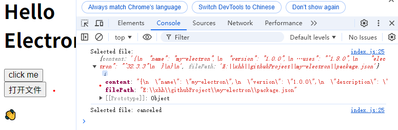

# [Electron](https://www.electronjs.org/zh/docs/latest/tutorial/tutorial-first-app#%E5%B0%86%E7%BD%91%E9%A1%B5%E8%A3%85%E8%BD%BD%E5%88%B0-browserwindow)

Electron 是一个使用 Web 技术（HTML、CSS、JavaScript）构建跨平台桌面应用的框架，基于 Chromium 渲染引擎和 Node.js 运行时。

### 安装
```
npm install electron --save
```

### package.json
```
{
  "name": "my-electron",
  "version": "1.0.0",
  "description": "electron",
  "main": "main.js",
  "scripts": {
    "start": "chcp 65001 && electron ."
  },
  "author": "xhh",
  "license": "ISC",
  "dependencies": {
    "electron": "^32.3.3"
  }
}
```

### 启动
新建 main.js 主程序入口文件，输入内容


### 创建窗体
新建 index.html 文件：

```
<!DOCTYPE html>
<html>
  <head>
    <meta charset="UTF-8" />
    <!-- https://developer.mozilla.org/en-US/docs/Web/HTTP/CSP -->
    <meta
      http-equiv="Content-Security-Policy"
      content="default-src 'self'; script-src 'self'"
    />
    <meta
      http-equiv="X-Content-Security-Policy"
      content="default-src 'self'; script-src 'self'"
    />
    <title>Hello from Electron renderer!</title>
  </head>
  <body>
    <h1>Hello Electron</h1>
    <p>👋</p>
  </body>
</html>
```
下面将该页面加载到 Electron 的 BrowserWindow 上，先修改 main.js:

```
const { app, BrowserWindow } = require('electron')

const createWindow = () => {
  const win = new BrowserWindow({
    width: 800,
    height: 600
  })

  win.loadFile('index.html')
}

// 应用准备完成
// app.on('ready', ()=>{
// })
// 或
app.whenReady().then(() => {
  createWindow()
})
```

再次启动：


### 打开开发者工具

显示控制台，在 main.js 添加代码：

```
// 或 ctrl+shift+i
win.webContents.openDevTools();
```

### 给页面添加按钮

创建 index.js, 并在 index.html 中引入
```
<script src="index.js"></script>
```
index.js:
```
window.onload = function () {
  document.getElementById("myBtn").addEventListener("click", () => {
    console.log('click me')
  })
}
```

### 主进程和渲染进程

**主进程 Main Process**

每个 Electron 应用都有一个单一的主进程，作为应用程序的入口点。主进程在 Node.js 环境中运行，这意味着它具有 require 模块和使用所有 Node.js API 的能力。
- 窗口管理
- 应用程序生命周期
- 原生 API

---

**渲染器进程 Renderer Process**

每个 Electron 应用都会为每个打开的 BrowserWindow 生成一个单独的渲染器进程。渲染器负责 渲染 网页内容。

渲染器无权直接访问 require 或其他 Node.js API。

### 上下文隔离
安全封装方案，通过 预加载preload 脚本暴露有限 API 给渲染进程

| 可用的 API            | 详细信息                                               |
| --------------------- | ------------------------------------------------------ |
| Electron 模块         | 渲染进程模块                                           |
| Node.js 模块          | events、timers、url                                   |
| Polyfilled 的全局模块 | Buffer、process、clearImmediate、setImmediate         |

https://www.electronjs.org/zh/docs/latest/tutorial/sandbox

示例：

创建 preload.js 提供暴露的变量和方法:
```
const {contextBridge} = require('electron')

contextBridge.exposeInMainWorld('versions', {
  node: process.versions.node,
  chrome: process.versions.chrome,
  electron: process.versions.electron,
})

contextBridge.exposeInMainWorld('electronAPI', {
  print: (content) => console.log('content', content)
})
```
main.js 中指定 preload:
```
const {join} = require("node:path");

const createWindow = () => {
  // 每个打开的BrowserWindow称为渲染进程
  const win = new BrowserWindow({
    width: 800,
    height: 600,
    webPreferences: {
      preload: join(__dirname, 'preload.js'), // 指定 preload 脚本的路径
      // 这个设为 true 的话，preload 脚本将具有 Node.js 环境的所有能力
      nodeIntegration: false, // 控制渲染进程中是否启用 Node.js 集成
      contextIsolation: true, // 启用上下文隔离
      enableRemoteModule: false // 禁用 remote 模块以进一步提高安全性
    }
  })
  ...
}
```
index.js(渲染进程) 中调用暴露的变量和方法:
```
window.versions.node

window.electronAPI.print()
```
<!--
### enableRemoteModule 
不推荐

remote 模块提供了一个桥梁，可以在渲染进程中直接使用主进程中的属性和方法。

安装
```
npm install --save @electron/remote
```
主进程初始化
```
// 初始化
require('@electron/remote/main').initialize()

// 启用 electron > 10
require("@electron/remote/main").enable(win.webContents)
```
preload.js
```
contextBridge.exposeInMainWorld('require', require)
```
渲染进程获取主进程的模块
```
const { dialog } = window.require('@electron/remote')
```
-->

### 进程间通信

进程通信方式：<font size="4">**ipc**</font>

ipc 分别有 ipcMain 和 ipcRenderer，ipcMain 用于主进程，ipcRenderer 用于渲染进程

- 模式 1

渲染进程到主进程（单向），ipcRenderer.send 发送消息，ipcMain.on 接收消息

preload.js:
```
const { contextBridge, ipcRenderer } = require('electron')

contextBridge.exposeInMainWorld(
  'electronAPI', {
    // print: (content) => console.log('content:', content)
    send: (channel, data) => {
      let validChannels = ['toMain'];
      if (validChannels.includes(channel)) {
        ipcRenderer.send(channel, data);
      }
    },
    receive: (channel, func) => {
      let validChannels = ['fromMain'];
      if (validChannels.includes(channel)) {
        ipcRenderer.on(channel, (event, ...args) => func(...args));
      }
    }
  }
)
```
index.js:
```
window.onload = function () {
  document.getElementById("myBtn").addEventListener("click", () => {
    window.electronAPI.send('toMain', 'this is child data'); // 发送数据到主进程
    console.log('click me')
  })

  // 监听主进程返回的数据
  window.electronAPI.receive('fromMain', (data) => {
    console.log('接收主进程数据：', data);
  });
}
```
main.js:
```
const { app, ipcMain, BrowserWindow } = require('electron')

const createWindow = () => {
  ...
  // 监听渲染进程发送的消息
  ipcMain.on('toMain', (event, arg) => {
    console.log('接收渲染进程数据: ', arg);

    let webContents = event.sender;
    // 经 channel 向渲染进程发送异步带参消息
    webContents.send('fromMain', 'Main has received');
  })
  ...
}
```


- 模式 2

双向通信，使用 ipcRenderer.invoke 与 ipcMain.handle(有返回值)

preload.js 中添加：
```
invoke: (channel, ...data) => {
  let validChannels = ['invoke-message'];
  if (validChannels.includes(channel)) {
    return ipcRenderer.invoke(channel, ...data);
  }
}
```
index.js:
```
window.electronAPI.invoke('invoke-message', 'aaa', 'bbb').then((result) => {
  console.log('invoke result: ', result);
})
```
main.js:
```
// 监听渲染进程发送的消息
ipcMain.handle('invoke-message', (event, arg1, arg2) => {
  console.log('event:', event);
  console.log('args: ', arg1, arg2);
  return 'main result'
})
```


- 模式 3

主进程到渲染进程（单向），使用 win.webContents.send 发送消息，ipcRenderer.on 接收消息

preload.js 添加 ipcRenderer 监听事件：
```
receive: (channel, func) => {
  let validChannels = ['fromMain', 'notify-message'];
  if (validChannels.includes(channel)) {
    ipcRenderer.on(channel, (event, ...args) => func(...args));
  }
},
```
main.js:
```
// 主进程发送消息
setTimeout(()=>{
  win.webContents.send('notify-message', 'a', 'b');
}, 1000)
```
index.js:
```
window.electronAPI.receive('notify-message', (...data) => {
  console.log('args:', ...data)
})
```


- 模式 4

渲染进程到渲染进程

1.将主进程作为渲染器之间的消息代理。这需要将消息从一个渲染器发送到主进程，然后主进程将消息转发到另一个渲染器。

2.[MessagePort](https://www.electronjs.org/zh/docs/latest/tutorial/message-ports)

### 打开系统 dialog

preload.js:
```
showOpenDialog: (properties) => ipcRenderer.invoke('show-open-dialog', properties)
```
main.js:
```
const fs = require('fs');
const { promisify } = require('util');
const readFileAsync = promisify(fs.readFile);

ipcMain.handle('show-open-dialog', async (event, properties) => {
  const { canceled, filePaths } = await dialog.showOpenDialog({ properties })
  if (!canceled) {
    const content = await readFileAsync(filePaths[0], 'utf-8')
    return {
      content,
      filePath: filePaths[0]
    }
  } else {
    return 'canceled'
  }
})
```
index.js:
```
document.getElementById("openFile").addEventListener("click", () => {
  window.electronAPI.showOpenDialog(['openFile']).then(result => {
    console.log('Selected file:', result)
  })
})
```


### 保存文件对话框
```
ipcMain.handle('show-save-dialog', async (event) => {
  let result = await dialog.showSaveDialog({
    title: '保存文件', // 标题
    defaultPath: 'test.txt', // 默认保存的文件名
    buttonLabel: "保存文件" // 确认保存文件按钮
  })
  if(result.canceled) return '取消保存';
  try {
    await fs.promises.writeFile(result.filePath, 'hello world')
    return '保存成功';
  } catch (error) {
    return error;
  }
})
```

### 消息对话框
```
dialog.showMessageBox({ 
  type: 'info',
  title: '提示',
  message: '这是对话框',
  buttons: ['确定', '取消']
}).then(result => {
  console.log(result.response) // buttons 下标
})
```

### 创建菜单
新建 menu.js:
```
const { Menu } = require('electron')

let menutap = [
  {
    label: '角色',
    submenu: [
      { label: '最小化', role: 'minimize', click: () => { console.log('点击了') }},
      { type: 'separator' },
      { label: 'windows', type: 'submenu', role: 'windowMenu' },
      { type: 'separator' },
      {
        label: '打开',
        icon: '',
        accelerator: 'ctrl + o', // 定义执行点击事件的快捷键
        click () {
          console.log('打开操作')
        }
      }
    ]
  }
]
// 创建一个menu
let menu = Menu.buildFromTemplate(menutap)
// 将菜单添加至app上
Menu.setApplicationMenu(menu)
```
main.js 导入菜单：
```
const createWindow = () => {
  let win = new BrowserWindow({
    ...
  })

  require('./menu')
  ...
}
```
添加菜单项：
```
...
require('./menu')

// 获取当前应用程序菜单
let currentMenu = Menu.getApplicationMenu()
// 如果菜单不存在，就创建一个新菜单
if (!currentMenu) {
  currentMenu = new Menu()
}
// 追加菜单
currentMenu.append(new MenuItem({
  label: '打开控制台',
  accelerator: 'ctrl+shift+i', 
  click () {
    win.webContents.openDevTools()
  }
}))
// 设置应用程序菜单
Menu.setApplicationMenu(currentMenu)
```

### 右键菜单
preload.js:
```
createContextMenu: (params) => ipcRenderer.send('create-context-menu')
```
index.js:
```
window.addEventListener('contextmenu', (event) => {
  event.preventDefault(); // 阻止默认的浏览器上下文菜单
  window.electronAPI.createContextMenu()
}, false);
```
main.js:
```
// 监听
ipcMain.on('create-context-menu', (event, params) => {
  createContextMenu(win);
})

function createContextMenu(win) {
  const template = [
    { label: '复制', role: 'copy' },
    { label: '粘贴', role: 'paste', enabled: false } // 根据需要启用或禁用
  ];
  const menu = Menu.buildFromTemplate(template);
  // 右键菜单
  menu.popup({ window: win });
}
```

### 子窗口向父窗口传递信息
主窗口：
```
// 打开electron子窗口
document.getElementById("openWin").addEventListener('click', () => {
  window.open('./subIndex.html')
})
window.addEventListener('message', (e) => {
  console.log('index window received message:', e.data)
})
```
子窗口：
```
window.opener.postMessage('info~~~', '*')
```

### a标签通过浏览器打开链接
```
const { shell } = require('electron')

let ahref = document.getElementById("ahref");
ahref.addEventListener('click', (e) => {
  e.preventDefault() // 阻止在窗口内打开
  shell.openExternal(ahref.href) // 使用shell在浏览器打开链接
})
```

### 注册全局快捷键
```
const { globalShortcut } = require('electron')

globalShortcut.register('ctrl + f', () => {
  console.log('this is ctrl + f')
})
let isRegister = globalShortcut.isRegistered('ctrl + f')
console.log('isRegister:', isRegister)

app.on('will-quit', () => {
  console.log('will quit~')
  // 将要退出时时注销全局快捷键
  globalShortcut.unregisterAll()
})
```

### 配置热更新

nodemon

示例：
```
"start": "nodemon --watch main.js --exec \"electron .\"",
```
nodemon 监听 main.js 文件变化，然后执行命令 electron .

<!--
### electron-builder
```
"scripts": {
  "start": "electron .",
  "pack": "electron-builder --dir", // 构建应用程序但不生成安装包或软件包，只输出目录结构。
  "build": "electron-builder" // 构建应用程序并生成安装包或软件包
},
"build": {
  "appId": "com.hospital.bedsystem",
  "productName": "", // 安装包显示中文名
  "files": [
    "electron/**/*",
    "dist/**/*",
    "node_modules/**/*"
  ],
  "extraResources": [
    "./assets/**"
  ],
  "directories": {
    "output": "release", // 打包输出目录
    "buildResources": "build" // 图标资源目录
  },
  "asar": true, // 代码打包asar加密；false可解压源码
  "asarUnpack": ["node_modules/ffmpeg/**"], // 音视频依赖不解压

  // Windows专属配置
  "win": {
    "target": [
      {
        "target": "nsis", // 安装包；可选portable便携包
        "arch": ["x64"]
      }
    ],
    "icon": "build/icon.ico",
    "requestExecutionLevel": "asInvoker", // 权限：administrator管理员
    "publisherName": ""
  },
  "nsis": {
    "oneClick": false, // 不要一键安装，允许选择安装路径
    "allowToChangeInstallationDirectory": true,
    "installerIcon": "build/icon.ico",
    "uninstallerIcon": "build/icon.ico",
    "shortcutName": "",
    "createDesktopShortcut": true,
    "createStartMenuShortcut": true
  },

  // Mac配置
  "mac": {
    "target": ["dmg", "zip"],
    "icon": "build/icon.icns",
    "hardenedRuntime": true,
    "entitlements": "build/entitlements.mac.plist",
    "entitlementsInherit": "build/entitlements.mac.plist"
  },

  // Linux
  "linux": {
    "target": ["deb", "rpm"],
    "icon": "build/icon.png",
    "category": "Utility"
  },

  // 自动更新
  "publish": [
    {
      "provider": "generic",
      "url": "http://内网服务器/update/"
    }
  ]
}
```
-->

### 打包应用
[Electron Forge](https://www.electronjs.org/zh/docs/latest/tutorial/%E6%89%93%E5%8C%85%E6%95%99%E7%A8%8B)

```
npm install --save-dev @electron-forge/cli
npx electron-forge import
```
```
npm run make
```