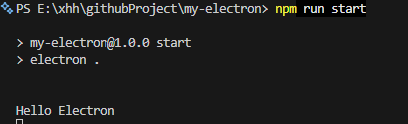
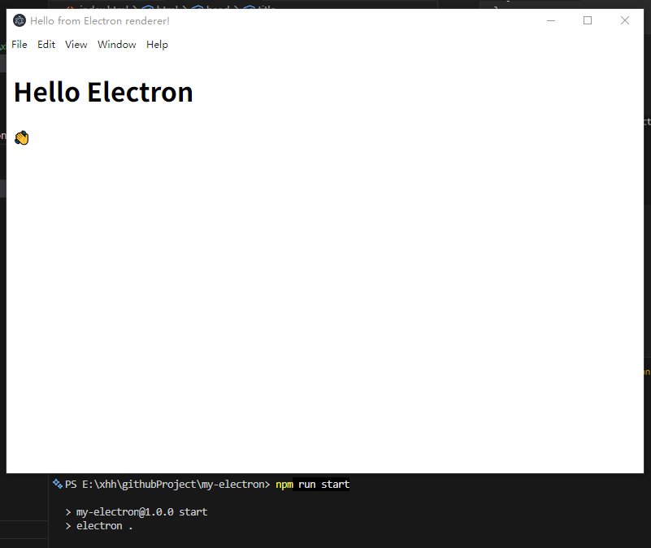
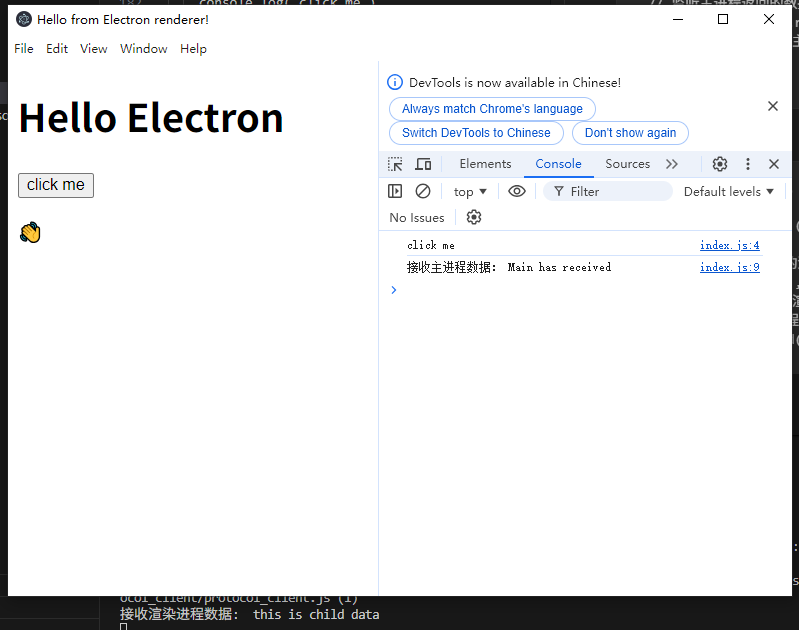
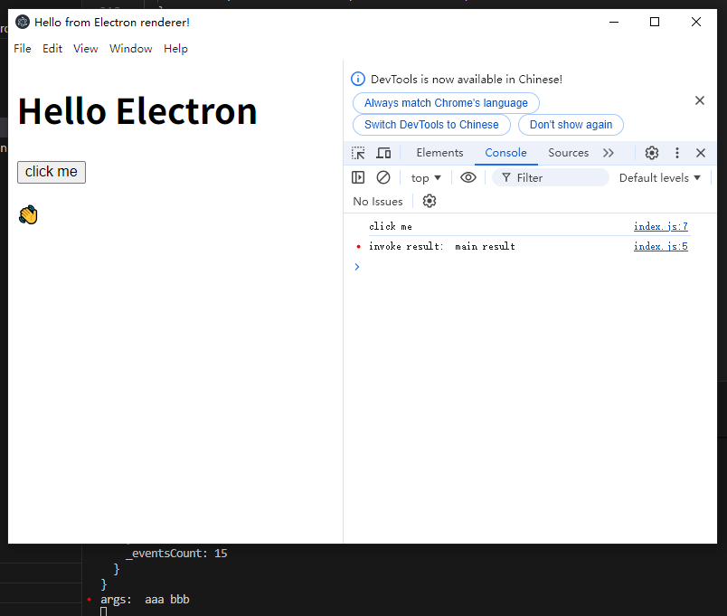
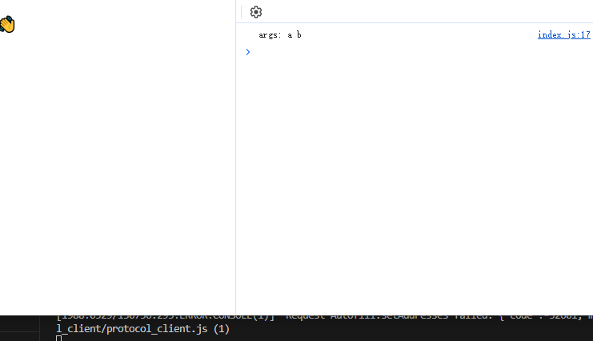

# [Electron](https://www.electronjs.org/zh/docs/latest/tutorial/tutorial-first-app#%E5%B0%86%E7%BD%91%E9%A1%B5%E8%A3%85%E8%BD%BD%E5%88%B0-browserwindow)

### 安装
```
npm install electron --save
```

### package.json
```
{
  "name": "my-electron",
  "version": "1.0.0",
  "description": "electron",
  "main": "main.js",
  "scripts": {
    "start": "chcp 65001 && electron ."
  },
  "author": "xhh",
  "license": "ISC",
  "dependencies": {
    "electron": "^32.3.3"
  }
}
```

### 启动
新建 main.js 文件，输入内容



### 创建窗体
新建 index.html 文件：

```
<!DOCTYPE html>
<html>
  <head>
    <meta charset="UTF-8" />
    <!-- https://developer.mozilla.org/en-US/docs/Web/HTTP/CSP -->
    <meta
      http-equiv="Content-Security-Policy"
      content="default-src 'self'; script-src 'self'"
    />
    <meta
      http-equiv="X-Content-Security-Policy"
      content="default-src 'self'; script-src 'self'"
    />
    <title>Hello from Electron renderer!</title>
  </head>
  <body>
    <h1>Hello Electron</h1>
    <p>👋</p>
  </body>
</html>
```
下面将该页面加载到 Electron 的 BrowserWindow 上，先修改 main.js:

```
const { app, BrowserWindow } = require('electron')

const createWindow = () => {
  const win = new BrowserWindow({
    width: 800,
    height: 600
  })

  win.loadFile('index.html')
}

// 应用准备完成
// app.on('ready', ()=>{
// })
// 或
app.whenReady().then(() => {
  createWindow()
})
```

再次启动：



### 打开开发者工具

显示控制台，在 main.js 添加代码：

```
win.webContents.openDevTools();
```

### 给页面添加按钮

创建 index.js, 并在 index.html 中引入
```
<script src="index.js"></script>
```
index.js:
```
window.onload = function () {
  document.getElementById("myBtn").addEventListener("click", () => {
    console.log('click me')
  })
}
```

### 上下文隔离
渲染进程通过 预加载preload暴露的api 执行electron的方法

创建 preload.js 提供暴露的方法:
```
const {contextBridge} = require('electron')

contextBridge.exposeInMainWorld('electronAPI', {
  print: (content) => console.log('content', content)
})
```
main.js 中指定 preload:
```
const {join} = require("node:path");

const createWindow = () => {
  // 每个打开的BrowserWindow称为渲染进程
  const win = new BrowserWindow({
    width: 800,
    height: 600,
    webPreferences: {
      preload: join(__dirname, 'preload.js'), // 指定 preload 脚本的路径
      nodeIntegration: false, // 控制渲染进程中是否启用 Node.js 集成
      contextIsolation: true, // 启用上下文隔离
      enableRemoteModule: false // 禁用 remote 模块以进一步提高安全性
    }
  })
  ...
}
```
index.js 中调用暴露的API:
```
window.electronAPI.print()
```

### 进程间通信

进程通信方式：<font size="4">**ipc**</font>

ipc 分别有 ipcMain 和 ipcRenderer，ipcMain 用于主进程，ipcRenderer 用于渲染进程

- 模式 1

渲染进程到主进程（单向），ipcRenderer.send 发送消息，ipcMain.on 接收消息

preload.js:
```
const { contextBridge, ipcRenderer } = require('electron')

contextBridge.exposeInMainWorld(
  'electronAPI', {
    // print: (content) => console.log('content:', content)
    send: (channel, data) => {
      // whitelist channels
      let validChannels = ['toMain'];
      if (validChannels.includes(channel)) {
        ipcRenderer.send(channel, data);
      }
    },
    receive: (channel, func) => {
      let validChannels = ['fromMain'];
      if (validChannels.includes(channel)) {
        // Deliberately strip event as it includes `sender` 
        ipcRenderer.on(channel, (event, ...args) => func(...args));
      }
    }
  }
)
```
index.js:
```
window.onload = function () {
  document.getElementById("myBtn").addEventListener("click", () => {
    window.electronAPI.send('toMain', 'this is child data'); // 发送数据到主进程
    console.log('click me')
  })

  // 监听主进程返回的数据
  window.electronAPI.receive('fromMain', (data) => {
    console.log('接收主进程数据：', data);
  });
}
```
main.js:
```
const { app, ipcMain, BrowserWindow } = require('electron')

const createWindow = () => {
  ...
  // 监听渲染进程发送的消息
  ipcMain.on('toMain', (event, arg) => {
    console.log('接收渲染进程数据: ', arg);
    event.sender.send('fromMain', 'Main has received');
  })
  ...
}
```


- 模式 2

渲染进程到主进程（双向），使用 ipcRenderer.invoke 与 ipcMain.handle(有返回值)

preload.js 中添加：
```
invoke: (channel, ...data) => {
  let validChannels = ['invoke-message'];
  if (validChannels.includes(channel)) {
    return ipcRenderer.invoke(channel, ...data);
  }
}
```
index.js:
```
window.electronAPI.invoke('invoke-message', 'aaa', 'bbb').then((result) => {
  console.log('invoke result: ', result);
})
```
main.js:
```
// 监听渲染进程发送的消息
ipcMain.handle('invoke-message', (event, arg1, arg2) => {
  console.log('event:', event);
  console.log('args: ', arg1, arg2);
  return 'main result'
})
```


- 模式 3

主进程到渲染进程，使用 win.webContents.send 发送消息，ipcRenderer.on 接收消息

preload.js 添加 ipcRenderer 监听事件：
```
receive: (channel, func) => {
  let validChannels = ['fromMain', 'notify-message'];
  if (validChannels.includes(channel)) {
    ipcRenderer.on(channel, (event, ...args) => func(...args));
  }
},
```
main.js:
```
// 主进程发送消息
setTimeout(()=>{
  win.webContents.send('notify-message', 'a', 'b');
}, 1000)
```
index.js:
```
window.electronAPI.receive('notify-message', (...data) => {
  console.log('args:', ...data)
})
```



- 模式 4

渲染进程到渲染进程

1.将主进程作为渲染器之间的消息代理。这需要将消息从一个渲染器发送到主进程，然后主进程将消息转发到另一个渲染器。

2.[MessagePort](https://www.electronjs.org/zh/docs/latest/tutorial/message-ports)


### 打包应用
[Electron Forge](https://www.electronjs.org/zh/docs/latest/tutorial/%E6%89%93%E5%8C%85%E6%95%99%E7%A8%8B)

```
npm install --save-dev @electron-forge/cli
npx electron-forge import
```
```
npm run make
```