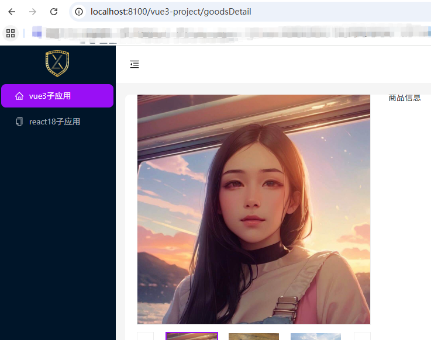

# 微前端qiankun 使用

多框架集成、子应用并行运行、跨应用通信

### 主应用注册微应用并启动
```
npm i qiankun -S
```
```
import { registerMicroApps, start } from 'qiankun'

registerMicroApps([
  {
    name: 'vue-project', // 子应用名称
    entry: 'http://localhost:8101/', // 子应用入口
    container: '#subAppContainer', // 放子应用的容器
    activeRule: '/vue-project', // 激活子应用的路路由
    props: { // 传递给子应用的数据
      greeting: 'Hello from mainApp!'
    }
  },
  {
    name: 'react-project',
    entry: 'http://localhost:8102/',
    container: '#subAppContainer',
    activeRule: '/react-project'
  }
])

start({
  sandbox: {
    experimentalStyleIsolation: true // 样式隔离
  }
})
```
### 主应用设置跳转子应用的入口
```
const routes = createBrowserRouter([
  {
    path: '/',
    element: <LayoutPage />,
    children: [
      {
        index: true, // 默认打开
        element: <Home />
      },
      {
        path: 'vue-project/?/*', // 通配符匹配 /vue-project、 /vue-project/goodsDetail
        element: <EmptyPage />
      },
      {
        path: 'react-project/?/*',
        element: <EmptyPage />
      }
    ]
  }
])
```
### 主应用设置子应用挂载的容器
```
const EmptyPage = () => {
  return <div id="subAppContainer"></div>
}
export default EmptyPage
```

### vite 构建的子应用

qiankun 不支持 vite，需要使用插件 vite-plugin-qiankun
```
npm i vite-plugin-qiankun -S
```
```
import qiankun from 'vite-plugin-qiankun'

export default defineConfig({
  plugins: [
    vue(),
    qiankun('vue-project', { // 与主应用注册的name保持一致
      useDevMode: true
    })
  ],
  server: { // 本地启动
    port: 8101,
    origin: "//localhost:8101", // 不加这个静态资源404
    headers: { 'Access-Control-Allow-Origin': '*' }
  },
  ...
})
```
```
export default defineConfig({
  plugins: [
    // react(),
    qiankun('react-project', {
      useDevMode: true
    })
  ],
  server: {
    port: 8102,
    headers: { 'Access-Control-Allow-Origin': '*' }
  },
  ...
})
```

### vue 子应用路由
```
import { qiankunWindow } from 'vite-plugin-qiankun/dist/helper'

const router = createRouter({
  // 路由前缀
  history: createWebHistory(qiankunWindow.__POWERED_BY_QIANKUN__ ? '/vue-project/' : '/'),
  routes: [
    {
      path: '/',
      name: 'home',
      meta: {
        title: '首页'
      },
      component: HomeView
    }
    ...
})
```

### react 子应用路由
```
import { qiankunWindow } from 'vite-plugin-qiankun/dist/helper'

const routes = createBrowserRouter([
  {
    path: '/',
    element: <LayoutPage />,
    children: [
      {
        index: true,
        element: <Home />
      },
      {
        path: 'article',
        element: <Article />,
        children: [
          {
            path: 'list',
            element: <ArticleList />
          },
          ...
        ]
      },
      ...
    ]
  },
  {
    path: '*',
    element: <NotFound />
  }
], { basename: qiankunWindow.__POWERED_BY_QIANKUN__ ? '/react-project' : '/' }) // 路由前缀
```
### vue 子应用 main.js 添加生命周期
```
import { renderWithQiankun, qiankunWindow } from 'vite-plugin-qiankun/dist/helper'

let app = null

function render() {
  app = createApp(App)
  app.use(router)
  app.mount('#subApp')
}

if (!qiankunWindow.__POWERED_BY_QIANKUN__) {
  render()
}
renderWithQiankun({
  mount(props) {
    console.log('props', props)
    render()
  },
  update() {},
  bootstrap() {},
  unmount() {
    app.unmount()
  }
})
```

### react 子应用 main.tsx 添加生命周期
```
import { renderWithQiankun, qiankunWindow } from 'vite-plugin-qiankun/dist/helper'

let root = null

function render() {
  root = createRoot(document.getElementById('root1')!)
  root.render(
    <ConfigProvider locale={zhCN} 
      theme={{
        token: {
          colorPrimary: '#990ff5'
        }
      }}>
      <RouterProvider router={router}></RouterProvider>
    </ConfigProvider>
  )
}

if (!qiankunWindow.__POWERED_BY_QIANKUN__) {
  render()
}
renderWithQiankun({
  mount(props) {
    render()
  },
  update() {},
  bootstrap() {},
  unmount() {
    root.unmount()
  }
})
```

### 子应用跳到其他应用
```
// 跳到其他子应用
window.history.pushState({}, '', '/react-project/article/list')
// 跳到主应用
window.history.pushState({}, '', '/');
```

### 启动应用
```
{
  "name": "xhh-qiankun-project",
  "version": "1.0.0",
  "private": true,
  "scripts": {
    "dev": "npm-run-all --parallel dev:*",
    "dev:main": "npm run dev --workspace main-app",
    "dev:vue": "npm run dev --workspace vue-project",
    "dev:react": "npm run dev --workspace react-project"
  },
  "workspaces": [
    "main-app",
    "vue-project",
    "react-project"
  ],
  "devDependencies": {
    "npm-run-all": "^4.1.5"
  },
  "dependencies": {
    "cheerio": "^1.0.0-rc.10",
    "vite-plugin-qiankun": "^1.0.15"
  }
}
```

### 主子应用通信

#### 主应用

initGlobalState设置全局状态：
```
import { initGlobalState, MicroAppStateActions } from 'qiankun'
   
const initialState = {}
const actions: MicroAppStateActions = initGlobalState(initialState)
   
export default actions
```
传递给子应用：
```
import actions from '@/utils/actions'

registerMicroApps([
  {
    name: 'vue-project',
    entry: 'http://localhost:8101/',
    container: '#subAppContainer',
    activeRule: '/vue-project',
    props: {
      actions
    }
  },
  ...
])
```
主应用修改全局状态：
```
import actions from '@/utils/actions'

function changeTheme(){
  if(theme === 'dark'){
    setTheme('light')
    actions.setGlobalState({ theme: 'light' })
  }else{
    setTheme('dark')
    actions.setGlobalState({ theme: 'dark' })
  }
}
```

#### 子应用

先配置一个空的 actions 实例：
```
class Actions {
  actions = { onGlobalStateChange: () => {}, setGlobalState: () => {} }
  setActions(actions) { this.actions = actions }
  onGlobalStateChange(...args) { return this.actions.onGlobalStateChange(...args) }
  setGlobalState(...args) { return this.actions.setGlobalState(...args) }
}
let actions = new Actions()
export default actions
```

注入 actions:
```
renderWithQiankun({
  mount(props) {
    actions.setActions(props.actions)
    render()
  },
  ...
})
```

监听全局状态：
```
actions.onGlobalStateChange((state, prev) => {
  console.log('全局状态改变：', state, prev)
})
```

### 效果图


---
参考文档

https://qiankun.umijs.org/zh/api#initglobalstatestate