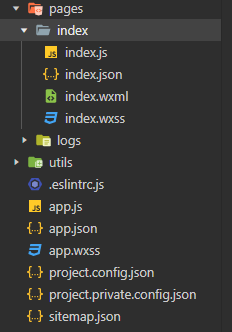
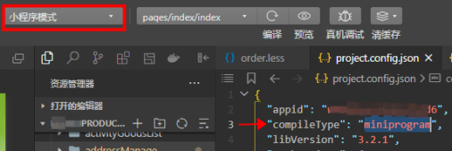
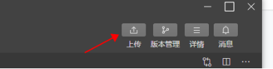
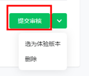
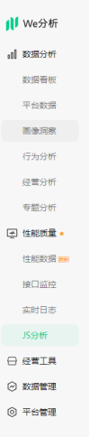

# 微信小程序

## 注册微信小程序

打开 微信公众平台(https://mp.weixin.qq.com/)，右上角“立即注册”，选择小程序，前往注册。

## appid

登录微信公众平台（管理者给开发人员开了权限即可扫码登录）左侧菜单开发-开发管理，可以看到AppID(小程序ID)。

## 项目框架

### 创建项目
下载微信开发者工具，填写appid（个人也可以用测试号），创建小程序（可以选择模板）。
### 基础版项目目录

### 目录介绍
**app.json**: 小程序根目录下，用来对微信小程序进行全局配置。

**project.config.json**：开发者工具公共配置。



**project.private.config.json**：优先级高于project.config.json，个人配置。
部分设置无法在 project.private.config.json 中生效，有些字段可以在开发者工具-详情-本地设置对应上。

**app.js**：小程序逻辑。

**app.wxss**：小程序公共样式表。

一个**小程序页面**由四个文件组成，分别是 js,wxml,json,wxss；

**page.json**：每个页面下的配置文件，页面中配置项在当前页面会覆盖 app.json 中相同的配置项。

### 为方便样式书写，使用less写样式，再转化为wxss
VSCode 安装esay less插件，项目根目录新增.vscode文件夹，该文件夹新增settings.json文件，内容为
```
{
  "less.compile": {
    "out": true,
    "outExt": ".wxss"
  }
}
```
新建编写less文件并保存，可以看到同目录下生成了wxss文件。
### 微信开放文档
https://developers.weixin.qq.com/miniprogram/dev/framework/

## 发版

### 体验版
开发者工具点击上传按钮


管理者后台，左侧菜单管理-版本管理，找到开发版本那一栏，将刚才自己上传的包设为体验版，就可以扫码查看了。
可以有多个开发版本，只能设一个体验版。

### 审核版本

审核版本那一栏就能看到了。

### 线上版本
审核版本提交审核，微信审核通过之后，就可以发布上线了。


## 管理者后台部分功能介绍

### 左侧菜单开发，开发管理-基本设置

可以看到主体信息；同一主体可以申请多个小程序（同一个体工商户注册小程序数量上限为5个），注册新的小程序时选择该主体即可。

### 左侧菜单开发，开发管理-开发设置，服务器域名
小程序只可以跟指定的域名进行网络通信。包括普通 HTTPS 请求（wx.request）、上传文件（wx.uploadFile）、下载文件（wx.downloadFile) 和 WebSocket 通信（wx.connectSocket）。

### 左侧菜单开发，开发管理-开发设置，扫普通链接二维码打开小程序

### 左侧菜单开发，开发管理-接口设置，地理位置 或 其他接口
比如：wx.chooseLocation 开通后才能在项目中使用。

### 左侧菜单统计
