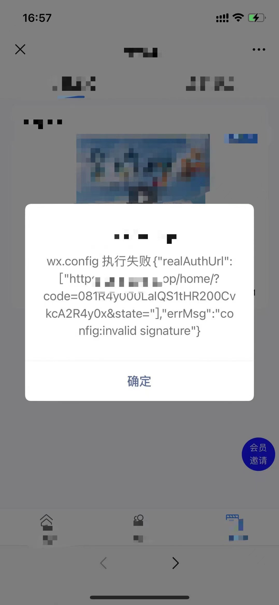

### 微信浏览器 h5 如何判断是否已经网页授权？如何授权？

判断是否已经网页授权：可以把openid存cookie或缓存，已存在就是授权过直接跳目的页；

如何授权：直接跳转地址
```
jumpUrl = encodeURIComponent(location.protocol + '//' + location.hostname + jumpUrl)
let authUrl = `https://open.weixin.qq.com/connect/oauth2/authorize?appid=${appId}&redirect_uri=${jumpUrl}&response_type=code&scope=snsapi_userinfo&state=${state}&connect_redirect=1#wechat_redirect`
window.location.href = authUrl
```

微信网页授权文档：
https://developers.weixin.qq.com/doc/offiaccount/OA_Web_Apps/Wechat_webpage_authorization.html


### 微信浏览器 h5 如何直接关闭？

```
function wxJSBridgeClose() {
  if (typeof WeixinJSBridge === 'undefined') {
    document.addEventListener('WeixinJSBridgeReady', function onBridgeReady() {
      document.removeEventListener('WeixinJSBridgeReady', onBridgeReady, false)

      WeixinJSBridge.call('closeWindow')
    }, false)
  } else {
    WeixinJSBridge.call('closeWindow')
  }
}
```


### 微信浏览器 h5 页面回退或前进事件 如何监听？

ios:

location跳转触发popstate; vue router不触发;

< 回退按钮亮，跳到前一个页面触发popstate; > 前进按钮亮，跳到下一个页面触发popstate;

<> 跳转都不会触发vue路由(beforeEach...)

箭头不亮不触发 popstate。

没有路由栈如何触发 popstate:
```
this.pushHistoryFn() // 为了能触发 popstate
window.addEventListener('popstate', this.watchPopState, false)
window.removeEventListener('popstate', this.watchPopState, false)

pushHistoryFn() {
    pushHistory()
    function pushHistory() {
        const state = {
            title: 'title',
            url: '#'
        }
        window.history.pushState(state, 'title', '#')
    }
}
```

Android：只有左返回按钮，不触发popstate，但会触发vue路由(beforeEach...)


### 微信浏览器 h5 左上角X按钮关闭事件 如何监听？

监听不了


### 微信浏览器 h5 iOS偶现 头部绿色进度条一直loading怎么回事?

不知道啥原因，有一次抓包时遇到了：
```

captureError connect  http tunnel to gateway.icloud.com.cn:443
captureError connect http tunnel to xp.apple.com:443
```

这种情况wx.config未生效，分享好友设置无效。

手動刷新页面后是好的，不loading了。


### 微信h5分享 转发给朋友 卡片 如何配置？
```
wx.config({
    debug: false, // 开启调试模式,调用的所有api的返回值会在客户端alert出来，报错也会alert。
    appId: data.appId,
    timestamp: data.timestamp,
    nonceStr: data.nonceStr,
    signature: data.signature,
    jsApiList: ['updateAppMessageShareData', 'chooseWXPay'] // 必填，需要使用的JS接口列表
})

wx.ready(() => { // 需在用户可能点击分享按钮前就先调用
    wx.updateAppMessageShareData({
        title: this.currentObj.title, // 分享标题
        desc: '描述非必填',
        link: this.shareLink,
        imgUrl: this.currentObj.coverImage, // 必填
        success: function() {
            // 设置成功
            // alert('设置成功')
        },
        fail: function(error) {
            console.log('分享设置失败：' + error.errMsg)
        }
    })
})
```
如果使用url链接打开的页面，分享出去不是卡片，还是链接。

从公众号进去分享就是卡片。


### 微信网页授权 invalid signature


签名用到的url必须和当前页面的url地址一样

从公众号底部菜单跳转授权h5地址，如果state没有设置，ios第一次进入目的页面url上是state=，再刷新就是state，导致第一次进来就报错，刷新反而好了。android正常。

解决：state=111（随便写一个）

随便写的state=1，页面竟然报错了：

不知道啥原因，改了个state=111好了。

JS-SDK说明文档：

https://developers.weixin.qq.com/doc/offiaccount/OA_Web_Apps/JS-SDK.html


### vue的beforeEach如何跳过某一个页面直接进入下一页？
```
// 跳微信授权页
goWxAuth() // 本来要进入的页面也在历史栈里，展示空白页面；授权页面回退会到空白页


next() // 会执行本来要进入的初始页面代码
goWxAuth() // 授权页面回退会到初始页面


next() // 最终只有home页面
location.href = '/home'


next() // 最终只有baidu页面
location.href = 'https://www.baidu.com'


next() 
// android 只展示 /home 页面，页面底部< 返回直接closeWindow
// 在这里_blank ios没反应，还在初始页面无法打开/home
window.open('/home', '_blank') 


next({ // 直接进入第二个/home，返回还是/home
    path: '/home'
})

next({ // 直接替换初始页面进入到/home
    path: '/home',
    replace: true
})

```

### 如何记录视频播放进度，下次从观看位置继续播放？

监听页面回退，调接口记录视频播放时长；

但是有场景无法监听到页面回退或关闭，比如微信h5左上角关闭事件，那就在视频播放时使用定时器定时调接口；
```
this.player.on('play', (e) => {
    this.recordTimer = setInterval(() => {
        ...
    }, 15000)
})
```

### 承接上个问题，退出微信h5页面到后台，再次打开页面，定时器开启多个产生混乱
页面再次打开，会再次进入播放器play事件；又执行了定时器操作；

解决办法：监听页面隐藏，关闭定时器；
```
document.addEventListener('visibilitychange', () => {
    if (document.visibilityState === 'visible') {
        // alert('页面显示')
    } else if (document.visibilityState === 'hidden') {
        this.recordTimer && clearInterval(this.recordTimer)
    }
})
```
或者使用一个变量，判断开启过定时器，就return，不执行 this.player.on('play',...)里的代码。
