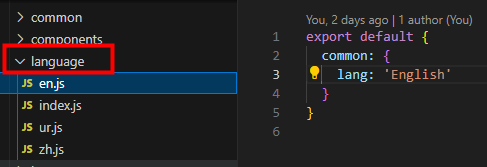
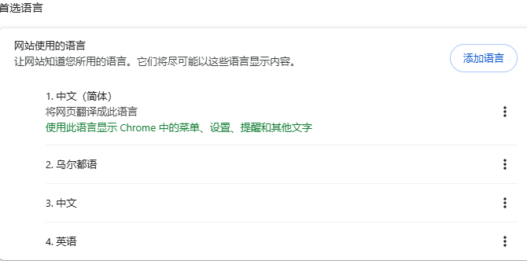
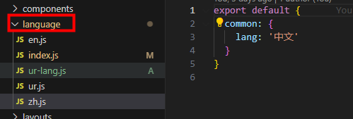

# 国际化

---
<font size=4>和element-ui组件库配合使用：</font>

### 1. npm i @nuxtjs/i18n@7 --save

nuxt2 对应 @nuxtjs/i18n@7

### 2. 配置多语言


### 3. 创建 i18n 实例
```
import enLocale from 'element-ui/lib/locale/lang/en'
import zhLocale from 'element-ui/lib/locale/lang/zh-CN'

import zh from './zh'
import en from './en'

const i18n = {
  locales: ['en', 'zh'],
  strategy: 'no_prefix', // 不使用语言前缀
  // defaultLocale: 'zh', // 默认获取navigator.language的值
  vueI18n: {
    // fallbackLocale: 'en', // 回退策略
    messages: {
      zh: {
        ...zh,
        ...zhLocale
      },
      en: {
        ...en,
        ...enLocale
      }
    }
  },
  // detectBrowserLanguage: {
    // useCookie: true // 默认存cookie：i18n_redirected,例如zh
  // }
}

export default i18n 
```
如果手动删除cookie(i18n_redirected)，那默认语言会取浏览器设置的。


### 4. nuxt.config.js i18n 配置
```
import i18n from '../../src/language'

modules: [
    '@nuxtjs/axios',
    '@nuxtjs/style-resources',
    [
      '@nuxtjs/i18n',
      i18n
    ]
]
```

### 5. element-ui 组件配置多语言切换
```
import Vue from 'vue'
import Element from 'element-ui'
import locale from 'element-ui/lib/locale/lang/zh-CN' // 默认

export default ({
  app
}) => {
  Vue.use(Element, {
    locale,
    i18n: (key, value) => app.i18n.t(key, value)
  })
}
```
### 6. 切换语言
```
<button @click="translateLang('zh')">切换为中文</button>
<button @click="translateLang('en')">切换为英文</button>

translateLang(lang) {
  this.$i18n.setLocale(lang)
}
```

### 7. 使用
```
<span>{{ $t('common.lang') }}</span>

${this.$t('common.orderPrice')}
```
在 js文件中 中使用
```
window.$nuxt.$t('common.lang')
```

---
<font size=4>和vant组件库配合使用：</font>

### 1. npm i @nuxtjs/i18n@7 --save

nuxt2 对应 @nuxtjs/i18n@7

### 2. 配置多语言


### 3. 创建 i18n 实例
```
import zh from './zh'
import en from './en'
import ur from './ur'

// 默认语言取navigator.language的值，匹配不到是en
const i18n = {
  locales: ['en', 'zh', 'ur'],
  strategy: 'no_prefix', // 不使用语言前缀
  vueI18n: {
    messages: {
      zh,
      en,
      ur
    }
  },
  detectBrowserLanguage: {
    cookieKey: 'test-h5-i18n'
  }
}

export default i18n
```

### 4. nuxt.config.js i18n 配置
```
import i18n from '../../src/language'

modules: [
    '@nuxtjs/axios',
    [
      '@nuxtjs/i18n',
      i18n
    ]
]
```

### 5. vant 组件配置多语言切换
```
import Vue from 'vue'
import Vant from 'vant'
import 'vant/lib/index.css'

// 组件库多语言
import { Locale } from 'vant'
import enUS from 'vant/es/locale/lang/en-US'
import zhCN from 'vant/es/locale/lang/zh-CN'
import Ur from '../language/ur-lang'
function locales(lang) {
  let language = lang || navigator.language
  if (language === 'zh' || language === 'zh-CN') {
    Locale.use('zh', zhCN)
  } else if (language === 'ur') {
    Locale.use('ur', Ur)
  } else {
    Locale.use('en', enUS)
  }
}
// 保证业务和组件库默认语言统一
locales(getCookie('test-h5-i18n') || navigator.language) // 初始化

function getCookie(name) {
  let matches = document.cookie.match(new RegExp(
    '(?:^|; )' + name.replace(/([\.$?*|{}\(\)\[\]\\\/\+^])/g, '\\$1') + '=([^;]*)'
  ))
  return matches ? decodeURIComponent(matches[1]) : undefined
}

Vue.use(Vant)
Vue.prototype.$Locale = locales
```
### 6. 切换语言
```
button @click="translateLang('zh')">切换为中文</button>
<button @click="translateLang('en')">切换为英文</button>
<button @click="translateLang('ur')">切换为乌尔都语</button>

translateLang(lang) {
  this.$i18n.setLocale(lang) // 业务
  this.$Locale(lang) // vant组件库
}
```

### 7. 使用
```
<span>{{ $t('common.lang') }}</span>
```
在 js文件中 中使用
```
export function testUtil() {
  return window.$nuxt.$t('common.lang')
}

import { testUtil } from '@/utils/index'
methods: {
  testUtil: testUtil // 不要把方法赋值给变量，会失去响应式
}

<div>{{ testUtil() }}</div>
```

---
参考文档：
https://i18n.nuxtjs.org/docs/getting-started