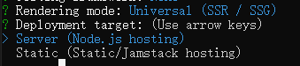
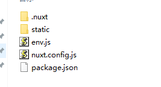

- [Nuxt.js](https://www.nuxtjs.cn/guide)

### 环境变量

- 默认环境变量（项目脚手架里定义的，依赖 dotenv）：
```
"scripts": {
    "dev": "nuxt", // development
    "build": "nuxt build", // production
    "start": "nuxt start"
}
```

- 修改环境变量：
```
npm install cross-env --save-dev
```
```
"dev": "cross-env NODE_ENV=development nuxt",
"upload": "cross-env NODE_ENV=production node build/deploy/index.js",
"upload:stage": "cross-env NODE_ENV=stage node build/deploy/index.js",
```
代码中访问：
```
process.env.NODE_ENV
```

### 打包部署方式
```
"nuxt": "^2.15.8"

npx create-nuxt-app demo-project 
快速创建项目
```



#### 1. Universal (SSR / SSG) 和 Server (Node.js hosting)

> SSR (服务端渲染)

即：
```
ssr: true         （默认）
target: 'server'  （默认）
```


打包命令：
```
nuxt build
```

服务端启动项目：
```
pm2 start npm --name "你的项目名称" -- run start
```
打包文件本地启动项目：
```
npm run start
```

放在服务器端文件：



#### 2. Universal (SSR / SSG) 和 Static (Static/Jamstack hosting)

> SSG(静态站点生成)

即：
```
ssr: true         （默认）
target: 'static'  
```

打包命令:
```
nuxt generate
```

直接把dist目录放到服务器。

如果要生成含有动态[id].vue的页面：
```
generate: {
  // routes: ['/aboutus', '/news', '/news/1']
  async routes() {
    // 假设 API 返回 新闻id 数组
    const response = await fetch('https://api.example.com/ids') 
    const newIds = await response.json()
    return ['/aboutus', '/news'].concat(newIds.map(id => `/news/${id}`))
  }
}
```

#### 3. Single Page App 和 Static (Static/Jamstack hosting)

> CSR(客户端渲染)

即：
```
ssr: false         
target: 'static'  
```

打包命令：
```
nuxt build
```

#### 4. Single Page App 和 Server (Node.js hosting)

即：
```
ssr: false         
target: 'server'  （默认）
```