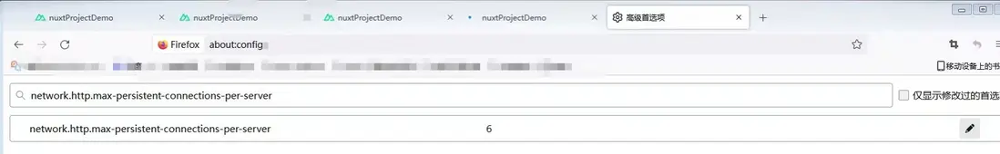

### 问题来源

nuxt 项目本地启动 npm run dev，本地localhost多开几个标签页，会出现卡死或一直转圈的情况，如果关闭其中一个tab标签，卡死的tab标签页就会立即加载完成，控制台看不到任何错误信息。

### 问题分析

浏览器对同一个主机有连接数限制。

### 解决方案

- Chrome浏览器目前没有解决方法；

- Firefox浏览器可以修改，在浏览器输入 about:config，在文本框输入 network.http.max-persistent-connections-per-server，默认最大连接数是6，比如改成10保存。

