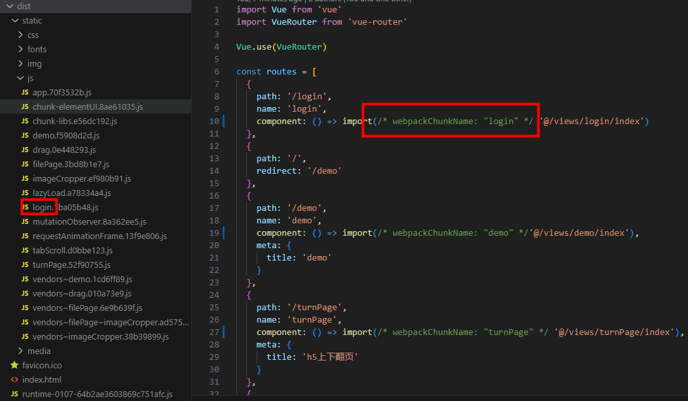

- [webpack](https://www.webpackjs.com/configuration/output/#outputclean)

<!-- https://webpack.docschina.org/guides/code-splitting/ -->

### 构建方式

Webpack 先打包再启动开发服务器。

### 环境变量
```
.env.[mode] 
```
只有 NODE_ENV，BASE_URL 和以 VUE_APP_ 开头的变量将通过 webpack.DefinePlugin 静态地嵌入到客户端侧的代码中。

可以通过传递 --mode 选项参数为命令行覆写默认的模式。
```
vue-cli-service build --mode release
```

代码中访问：
```
process.env.NODE_ENV

process.env.BASE_URL

process.env.VUE_APP_BASE_API
```

### 配置全局使用 less 变量
安装 less、less-loader 模块

vue.config.js:
```
module.exports = {
  css: {
    loaderOptions: {
      less: {
        additionalData: `@import "@/public.less";`
      }
    }
  }
}
```

### 加载图片
Webpack 使用自己的模块解析系统
```
// 动态 require
const imageUrl = require('@/assets/img1.jpg')

```
```
// 静态导入
import staticImage from '@/assets/static.png'
```

### 热更新

Webpack 的热更新通常需要借助 webpack-dev-server 等插件，在一些情况下配置起来比较复杂。

### 打包配置

```
output: {
  filename: `[name]` + '-' + Timestamp + '-[hash]' + '.js', // 入口文件
 // chunkFilename: `[name].[hash].js`
},
```

路由懒加载设置 webpackChunkName，chunkFilename 就会变成对应的值，否则默认是 chunk.[hash]

```
{
  path: '/login',
  name: 'login',
  component: () => import(/* webpackChunkName: "login" */ '@/views/login/index')
}
```



### 拆包

```
optimization: {
  splitChunks: {
    chunks: 'all',
    name: 'vendors',
    minSize: 10000, // 设置拆分的最小文件大小
    maxSize: 0, // 不限制最大文件大小，让webpack自动决定
    minChunks: 1, // 每个模块至少被多少个chunk引用才会被拆分
    cacheGroups: {
      vendors: {
        test: /[\\/]node_modules[\\/]/,
        priority: -10, // 设置较低的优先级，保证核心代码先加载
        enforce: true, // 强制执行拆分
        reuseExistingChunk: true // 重用已存在的chunk
      }
    }
  }
}
```

这样体积较大的 vendors 文件就被拆分为几个小的 vendors 文件。
