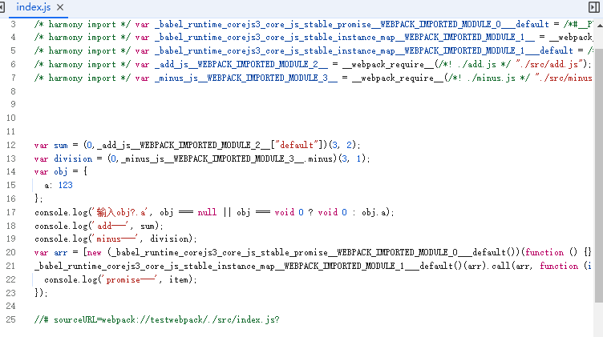

### 初始化项目
```
npm init -y
```

### 安装 模块

打包命令 "webpack" （默认 webpack --config webpack.config.js）：
```
npm i webpack webpack-cli --save-dev
```

引用插件生成一个 HTML5 文件,在 body 中使用 script 标签引入 webpack 生成的 bundle：
```
npm i html-webpack-plugin --save-dev
```

babel 将代码里的ES6+语法转为es5：
```
npm install --save-dev @babel/core babel-loader @babel/preset-env
```

babel 转换API（比如 Promise）：
```
npm i @babel/plugin-transform-runtime @babel/runtime-corejs3 --save-dev
```

### 代码展示
webpack.config.js：
```
const path = require('path')
const HtmlWebpackPlugin = require('html-webpack-plugin');

module.exports = {
  mode: 'development',
  entry: { // 打包-入口
    main: './src/index.js'
  },
  output: { // 打包-出口 dist目录下
    path: path.resolve(__dirname, 'dist'),
    filename: '[name].js'
  },
  module: {
    rules: [
      {
        test: /\.(js)$/,
        exclude: /node_modules/,
        use: {
          loader: 'babel-loader',
          // options: { // 在.babelrc中配置
          //   presets: ['@babel/preset-env']
          // }
        }
      }
    ]
  },
  plugins: [
    new HtmlWebpackPlugin({
      template: './index.html', // 模板文件路径
      inject: 'body' // 插入的位置
    })
  ]
}
```

.babelrc：
```
{
  "presets": [
    [
      "@babel/preset-env"
    ]
  ],
  "plugins": [
    [
      "@babel/plugin-transform-runtime",
      {
        "corejs": 3
      }
    ]
  ]
}
```

### 目录结构


### 效果展示


### webpack打包后代码

