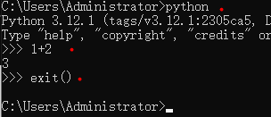
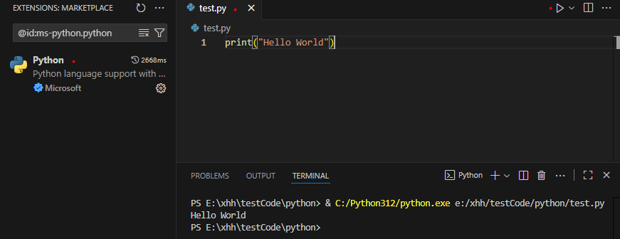

# Python

## 安装

https://www.python.org/downloads/

```
python --version
# 或
python -V
```

## 运行
在终端运行：
```
python
```


在 VSCode 中运行：

先安装 Microsoft 出品的 Python 插件，然后新建 .py 文件，点击右上角运行按钮。 


## 变量
变量名支持字母、下划线、数字。但不能在变量名里加入空格，不能以数字开头。

变量名 = 值
```
msg = "你好"
print(msg)
```

## 注释
```
# 这是单行注释

"""
这是多行注释
"""
```

## 条件判断
```
grade = 98

if grade >= 90:
    print("优")
elif 80 <= grade < 90:
    print("良")
elif 60 <= grade < 80:
    print("中")
else:
    print("差")
```

## 条件运算符

与：and

或：or

取反：not

## 循环
```
for 项 in 序列:
    代码块
```

## 列表
```
food_list = ["糖果", "巧克力", "薯片", "棒棒糖"]

# 获取列表元素
food_list[0]

# len: 查看列表长度
len(food_list)

# append: 在列表末尾添加元素
food_list.append("可乐")

# insert: 在列表指定位置插入元素
food_list.insert(1, "果冻")

# remove: 删除指定值的元素
food_list.remove("薯片")

# pop: 删除指定索引的元素
food_list.pop(1)
```

## 字典
```
grade = {
    "html": 100,
    "js": 99,
    "css": 88
}

print(grade['js'])
```

## 函数
```
# 定义函数
def 函数名(参数1, 参数2, ...):
    代码块

# 调用函数
函数名()
```

## 引入模块
```
import 模块名
```
