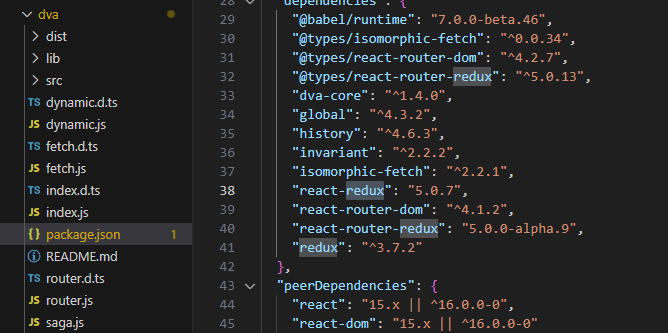
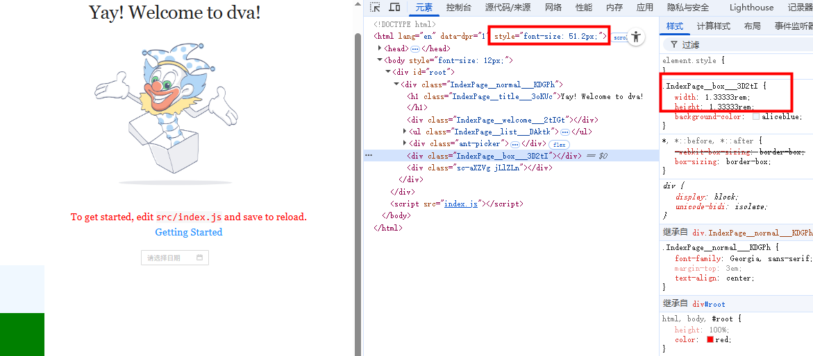
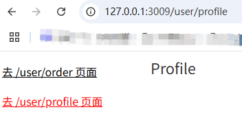
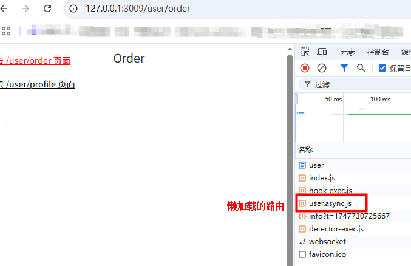
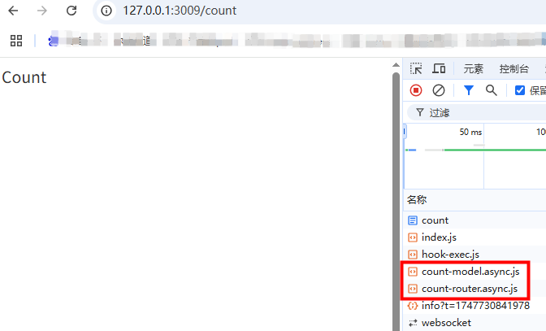
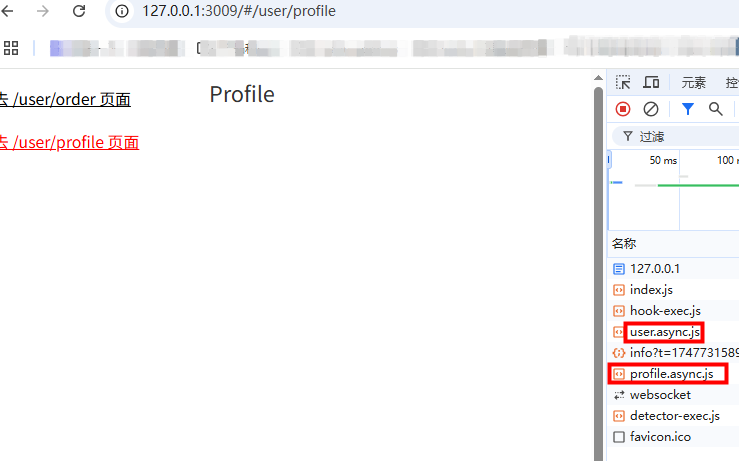
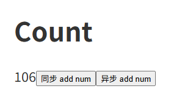
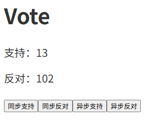
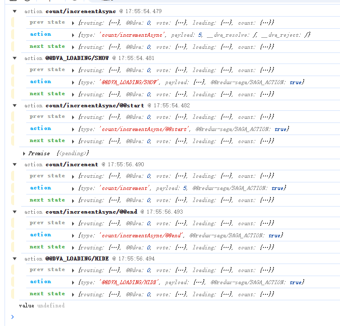

# dva

内置了 redux、redux-saga、react-redux、react-router-dom 等


## 全局安装 dva-cli
```
npm install dva-cli -g

dva -v
```

## 新建项目
```
dva new myproject
```

## 配置支持 antd
```
npm i antd@4 antd-icons babel-plugin-import@1
```
手动配置 antd 按需导入

.webpackrc.js:
```
export default {
  extraBabelPlugins: [
    // antd手动按需导入
    [
      "import",
      {
        libraryName: "antd",
        libraryDirectory: "es",
        style: "css",
      }
    ]
  ]
}
```
引入 antd 组件：
```
import { DatePicker } from "antd"

const onChange = (date, dateString) => {
    console.log(date, dateString);
}
<DatePicker onChange={onChange} />
```
汉化：

src/router.js:
```
import { ConfigProvider } from 'antd';
import zhCN from 'antd/es/locale/zh_CN';

function RouterConfig({ history }) {
  return (
    <ConfigProvider locale={zhCN}>
       <Router history={history}>
        <Switch>
          <Route path="/" exact component={IndexPage} />
        </Switch>
      </Router>
    </ConfigProvider>
  );
}
```
https://4x.ant.design/docs/react/i18n-cn

## 配置 less
```
npm i less@4 less-loader@8
```

## 配置 css 模块化
.webpackrc.js:
```
// disableCSSModules: true, // 关闭 css 模块化
disableCSSSourceMap: true, // 禁用 css的sourcemap生成
```
https://github.com/sorrycc/roadhog/blob/master/README_zh-cn.md

## 配置代理
.webpackrc.js:
```
proxy: {
    "/api": {
      target: "https://new-api",
      changeOrigin: true,
      ws: true,
      pathRewrite: { "/api": "" },
    }
}
```

## 配置移动端适配
```
npm i lib-flexible@0 postcss-pxtorem@5 babel-plugin-styled-components-px2rem@1 styled-components@5
```
src/router.js:
```
import 'lib-flexible'
```
.webpackrc.js:
```
import px2rem from "postcss-pxtorem";

extraPostCSSPlugins: [ // css文件 px 转 rem
    px2rem({
      rootValue: 75,
      propList: ["*"],
    }),
],
extraBabelPlugins: [
    ...
    [
      "styled-components-px2rem", // styled-components px 转 rem
      {
        "rootValue": 75
      }
    ]
]
```
css文件 px 转 rem：
```
.box {
  width: 100px;
  height: 100px;
  background-color: aliceblue;
}

<div className={styles.box}></div>
```
styled-components px 转 rem:
```
import styled from "styled-components";

const Ok = styled.div`
    width:100px;
    height:100px;
    background-color: green;
`;
function IndexPage() {
    ...
}

<Ok></Ok>
```


## ES6和CSS3兼容处理
roadhog 脚手架默认支持ES6和CSS3。处理时依赖设置的浏览器兼容列表。但是有些语法（如装饰器语法），还需要我们安装单独的babel插件处理。
- ES6: babel-loader、babel-preset-react-app
- CSS3: postcss-loader、autoprefixer

.webpackrc.js:
```
env: { // 浏览器兼容列表
    development: {
      extraBabelPlugins: ["dva-hmr"],
      browserslist: [
        "last 1 chrome version",
        "last 1 firefox version",
        "last 1 safari version",
      ],
    },
    production: {
      extraBabelPlugins: ["transform-remove-console"],
      browserslist: [
        "> 0.2%",
        "not dead",
        "not ie <= 8"
      ],
    },
}
```
```
npm i @babel/polyfill@7

import '@babel/polyfill'
```

## 配置 public/index.ejs
把 public/index.html 改成 public/index.ejs，就可以把手动引入的 index.css、index.js 去掉。
同时需要修改 .webpackrc.js:
```
hash: true, // 打包的文件带有 hash 值，避免缓存
html: {
    template: './public/index.ejs'
},
```

## 基于cross-env设置环境变量
```
npm i cross-env@7

"start": "cross-env HOST=127.0.0.1 PORT=3009 roadhog server",
```
http://127.0.0.1:3009/#/

## 配置路由模式
路由默认是 hash 模式，如果改为history模式：
```
npm i history@4
```
src/index.js:
```
import createHistory from 'history/createBrowserHistory'

const app = dva({
    history: createHistory() // history路由模式
});
```

## 配置一级路由和二级路由
一级路由：

src/router.js:
```
import { Router, Route, Switch, Redirect } from 'dva/router';

import Vote from './routes/Vote';
import User from './routes/User'
import Count from './routes/Count';

function RouterConfig({ history }) {
  return (
    <ConfigProvider locale={zhCN}>
       <Router history={history}>
        <Switch>
          {/* exact 表示精确匹配 */}
          <Route path="/" exact component={Vote} />
          <Route path="/count" component={Count} />
          {/* user 不能加 exact，因为有子页面 /user/Order */}
          <Route path="/user" component={User} />
          {/* 以上路由匹配不到重定向到首页 */}
          <Redirect from="*" to="/" />
        </Switch>
      </Router>
    </ConfigProvider>
  );
}
```
二级路由：

src/routes/User.jsx:
```
import React from 'react';
import styled from 'styled-components'
import { NavLink, Switch, Route, Redirect } from "dva/router";
import Order from './user/Order'
import Profile from './user/Profile'

const UserBox = styled.div`
    display: flex;
    .box {
       width: 300px;
        a {
            display: block;
            color: #000;
            line-height: 60px;
            font-size: 22px;
            &.active {
                color: red
            }
        }
    }
`;

function User(props) {
    return (<UserBox>
        <div className='box'>
            <NavLink to='/user/order'>去 /user/order 页面</NavLink>
            <NavLink to='/user/profile'>去 /user/profile 页面</NavLink>
        </div>
        <div className='content'>
            <Switch>
                <Redirect from='/user' exact to='/user/order' />
                <Route path='/user/order' component={Order} />
                <Route path='/user/profile' component={Profile} />
            </Switch>
        </div>
    </UserBox>);
}
export default User
```


## 配置路由懒加载
src/router.js:
```
import dynamic from 'dva/dynamic';

function RouterConfig({ history, app }) {
  const LazyCount = dynamic({
    app,
    models: () => [import(/* webpackChunkName:'count-model' */'./models/count')], // model 懒加载
    component: () => import(/* webpackChunkName:'count-router' */'./routes/Count'), // 路由懒加载
  });
  const LazyUser = dynamic({
    app,
    component: () => import(/* webpackChunkName:'user' */'./routes/User'), // 路由懒加载
  });
  return (
    <ConfigProvider locale={zhCN}>
       <Router history={history}>
        <Switch>
          <Route path="/" exact component={Vote} />
          <Route path="/count" component={LazyCount} />
          <Route path="/user" component={LazyUser} />
        </Switch>
      </Router>
    </ConfigProvider>
  );
}

export default RouterConfig;
```



二级路由懒加载：
```
import dynamic from 'dva/dynamic';

const LazyOrder = dynamic({
    app: window.app,
    modles: () => [],
    component: () => import(/* webpackChunkName:'order' */'./user/Order')
});
const LazyProfile = dynamic({
    app: window.app,
    modles: () => [],
    component: () => import(/* webpackChunkName:'profile' */'./user/Profile')
});

function User(props) {
    return (<UserBox>
        <div className='box'>
            <NavLink to='/user/order'>去 /user/order 页面</NavLink>
            <NavLink to='/user/profile'>去 /user/profile 页面</NavLink>
        </div>
        <div className='content'>
            <Switch>
                <Redirect from='/user' exact to='/user/order' />
                <Route path='/user/order' component={LazyOrder} />
                <Route path='/user/profile' component={LazyProfile} />
            </Switch>
        </div>
    </UserBox>);
}
export default User
```



## 根据路由表生成路由规则
src/routerRoutes.js:
```
import Vote from './routes/Vote'
import dynamic from 'dva/dynamic'
// 路由懒加载
function lazy(component, models) {
  if (models === 'undefined') models = ()=>[]
  return dynamic({
    app: window.app,
    models,
    component
  })
}
const routes = [
  {
    path: '/',
    component: Vote,
    exact: true,
    meta: {
      title: '首页'
    }
  },
  {
    path: '/count',
    component: lazy( // 组件懒加载、model懒加载
      () => import(/* webpackChunkName:'count-router' */ './routes/Count'),
      () => [import(/* webpackChunkName:'count-model' */ './models/count')]
    ),
    meta: {
      title: '计数器'
    }
  },
  {
    path: '/user',
    component: lazy(
      () => import(/* webpackChunkName:'user' */ './routes/User'),
    ),
    meta: {
      title: '个人中心'
    },
    children: [
      {
        path: '/user', // 重定向
        exact: true,
        redirect: '/user/order'
      },
      {
        path: '/user/order',
        component: lazy(
          () => import(/* webpackChunkName:'order' */ './routes/user/Order'),
        ),
        meta: {
          title: '我的订单'
        },
      },
      {
        path: '/user/profile',
        component: lazy(
          () => import(/* webpackChunkName:'profile' */ './routes/user/Profile'),
        ),
        meta: {
          title: '我的信息'
        }
      }
    ]
  },
  {
    path: '*',
    redirect: '/' // 以上路由匹配不到重定向到首页
  }
]

export default routes
```
src/router.js:
```
import React from 'react';
import { Router, Route, Switch, Redirect } from 'dva/router';
import routes from './routerRoutes';

// antd 汉化
import { ConfigProvider } from 'antd';
import zhCN from 'antd/es/locale/zh_CN';
import 'lib-flexible'

const Element = function Element(props) {
  let { component:Component, history, location, match } = props
  // 登录状态校验 ...

  let config = {history, location, match}
  return <Component {...config}/>
}

// 一级路由规则
const createRoute = (routes) => {
  return <Switch>
    {
      routes.map((item, index) => {
        let { path, exact, component, meta, redirect } = item
        let config = {}
        if (redirect) {
          // 重定向
          config = {
            from: path,
            to: redirect
          }
          if (exact) {
            config.exact = exact
          }
          return <Redirect key={index} {...config}/>
        }
        // 正常路由规则
        config = {
          path
        }
        if (exact) {
          config.exact = exact
        }
        return <Route key={index} {...config} render={props=>{
          // 修改页面标题
          let title = meta && meta.title || 'dva project'
          document.title = title

          // 渲染组件
          return <Element {...props} {...item}/>
        }}></Route>
      })
    }
  </Switch>
}
// console.log('createRoute', createRoute(routes))

function RouterConfig({ history, app }) {
  return (
    <ConfigProvider locale={zhCN}>
       <Router history={history}>
        {
          createRoute(routes)
        }
      </Router>
    </ConfigProvider>
  );
}

// 二级路由规则
export const LevelTwoRouterConfig = function LevelTwoRouterConfig({path}) {
  let result = routes.find(item => item.path === path)
  let children = result && result.children
  if (!children) return null

  return createRoute(children)
}

export default RouterConfig;
```
src/routes/User.jsx:
```
import React from 'react';
import styled from 'styled-components'
import { NavLink } from "dva/router";
import { LevelTwoRouterConfig } from '../router';

const UserBox = styled.div`
    display: flex;
    .box {
       width: 300px;
        a {
            display: block;
            color: #000;
            line-height: 60px;
            font-size: 22px;
            &.active {
                color: red
            }
        }
    }
`;

function User(props) {
    return (<UserBox>
        <div className='box'>
            <NavLink to='/user/order'>去 /user/order 页面</NavLink>
            <NavLink to='/user/profile'>去 /user/profile 页面</NavLink>
        </div>
        <div className='content'>
            {/* 二级路由规则 */}
            <LevelTwoRouterConfig path="/user" />
        </div>
    </UserBox>);
}
export default User
```

## 路由跳转及传参
src/routes/user/Order.jsx:
```
import { Button } from 'antd'
import { Link } from 'dva/router'
function Order(props) {
  // 路由级别组件
  console.log('props', props)
  let { history } = props
  return (
      <div>
          <h1>Order</h1>
          {/* 声明式导航 */}
          <Link to={{
              pathname: '/user/profile',
              search: '?name=xhh&age=20'
          }}>to profile</Link>

          {/* 点击按钮跳转，叫编程式导航 */}
          <Button type="primary" onClick={()=> {
              history.push({
                pathname: '/user/profile',
                search: '?name=xhh&age=21'
              })
          }}>to profile(url传参)</Button>

          <Button type="primary" onClick={()=> {
              history.push({
                pathname: '/user/profile',
                state: { // 隐式传参，url中不会显示，刷新页面时参数就没有了，一般不用
                  name: 'xhh',
                  age: 22
                }
              })
          }}>to profile(隐式传参)</Button>

          <Button type="primary" onClick={()=> {
              history.push('/user/profile/xhh/23')
          }}>to profile(动态路由)</Button>
      </div>
  );
}
export default Order
```
src/routes/user/Profile.jsx:
```
import Demo from './Demo'
function Profile(props) {
    let { location, match } = props
        // search ?传递的参数
        // state  隐式传参
        // pathname
    console.log('location', location)
    console.log('动态参数', match.params)
    return (
        <div>
            <h1>Profile</h1>
            <Demo />
        </div>
    );
}
export default Profile
```
src/routes/user/Demo.js:
```
import { withRouter } from "dva/router";

// 非路由级别组件，没有参与路由的配置，props没有location等字段
// withRouter 是高阶组件，这样设置props就有了location等字段
function Demo(props) {
    console.log('demo中的props', props)
    return (
        <div>
            <h1>Demo</h1>
        </div>
    );
}
export default withRouter(Demo)
```
## react-router-redux

routerRedux是react-router-redux中提供的对象，这个对象包含路由跳转的方法：
- go
- goBack
- goForward
- push
- replace
- ...

相比 props.history ，routerRedux不仅可以在组件中实现跳转，还可以在 redux 操作中实现路由跳转。它本身就是redux和router的结合操作。
- 在 redux 中使用
  - yield put(routerRedux.push(...))
- 在组件中使用
  - dispatch(routerRedux.push(...))
  - 基于dispatch派发才会跳转，执行 routerRedux.push(...) 返回的是一个 action 对象

```
import { Button } from 'antd'
import { routerRedux } from 'dva/router'
import { connect } from 'dva'
// connect高阶组件: props里面就有了dispatch
function Order(props) {
  let { dispatch } = props
  return (
      <div>
          <div>
            {/* 在组件中使用，routerRedux.push()返回一个action对象 */}
            <Button type="primary" onClick={()=> {
                dispatch(
                  routerRedux.push('/user/profile/xhh/23')
                )
            }}>to profile(dispatch)</Button>
          </div>
      </div>
  );
}
export default connect()(Order)
```

## dva中的models

### 注册model

初始化就加载：

src/index.js：
```
import voteModel from './models/vote'

const app = dva({
  initialState: {
    count: { // model不能使用懒加载，count加载要改为 app.model(countModel) 才生效（优先级比model里设置的状态高）
      num: 20
    }
  }
});

app.model(voteModel)
```
model懒加载：
```
{
  path: '/count',
  component: lazy( // 组件懒加载、model懒加载
    () => import(/* webpackChunkName:'count-router' */ './routes/Count'),
    () => [import(/* webpackChunkName:'count-model' */ './models/count')]
  ),
  meta: {
    title: '计数器'
  }
},
```
### model 使用实例
src/models/count.js:
```
const delay = (interval=1000) => {
  return new Promise(resolve => {
    setTimeout(() => {
      resolve()
    }, interval)
  })
}
export default {
  namespace: 'count', // 模块名
  state: { // 状态
    num: 100
  },
  subscriptions: { // 订阅方法
    setup({ dispatch, history }) { // model设置了懒加载，访问到该页面才会执行
    }
  },
  reducers: { // 同步修改状态的方法 
    // state: 本模块状态
    // action: 包含 type 和 payload
    increment(state, { payload = 1 }) {
      // state = {...state} // copy一份
      // state.num = payload

      // // 更新 state
      // return state
      // 或
      return {...state, num: state.num + payload}

      /*
        不要直接修改 state，不生效，因为 redux 会进行浅比较
        state.num += payload
        return state
      */
    }
  },
  effects: { // 异步修改状态的方法
    incrementAsync: [
      function* ({payload}, {call, put, select}) {
        yield call(delay, 2000)
        yield put({
          type: 'increment', 
          payload
        })
        return '返回值haha'
      },
      // 第二项指定监听器的类型
      // {type: 'throttle', ms: 500}
      { type: 'takeLatest' } // 多次点击只有最有一次生效（防抖）
    ],
    // *incrementAsync({payload}, {call, put, select}) { // 没有防抖
    //   // let state = yield select() // 获取所有 model 状态
    //   let state = yield select(state => state.count) // 只获取 count 状态
    //   yield call(delay, 2000)
    //   yield put({
    //     type: 'increment',
    //     payload
    //   })
    // }
  }
}
```
src/routes/user/Count.jsx:
```
import { connect } from "dva";
function Count({num, dispatch}) {
    return (
        <div style={{padding: '20px'}}>
            <h1>Count</h1>
            <div>
                <span>{num}</span>
                <button onClick={() => {
                    console.log(dispatch({type: 'count/increment', payload: 1})) // 返回值是 action
                }}>同步 add num</button>
                <button onClick={() => {
                    // 异步派发 返回值是 Promise
                    console.log(dispatch({type: 'count/incrementAsync', payload: 5}).then((value) => {
                        console.log('value', value) // 返回值haha
                    }))
                }}>异步 add num</button>
            </div>
        </div>
    );
}
// state => state.count 把仓库中count模块中的状态，映射到组件的props
// connect第二个参数，一般不写
export default connect(state => state.count)(Count)
```


### subscriptions

src/models/vote.js:
```

const delay = (interval=1000) => {
  return new Promise(resolve => {
    setTimeout(() => {
      resolve()
    }, interval)
  })
}

export default {
  namespace: 'vote', // 模块名，获取状态和进行派发的标识
  state: { // 状态
    supNum: 10,
    oppNum: 100
  },
  subscriptions: { // 订阅方法，页面一加载或刷新就会执行(路由切换不执行)
    setup({ dispatch, history }) { // 订阅方法
      // 监听路由切换(这样加载和路由切换时都会执行): supNum 11 12 ...
      history.listen(({ pathname }) => {
        if (pathname === '/') {
          dispatch({type: 'support'})
        }
      })
    }
    // setup({ dispatch, history }) { // 订阅方法
    //   // 监听路由切换(这样加载和路由切换时都会执行): supNum 11 12 ...
    //   let unlisten = history.listen(async ({ pathname }) => {
    //     if (pathname === '/') {
    //       await delay(2000)
    //       dispatch({type: 'support'})

    //       // 移除监听器
    //       unlisten();
    //     }
    //   })
    // }
  },
  reducers: { // 同步修改状态的方法（类似 vuex mutation）
    support(state) {
      return {
        ...state,
        supNum: state.supNum + 1
      }
    },
    oppose(state) {
      return {
        ...state,
        oppNum: state.oppNum + 1
      }
    }
  },
  effects: { // 异步修改状态的方法（类似 vuex action）
    *supportAsync(_, {call, put}) {
      yield call(delay, 2000)
      yield put({
        type: 'support'
      })
    },
    opposeAsync: [
      function* (_, {call, put}) {
        yield call(delay, 2000)
        yield put({
          type: 'oppose'
        })
      },
      {type: 'takeLatest'}
    ]
  }
}
```
src/routes/Vote.jsx:
```

import { connect } from "dva";
function Vote({supNum, oppNum, dispatch}) {
    return (
        <div>
            <h1>Vote</h1>
            <div>
                <p>支持：{ supNum }</p>
                <p>反对：{ oppNum }</p>
            </div>
            <div>
                <button onClick={() => {
                    dispatch({type: 'vote/support'});
                }}>同步支持</button>
                <button onClick={() => {
                    dispatch({type: 'vote/oppose'});
                }}>同步反对</button>
                <button onClick={() => {
                    dispatch({type: 'vote/supportAsync'});
                }}>异步支持</button>
                <button onClick={() => {
                    dispatch({type: 'vote/opposeAsync'});
                }}>异步反对</button>
            </div>
        </div>
    );
}
export default connect(state => state.vote)(Vote)
```


## dva-loading 插件
src/index.js:
```
import createLoading from 'dva-loading'

app.use(createLoading()); // 全局state中就有 loading 状态了
```
src/routes/Count.jsx:
```
import { connect } from "dva";
import { Button } from 'antd'
function Count({num, loading, dispatch}) {
    // 和异步操作关联
    loading = loading.effects['count/incrementAsync']
    return (
        <div>
            <div>
                <Button type="primary" loading={loading} onClick={() => {
                    console.log(dispatch({type: 'count/incrementAsync', payload: 5}).then((value) => {
                        console.log('value', value) // 返回值haha
                    }))
                }}>异步 add num</Button>
            </div>
        </div>
    );
}
export default connect(state => {
    return {
        ...state.count,
        loading: state.loading
    }
})(Count)
```
点击“异步 add num”按钮，按钮上会出现loading，异步操作(2s)后，loading消失，同时打印value。

## redux-logger 中间件
src/index.js:
```
import createLogger from 'redux-logger'

const app = dva({
    onAction: createLogger() // 调试 redux
});
```
派发时打印的日志：
