# Next.js

| 模块             | 版本 |
| ---------------- | ---- |
| node             | 18+  |
| next             | 14+  |
| react            | 18+  |
| react-dom        | 18+  |

## 布局Layout和模板Template

### Layout
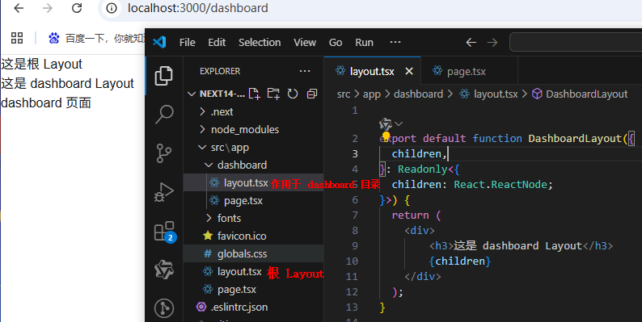

### Template
不会保留内部状态

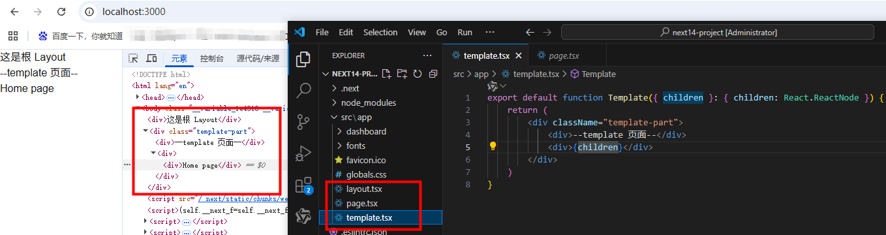

### 布局和模板区别：

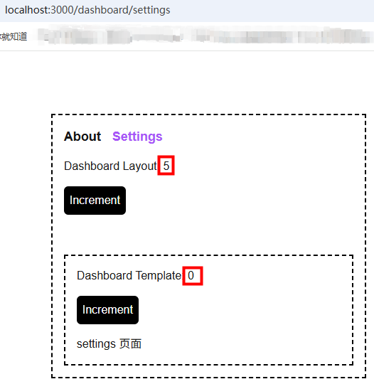

src/app/dashboard/layout.tsx:
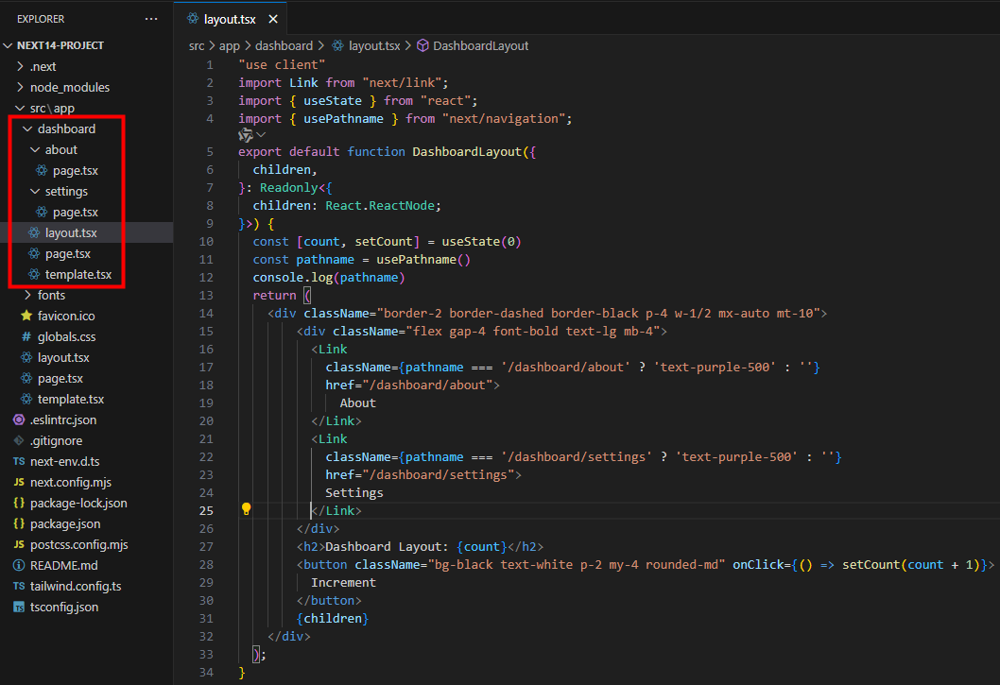

## 配置 not-found

1. 全局的 404 页面，放在 src/app 目录下
2. 局部的 404 页面，放在 src/app/子文件目录下，页面需要 notFound() 手动触发才能跳到局部 404 页面

## 动态路由
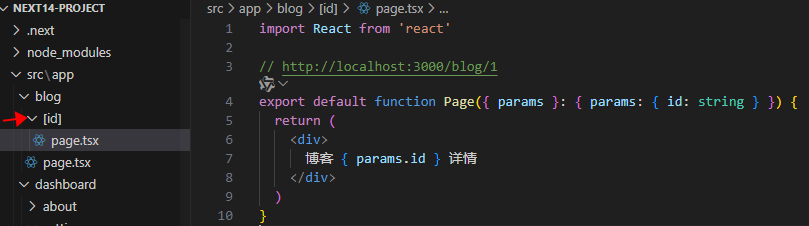

## 路由跳转
```
'use client'
import React from 'react'
import { Button } from 'antd'
import { useRouter } from 'next/navigation'

export default function Page() {
  let router = useRouter()
  const jump = () => {
    router.push('/dashboard/about')
  }
  return (
    <div>
    <Button onClick={(jump)}>跳转</Button>
    </div>
  )
}
```

## Metadata
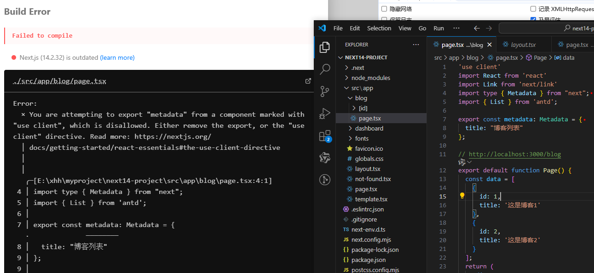
页面组件 List renderItem 是客户端渲染，需要在页面头部添加 'use client'，但是 metadata 又是服务端渲染，导致页面报错。

解决办法：服务端组件是可以导入客户端组件的，把blog列表封装为一个组件（带有 'use client'），然后blog页面导入该组件即可。
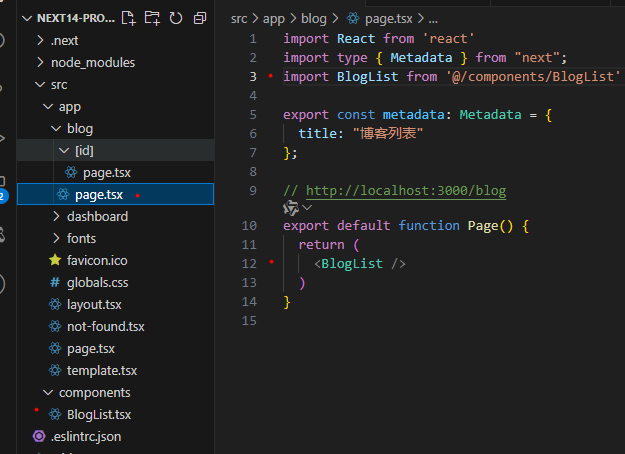

### 动态 Metadata
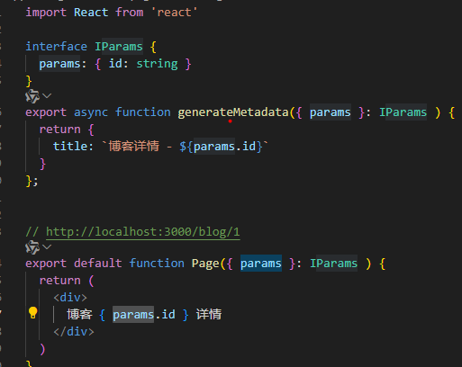

## 拦截路由
同一个地址以不同的方式打开 展示的内容不一样

- 以软链接的形式打开：点击图片打开大图，url地址后面路径变了
<!-- 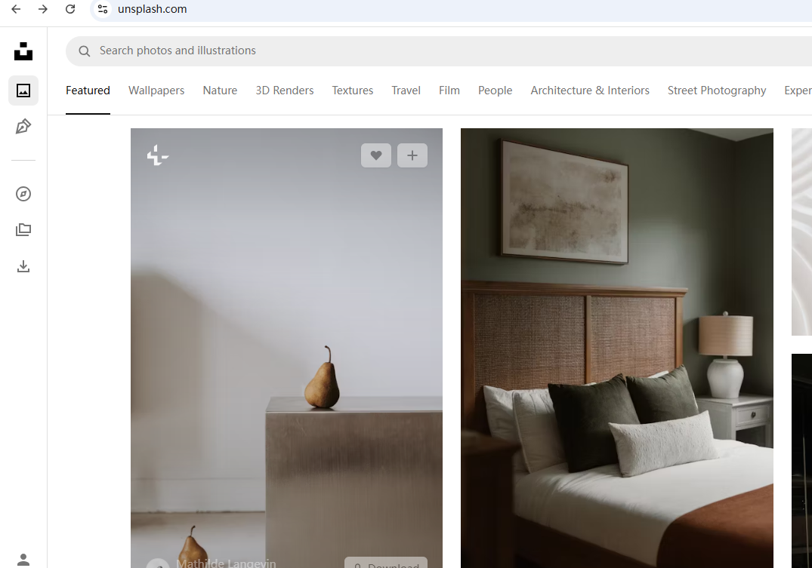
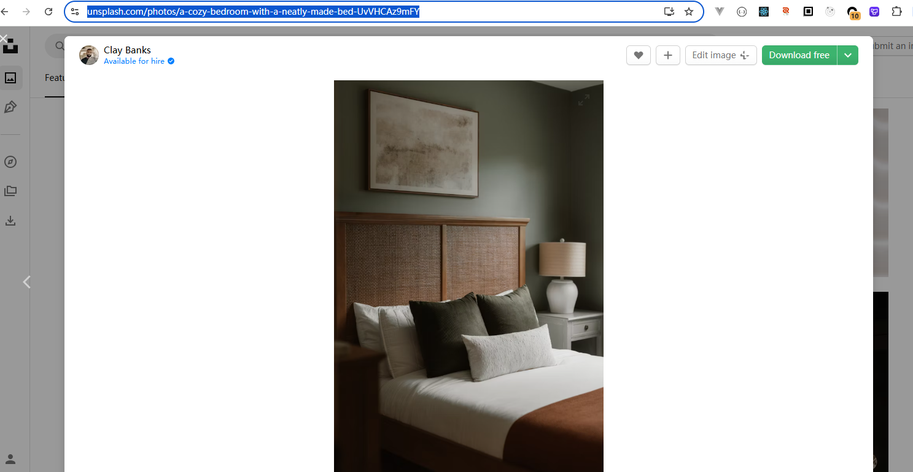 -->
https://test.com  => 点击图片 => https://test.com/photos/1

- 以硬链接的形式打开：输入 url 直接回车，只展示图片信息了

https://test.com/photos/1
<!-- 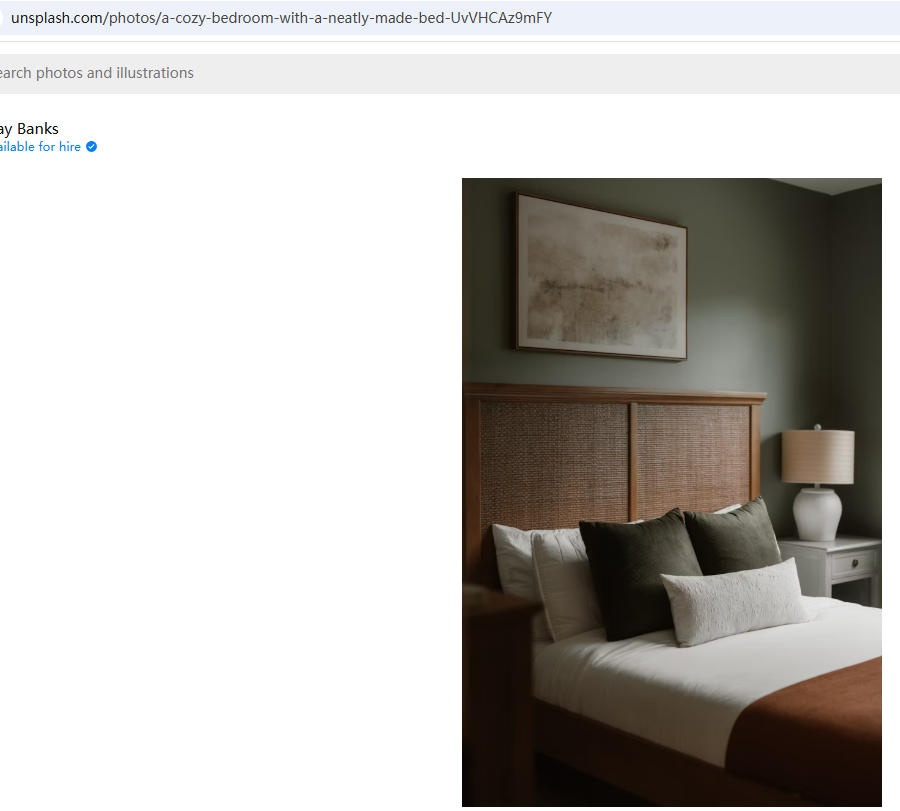 -->

文档：
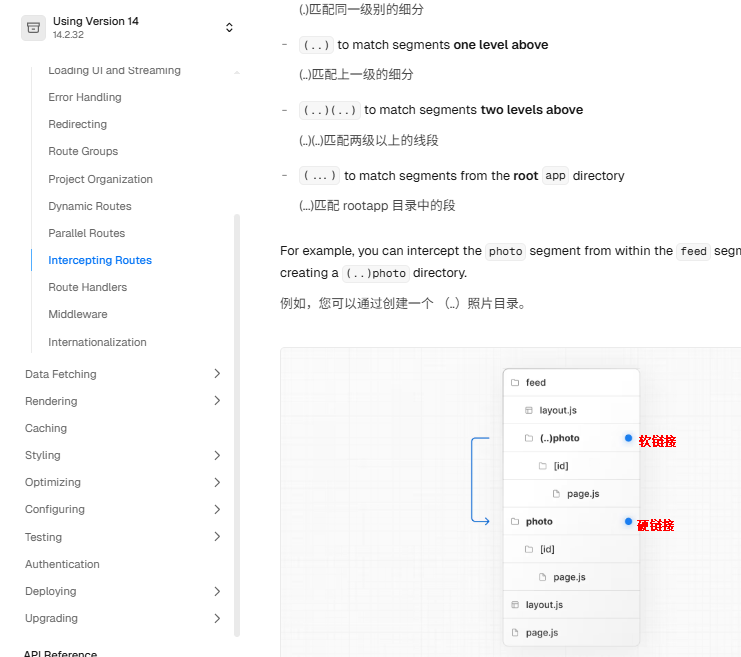

## 中间件 Middleware
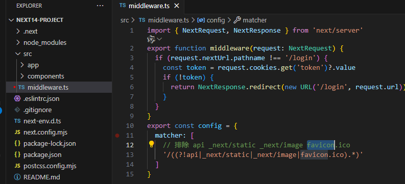