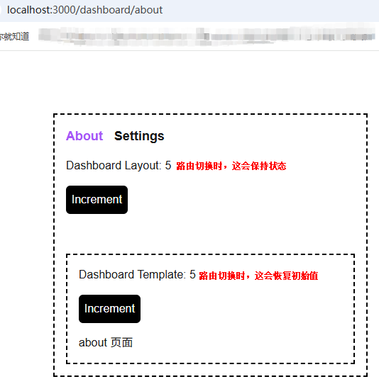

# Next.js

| 模块             | 版本 |
| ---------------- | ---- |
| node             | 18+  |
| next             | 14+  |
| react            | 18+  |
| react-dom        | 18+  |

## 布局Layout和模板Template

### Layout

### Template
不会保留内部状态

### 布局和模板区别：

src/app/dashboard/layout.tsx:

## 配置 not-found

1. 全局的 404 页面，放在 src/app 目录下
2. 局部的 404 页面，放在 src/app/子文件目录下，页面需要 notFound() 手动触发才能跳到局部 404 页面

