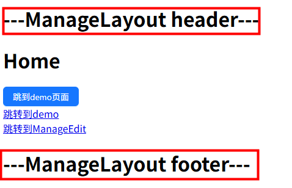
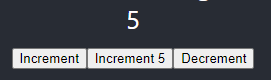
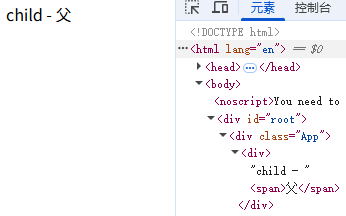
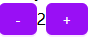
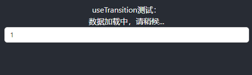
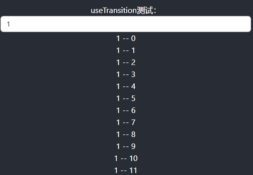
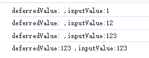

## 项目环境

| 模块             | 版本 |
| ---------------- | ---- |
| node             | 18+  |
| react            | 18+  |
| react-dom        | 18+  |
| react-router-dom | 6+   |
| react-redux      | 9+   |
| @reduxjs/toolkit | 2+   |

## 配置路由
```
npm i react-router-dom@6
```

<!-- 
### 方式1

index.js:

```
import { BrowserRouter } from 'react-router-dom';

const root = ReactDOM.createRoot(document.getElementById('root'));
root.render(
  <React.StrictMode>
      <BrowserRouter>
        <App />
      </BrowserRouter>
  </React.StrictMode>
);
```

App.js:

```
import { useRoutes } from "react-router-dom"
import routes from './router/index.js'

function App() {
  const element = useRoutes(routes)
  return (
    <div className="App">
      <header className="App-header">
        {/* <Routes>
          <Route path="/" element={<Home />}></Route>
          <Route path="/login" element={<Login />}></Route>
        </Routes> */}
        {element}
      </header>
    </div>
  );
}
```

router/index.js:

```
import Home from '../pages/home.js'
import Login from '../pages/login.js'
import NotFound from '../pages/notFound.js'

let routes = [
    {
        path: '/',
        element: <Home />
    },
    {
        path: '/login',
        element: <Login />
    },
    {
        path: '*',
        element: <NotFound />
    }
]
export default routes
``` 
-->

<!-- ### 方式2 -->


#### 新建路由
router/index.tsx:
```
import React from 'react'
import { createBrowserRouter } from 'react-router-dom'

import ManageLayout from '../layouts/ManageLayout'
import Home from '../pages/Home'
import Demo from '../pages/Demo'
import NotFound from '../pages/NotFound'
import ManageList from '../pages/manage/List'
import ManageEdit from '../pages/manage/Edit'

const router = createBrowserRouter([
  {
    path: '/',
    element: <ManageLayout />,
    children: [
      {
        path: '/',
        element: <Home />
      },
      {
        path: 'demo',
        element: <Demo />
      }
    ]
  },
  {
    path: 'manage',
    children: [
      {
        path: 'list',
        element: <ManageList />
      },
      {
        path: 'edit/:id',
        element: <ManageEdit />
      }
    ]
  },
  {
    path: '*', // 以上路由都没有命中，写在最后
    element: <NotFound />
  }
])

export default router
```
#### 注册路由
App.tsx:
```
import { RouterProvider } from 'react-router-dom'
import routerConfig from './router'

return (
  <RouterProvider router={routerConfig}></RouterProvider>
)
```

## 路由鉴权
authRouter.tsx:

```
import { getToken } from "@/utils/storage"
import { Navigate, useLocation } from "react-router-dom"

interface AuthRouteProps {
  children: React.ReactNode
}

const AuthRoute: React.FC<AuthRouteProps> = ({ children }) => {
  const hasToken = getToken()
  const location = useLocation() // 获取url信息
  if (hasToken) {
    if (location.pathname === '/login') {
      return <Navigate to="/" replace />
    } else {
      return <>{children}</>
    }
  } else {
    // 未登录
    if (location.pathname === '/login') {
      return <>{children}</>
    } else {
      return <Navigate to="/login" replace />
    }
  }
}

export default AuthRoute
``` 

router/index.tsx:
```
import { AuthRoute } from './authRoute.tsx'

{
  path: '/article',
  element: <AuthRoute><Article /></AuthRoute>
}
```
优化，兼容不需要授权的路由：
```
const routes = [
  ...
]
import AuthRoute from './authRouter.tsx'

const authRoutes = (routes) => {
    return routes.map((item) => {
        if (item.needAuth) {
            return {
                path: item.path,
                element: (
                    <AuthRoute>
                        {item.element}
                    </AuthRoute>
                )
            }
        } else {
            delete item.needAuth
            return item
        }
    })
}

export default authRoutes(routes)
```


## 路由 Layout

src/layouts/ManageLayout.tsx:
```
import React, { FC } from 'react'
import { Outlet, Link } from 'react-router-dom'

const ManageLayout: FC = () => {
  return (
    <div>
      <h1>---ManageLayout header---</h1>
      <Link to="/">home</Link>
      <Link to="/demo">demo</Link>
      <div>
        {/* 路由出口，配置二级路由渲染位置 */}
        <Outlet />
      </div>
      <h1>---ManageLayout footer---</h1>
    </div>
  )
}

export default ManageLayout
```

router/index.tsx:
```
import ManageLayout from '../layouts/ManageLayout'
import Home from '../pages/Home'
import Demo from '../pages/Demo'

const router = createBrowserRouter([
  {
    path: '/',
    element: <ManageLayout />,
    children: [
      {
        // 这样写打开/ 无法渲染出二级路由(跳转时 /home)
        // path: 'home',

        path: '/',
        // or
        index: true, // 默认二级路由页面,打开/ 渲染出home

        element: <Home />
      },
      {
        path: 'demo',
        element: <Demo />
      }
    ]
  }
])
```



## 路由懒加载
路由的JS资源只有在被访问时才会动态获取，目的是为了优化项目首屏时间。
- React 提供的 lazy 函数进行动态导入
- Suspense 组件包裹element路由

之前：
```
import Login from '../pages/Login/login'
import Article from '../pages/Article/article'
```
之后：
```
import { Suspense, lazy } from 'react'
const Login = lazy(() => import('../pages/Login/login'))
const Article = lazy(() => import('../pages/Article/article'))

{
  path: '/login',
  element: <Suspense fallback={'加载中...'}><Login /></Suspense>
}
```

## 路由传参

#### useSearchParams

```
import { useNavigate } from 'react-router-dom'
const navigate = useNavigate()
// 跳转页面
function jumpPage() {
  // navigate('/demo?a=20')
  // navigate('/demo?a=20', { replace: true })
  // 或
  navigate({
    pathname: '/demo',
    search: 'a=20'
  }, {
    replace: false
  })
  // navigate(-1) // 返回上一页
}

// 获取
import { useSearchParams } from "react-router-dom"
function Demo() {
    let [searchParams] = useSearchParams();
    console.log(searchParams.get('a'))
    ...
}
```

#### useParams

获取动态参数

```
{
  path: 'manage',
  children: [
    {
      path: 'list',
      element: <ManageList />
    },
    {
      path: 'edit/:id',
      element: <ManageEdit />
    }
  ]
}

<!-- 声明式导航 -->
<Link to="/manage/edit/666">跳转到ManageEdit</Link>


import React, { FC } from 'react'
import { useParams } from 'react-router-dom'

const ManageEdit: FC = () => {
  const { id } = useParams()
  return (
    <div>
      <h1>ManageEdit - {id}</h1>
    </div>
  )
}

export default ManageEdit
```

#### useLocation

```
// 携带参数
<Link to="/page1/111" state={{txt:777}}>go Page1</Link>

// 获取
import { useLocation } from "react-router-dom";
function Page1() {
  console.log('data:', useLocation().state.txt) // 777
  ...
}
```


## 别名路径配置
### create-react-app 

CRA 本身把webpack配置包装到了黑盒里无法直接修改，需要借助一个插件：craco

- 安装 craco
```
npm i @craco/craco -D
```
- 项目根目录创建配置文件

craco.config.js

- 配置文件中添加路径解析配置(webpack)

craco.config.js:
```
const path  = require('path');

module.exports = {
  webpack: {
    alias: {
      '@': path.resolve(__dirname, 'src'),
    },
  },
}
```
```
import sum from '@/test'
```
- 包文件中配置启动和打包命令

```
"scripts": {
  "start": "craco start",
  "build": "craco build"
}
```
- 路径联想配置(vscode)

jsconfig.json:
```
{
    "compilerOptions": {
        "baseUrl": "./",
        "paths": {
            "@/*": [
                "src/*"
            ]
        }
    }
}
```
输入 "@/" vscode会给后面的路径提示 

### vite 
#### 路径解析
```
import { defineConfig } from 'vite'
import react from '@vitejs/plugin-react'
import path from 'path'

// https://vite.dev/config/
export default defineConfig({
  plugins: [react()],
  resolve: {
    alias: {
      '@': path.resolve(__dirname, './src'),
    },
  },
})
```
path模块 和 __dirname 标红，缺少类型声明，解决办法：
```
npm i @types/node -D
```
#### vscode路径提示
tsconfig.json添加配置：
```
{
  "compilerOptions": {
    "baseUrl": ".",
    "paths": {
      "@/*": ["src/*"]
    }
  },
  ...
}
```


## 样式使用

### 引入样式文件，使用类

```
import './App.css';

<div className="foo">test</div>
```

### inline 样式
style 是对象形式,其中的key是驼峰式

```
const divStyle: React.CSSProperties = {
  color: 'red',
  marginBottom: '10px'
};

return <div style={divStyle}>content</div>
```

```
<div style={{ cursor: 'pointer',marginTop: '50px' }}>
  内容
</div>
```

### 使用 scss

create-react-app 原生支持 sass module，只需要安装

```
npm i sass -D
```

<!-- <font size=3 color=#ccc>要使用 less 的话，需要 npm run eject 暴露出 webpack 修改配置 或 使用其他工具。</font> -->

### CSS Module

解决className可能重复的问题；
create-react-app 内置了对 CSS Module 的支持。

‌1.更改文件名 ‌

将 CSS 文件名从 styles.css 更改为 styles.module.css
```
.color-yellow {
  color: #FFF766;
}

// 在CSS Module中导出变量
:export {
  primaryColor: red;
}
```

2.引入样式 ‌

在组件文件中，使用 ES6 模块语法引入样式文件

```
import styles from './styles.module.css';
```

‌3.使用样式 ‌

```
<div className={styles['color-yellow']}>
<span style={{ color: styles.primaryColor }}>222</span>
```

### Tailwind CSS

#### 安装

```
npm install tailwindcss@3 postcss autoprefixer -S
```

#### npx tailwindcss init

执行命令后自动生成 tailwind.config.js 文件，编辑

```
/** @type {import('tailwindcss').Config} */
module.exports = {
  content: ["./src/**/*.{js,jsx,ts,tsx}"],
  theme: {
    extend: {},
  },
  plugins: [],
}
```

#### 项目样式文件引入 tailwindcss
```
@tailwind base;
@tailwind components;
@tailwind utilities;
```

#### 安装 @types/tailwindcss
在 TypeScript 中获得智能提示（比如自动完成和类型检查）
```
npm install @types/tailwindcss -D
```

#### 新增 postcss.config.ts

```
module.exports = {
  plugins: {
    tailwindcss: {},
    autoprefixer: {},
  }
}
```

#### 组件中使用

```
div className="flex">
  <p>内容</p>
  <p className="flex-1">显示</p>
</div>
```

## JSX
JSX是Javascript和XML(HTML)的缩写，表示在JS代码中编写HTML模板结构。
是JS的语法扩展，浏览器本身不能识别，需要通过解析工具解析之后才能在浏览器中运行。

通过大括号{}识别JavaScript中的表达式。

注意：if语句，switch语句，变量声明属于语句，不是表达式，不能出现在{}中。

```
// 组件（函数）首字母必须大写
function App() {
  let list = [
    {
      id:1,
      title: '标题一'
    },
    {
      id: 2,
      title: '标题二'
    }
  ]
  let [isTure, setIsTure] = useState(true)

  const valueDom: string = '<section style="color: red">haha</section>'

  return (
    <div className="App">
      <ul>
        {
          list.map((item) => {
            return <li key={item.id}>{item.title}</li>
          })
        }
      </ul>
      { isTure && <div>ok</div> }

      <div dangerouslySetInnerHTML={{__html: valueDom }}></div>
    </div>
  );
}

export default App;
```

### 动态类名
```
// 使用模板字符串和三元运算符(逻辑与)构建类名字符串
<div className={`nav ${isActive && 'active'}`}>
```
或使用 classnames 库
```
<div className={classnames('nav', {active: isActive})}>
```

### 事件绑定
```
function App() {
  function handleClick(e) {
    console.log(e.target.innerHTML)
  }
  const handleClickButton = (params1, e)=> {
    console.log('click button：', params1, e)
  }

  return (
    <div className="App">
      <button onClick={handleClick}>button</button>
      <button onClick={(e)=>handleClickButton('Hi', e)}>button</button>
    </div>
  );
}

export default App;
```


## 状态管理 Redux

### 独立使用的Redux
- 定义一个 <font color=red>reducer 函数</font>
- 使用 <font color=red>createStore</font> 方法传入 reducer 函数 生成一个 store 实例对象
- 使用 store 实例的 <font color=red>subscribe 方法</font> 订阅数据的变化
- 使用 store 实例的 <font color=red>dispatch方法提交action对象</font> 触发数据变化
- 使用 store 实例的 <font color=red>getState方法</font> 获取最新的状态数据更新到视图中

```
// cdn 引入 redux 库
function reducer(state = {count: 0}, action) {
  // 数据不可变：基于原始状态生成一个新状态
  if (action.type === 'INCREMENT') {
    return {count: state.count + action.payload}
  }
  if (action.type === 'DECREMENT') {
    return {count: state.count - 1}
  }
  return state
}

const store = Redux.createStore(reducer)

store.subscribe(() => { 
  console.log('state change')
  document.getElementById('count').innerHTML = store.getState().count
})

function clickIncrement() {
  store.dispatch({
    type: 'INCREMENT',
    payload: 5
  })
}
function clickDecrement() {
  store.dispatch({
    type: 'DECREMENT'
  })
}

<div>
  <button onClick={clickDecrement}>-</button>
  <span id="count"></span>
  <button onClick={clickIncrement}>+</button>
</div>

```

### React 中的 Redux

Redux 是 React 最常用的集中状态管理工具，可以独立于框架运行。

#### 安装

```
npm install @reduxjs/toolkit react-redux -S
```

#### 1. 创建 Redux State Slice

store/modules/counterStore.js:

```
import { createSlice } from '@reduxjs/toolkit'

export const counterSlice = createSlice({
  name: 'counter',
  initialState: {
    count: 0
  },
  reducers: {
    // 同步方法，支持直接修改
    increment: state => {
      state.count += 1
    },
    decrement: state => {
      state.count -= 1
    },
    incrementByAmount: (state, action) => {
      state.count += action.payload
    }
  }
})

export const { increment, decrement, incrementByAmount } = counterSlice.actions

export default counterSlice.reducer
```

#### 2. 将 Slice Reducers 组合到 Redux Store 中

store/index.js:

```
import { configureStore } from '@reduxjs/toolkit'
import counterReducer from './modules/counterStore'

export default configureStore({
  reducer: {
    counter: counterReducer
  }
})
```

#### 3. 将 store 实例注入到应用中

index.js:

```
import store from './store/index.js'
import { Provider } from 'react-redux'

const root = ReactDOM.createRoot(document.getElementById('root'));
root.render(
  <React.StrictMode>
    <Provider store={store}>
        <App />
    </Provider>
  </React.StrictMode>
);

```

#### 4. 在 React 组件中使用

- useSelector 把 store 中的数据映射到组件中
- useDispatch 生成提交 action 对象的 dispatch 函数

```
import { useSelector, useDispatch } from 'react-redux'
import { decrement, increment, incrementByAmount } from '../store/modules/counterStore'

function Page2() {
  const { count } = useSelector(state => state.counter)
  const dispatch = useDispatch()

    return <div>
      <main>Welcome to Page2</main>
      <div>{count}</div>
      <div>
        <button
          onClick={() => dispatch(increment())}
        >
          Increment
        </button>
        <button
          onClick={() => dispatch(incrementByAmount(5))}
        >
          Increment 5
        </button>
        <button
          onClick={() => dispatch(decrement())}
        >
          Decrement
        </button>
      </div>
    </div>
}

export default Page2;
```

#### 页面效果



备注：chrome 插件 - Redux DevTools

#### 在 store 中使用异步操作：
```
export const counterSlice = createSlice({
  ...
  reducers: {
    ...
    setCount(state, action) {
      state.count = action.payload
    },
  }
})


export const { ..., setCount } = counterSlice.actions

export const fetchTestData = () => {
  return async (dispatch) => {
    const res = await axios('https://dev.test.shop/data')
    dispatch(setCount(res.data.num))
  }
}
```
```
useEffect(() => {
  dispatch(fetchTestData())
}, [dispatch])
```

## 异步请求 axios

安装

```
npm i axios -S
```

封装 utils/http.ts:
```
import axios from 'axios'

// 创建axios实例
const service = axios.create({
  baseURL: '',
  timeout: 30000 // 请求超时时间
})

// 请求拦截器
service.interceptors.request.use(
  config => {
    // config.headers['token'] = ''

    return config
  },
  error => {
    // 请求失败
   return Promise.reject(error)
  }
)

// 响应拦截器
service.interceptors.response.use(
  response => {
    const res = response.data || {}
    if (res.code !== 200) {

    }
    return res
  },
  // 处理错误响应
  error => {
    if (error.response && error.response.status === 401) {

    } else if (error.response && error.response.status === 403) {

    }
    return Promise.reject(error)
  }
)

export default service
```

api/home.ts:
```
import request from '../utils/http.ts'

// {
//   data: {
//     channels: []
//   },
//   message: ''
// }

// 1. 定义泛型
type ResType<T> = {
  message: string,
  data: T
}

// 2. 定义具体的接口类型
type ChannelItem = {
  id: number,
  name: string
}
type ChannelRes = {
  channels: ChannelItem[]
}
export function fetchChannelAPI() {
  return request<ResType<ChannelRes>>({
    url: '/home-data'
  })
}
```
优化，把公共 ResType 抽离出来
```
export type ResType<T> = {
  message: string,
  data: T
}

// 导入
import type { ResType } from './common.ts'
```

<!-- 
## 受控组件
受控组件：值同步到 state，使用 value 属性

将UI状态完全交给state或者props管理，不允许直接修改value。
```
const [text, setText] = useState('hello')
function changeText(e: ChangeEvent<HTMLInputElement>) {
  setText(e.target.value)
}

<input type="text" onChange={changeText} value={text} />
<button onClick={() => console.log(text)}>打印input值</button>
```
非受控组件：值不同步 state，使用 defaultValue 属性
```
<input type="text" defaultValue="hello world" />
```
defaultValue 显示在页面中，但无法获取到 
-->

## 父子组件交互
子组件只能读取 props 中的数据，不能直接修改，父组件的数据只能由父组件修改。

父组件：

```
import Button from '../components/button'

function Page1() {
  const buttonObj = {
    title: '点击按钮',
    bgColor: 'red'
  }
  // 点击子组件按钮时触发
  function handleChildFn(msg) {
    console.log('父组件接收消息：', msg)
  }

  return <div>
    {/* <Button title={buttonObj.title} bgColor={buttonObj.bgColor} /> */}
    <Button {...buttonObj} onMessageChange={handleChildFn} />
  </div>
}

export default Page1;
```

子组件：

```
function Button(props) {
  const buttonStyle = {
    padding: '5px 10px',
    fontSize: '16px',
    lineHeight: '16px',
    border: '1px solid #ccc',
    borderRadius: '4px',
    cursor: 'pointer',
    marginTop: '15px',
    backgroundColor: props.bgColor
  }
  function clickFn() {
    // 子传父
    props.onMessageChange('来自子组件')
  }

  return <div style={buttonStyle} onClick={clickFn}>
    <span>{props.title}</span>
  </div>
}

export default Button;
```

#### 特殊的 prop children
把内容嵌套在子组件标签中，父组件会自动把名为 children 的 prop 传递给子组件。
```
<Child>
  <span>父</span>
</Child>

function Child(props) {
  return (
    <div>
      child - {props.children}
    </div>
  );
}
```


## React Hooks

使函数式组件能够拥有类组件的一些特性，例如状态管理和生命周期方法的使用。

  hooks 使用规则：
1. 必须使用 useXXX 格式命名
2. 只能在 函数式组件内或其他hook 内调用
3. 每次的调用顺序一致（不能放在for、if 内）

### useState

向组件添加状态变量

```
const [count, setCount] = useState(0);

// setCount(count + 1) // 这种写法多次执行count只累加一次（合并更新）
// 或
setCount((count) => count + 1) // 如果页面中 count 是 6
console.log(count) // 那这里是 5，异步更新无法直接拿到最新的 state 值
// 如果 state 不用于 JSX 中显示，那就不要用 useState，用 useRef
// 可以使用 useEffect 把 count 作为依赖进行监听，实时获取最新 count
```
state 是不可变数据 (不能 count++，视图不更新)
```
// 修改对象
setUserInfo({
  ...userInfo,
  age: 21
})
setUserInfo({
  x: 100
})
// 修改数组
setList(list.concat('z'))
setList([...list, 'z']) 
// filter
```
> 可以使用 **immer** 修改 state 不可变数据

### useEffect

在组件渲染到屏幕之后异步执行(dom可用)。这意味着它不会阻塞浏览器的绘制和更新，适用于大多数不会直接影响页面布局和视觉呈现的操作，用于执行副作用操作，如本地存储、ajax、操作DOM、计时器等‌。

副作用函数：指的是那些在执行时会改变外部状态或依赖外部可变状态的函数。

<font size=2.5>注：react18 开始，useEffect 在开发环境下会执行两次(&lt;React.StrictMode&gt;)，模拟组件创建、销毁、再创建的完整流程，及早暴露问题；生产环境下只执行一次。</font>

```
useEffect(() => {
  const connection = createConnection(serverUrl, roomId);
  connection.connect();
  return () => {
    // 清除函数
    connection.disconnect();
  };
}, [serverUrl, roomId]);
```

- ‌不传第二个参数‌：监测所有状态和属性，任何变化都会触发副作用函数：组件初始渲染+组件更新时执行
- ‌第二个参数为空数组‌（[]）：表示不监测任何依赖项，组件挂载时执行副作用函数，卸载时执行清除函数。
- ‌第二个参数为具体依赖项数组‌：组件初始渲染会执行；数组中的任意一个依赖项发生变化时，副作用函数也会执行，执行新的副作用之前会调用清除函数。

### useLayoutEffect‌

- 在DOM更新完成后、浏览器绘制前‌同步执行‌，会阻塞浏览器的重绘过程
- 典型应用场景：动态调整元素尺寸/位置、避免UI闪烁等需要即时获取布局信息的操作
```
import React, { useEffect, useLayoutEffect, useRef } from 'react'

function Detail() {
  const onScrollFn = (e: React.UIEvent<HTMLDivElement>) => {
    const scrollTop = e.currentTarget.scrollTop
    window.history.replaceState(null, '', `?top=${scrollTop}`)
  }

  const container = useRef<HTMLDivElement>(null)
  useLayoutEffect(() => {
    const top = window.location.search.split('=')[1]
    if (top && container.current) {
      container.current.scrollTo(0, Number(top))
    }
  }, [])

  return (
    <div onScroll={onScrollFn} ref={container} style={{ height: '400px', overflowY: 'auto' }}>
      <div>Detail</div>
      {
        new Array(3000).fill(0).map((item, index) => {
          return <div key={index}>{index}</div>
        })
      }
    </div>
  )
}

export default Detail
```
DOM 更新完毕后立刻调整位置，浏览器在绘制时就已经是最终位置，避免闪烁。

浏览器打开 url?top=10000会直接跳到该位置；如果用useEffect，会先在页面顶部，然后闪一下跳到10000位置。


### useRef

访问 DOM 元素或保存不触发渲染的变量(不能作为hooks的依赖项，因为它不是一个响应式状态)
```
const divRef = useRef(null);
let count = useRef(0);
useEffect(() => {
  console.log('divRef.current: ', divRef.current)
}, [])
function clickFn() {
  count.current = count.current + 1;
  console.log('count:', count.current)
}

return <div ref={divRef} onClick={clickFn}</div>
```

### useContext

跨层级组件通信。

ThemeContext.js
```
import { createContext } from 'react'

// 默认值 'light'
export const ThemeContext = createContext('light')
```
在顶层用 Provider 提供状态:
```
import { useState } from 'react'
import { ThemeContext } from './ThemeContext'

function App() {
const [theme, setTheme] = useState('light')

return (
    <ThemeContext.Provider value={theme}>
      ...
      <button onClick={() => setTheme(theme === 'light' ? 'dark' : 'light')}>
        切换主题
      </button>
    </ThemeContext.Provider>
  );
}

export default App
```
在ThemeContext.Provider内的子组件中都可以使用 useContext 获取状态：
```
import { useContext } from 'react'
import { ThemeContext } from '../ThemeContext'

const Child = () => {
  const theme = useContext(ThemeContext)
  return (
    <div>
      当前主题: {theme}
    </div>
  );
};
```

### useReducer

useState 的替代方案，适用于管理复杂和大型的状态逻辑。

- 定义 Reducer 函数（根据不同action返回不同的新状态）
- 在组件中调用 useReducer，传入 reducer 函数和初始状态值
- dispatch 分派一个 action 对象

```
import { useReducer } from "react"

function Counter() {
  function reducer(state, action) {
    switch (action.type) {
      case 'increment':
        return {count: state.count + 1}
      case 'decrement':
        return {count: state.count - 1}
      case 'set':
        return {count: action.payload1}
      default:
        return {count: state.count}
    }
  }

  const [state, dispatch] = useReducer(reducer, {count: 0})

  return (
    <>
      <p>您点击了 {state.count} 次</p>
      <Button variant="outlined" onClick={() => dispatch({type: 'decrement'})}>递减</Button>
      <Button variant="outlined" onClick={() => dispatch({type: 'increment'})} style={{marginLeft: 15}}>递增</Button>
      <Button variant="outlined" onClick={() => dispatch({type: 'set', payload1: 100})} style={{marginLeft: 15}}>设为100</Button>
    </>
  )}
```

### useMemo
在组件每次重新渲染的时候缓存计算的结果。
```
  function fib(n) {
    console.log('执行')
    if (n < 3) {
      return 1
    }
    return fib(n - 1) + fib(n - 2)
  }
  let [count1, setCount1] = useState(0)
  let [count2, setCount2] = useState(0)

  // 这种写法，count1、count2 改变时，组件重新渲染，fib执行
  // const result = fib(count1)

  const result = useMemo(() => {
    // 监听count1改变时才会执行 fib
    return fib(count1)
  }, [count1])
  return (
    <div>
        <div>{result}</div>
        <button onClick={() => setCount1(count1+1)}>{count1}</button>
        <button onClick={() => setCount2(count2+1)}>{count2}</button>
    </div>
  )
```

#### React.memo 高阶组件
React组件默认的渲染机制：只要父组件重新渲染子组件就会重新渲染。

memo 作用：允许组件在props没有改变的情况下跳过渲染。
```
import { memo } from "react"

function Child(props) {
  ...
}
export default memo(Child)
```
父组件
1. 基本类型：count改变，子组件就重新渲染:
```
<Child count={count}/>
```
2. 引用类型：list定义在父组件内，父组件状态更新list会被重新定义，子组件就会重新渲染。
```
function Parent() {
  ...

  const list = [1,2,3]

  <Child list={list}/>
}
```
3. 使用useMemo缓存，即使父组件状态更新，但是list不变，子组件也不会重新渲染。
```
function Parent() {
  ...

  const list = useMemo(() => {
    return [1,2,3]
  }, [])
  // or
  const [list] = useState([1, 2, 3, 4, 5])

  <Child list={list}/>
}

// 子组件必须进行memo优化，否则useMemo没有任何性能提升。
```

### useCallback
作用：在组件多次重新渲染的时候缓存函数。

之前：

父组件状态更新，onChange属性值handleChange会重新创建，导致子组件重新渲染。
```
import { useCallback } from "react"

const handleChange = (value) => {
  console.log('value--', value)
}

<Child onChange={handleChange} />
```
之后：
```
import { useCallback } from "react"

const handleChange = useCallback((value) => {
  console.log('value--', value)
}, [])

<Child onChange={handleChange} />

// 子组件必须进行memo优化，否则useCallback没有任何性能提升。
```


#### forwardRef 高阶组件
父组件通过ref属性获取子组件实例，并调用子组件实例的方法。

子组件：
```
import { forwardRef } from 'react'

const Input = forwardRef((props, ref) => {
  return <input type="text" ref={ref} />
})
```
父组件：
```
function App() {
  const inputRef = useRef(null)
  function showRef() {
    inputRef.current && inputRef.current.focus() // 子组件聚焦
  }
  return (
    <>
      <Input ref={inputRef} />
      <button onClick={showRef}>click</button>
    </>
  )
}
```

### useImperativeHandle

用于暴露子组件的属性和方法，实现父组件对子组件的控制。
```
useImperativeHandle(ref, () => {
  return {
    
  }
}, [deps])
```
- 不传入依赖deps参数，useImperativeHandle会在组件挂载时执行一次，状态更新时也会执行
- deps 传 []，useImperativeHandle会在组件挂载时执行一次，状态更新时不会执行
- deps 传依赖项，useImperativeHandle会在组件挂载时执行一次，依赖项变化时也会执行

子组件：
```
import { forwardRef, useRef, useImperativeHandle } from 'react';

// 需要结合 forwardRef 使用
const MyInput = forwardRef((props:any, ref:any) => {
  const inputRef = useRef<HTMLInputElement>(null);

  useImperativeHandle(ref, () => ({
    focus: () => {
      inputRef.current?.focus()
    },
    testValue: 123
  }));

  return (<input {...props} ref={inputRef} />)
});

export default MyInput;
```
父组件：
```
const compRef = useRef<any>(null);
function buttonClick() {
  if (compRef.current !== null) {
    compRef.current.focus();
    console.log(compRef.current.testValue)
  }
}
<form>
  <MyInput placeholder='please input' ref={compRef} />
  <button type="button" onClick={buttonClick}> Edit </button>
</form>
```

### useSyncExternalStore
用于从外部存储(例如状态管理库、浏览器API等)获取状态并在数据更新时触发组件更新。

用法：
```
const res = useSyncExternalStore(subscribe, getSnapshot, getServerSnapShot?)
```
- subscribe: 订阅数据源的变化，接收一个回调函数，在数据源更新时调用该回调函数
- getSnapshot: 获取数据源的快照（当前状态）
- getServerSnapShot?: 在服务端渲染时用来获取数据源的快照（可选）

useStorage.ts:
```
import { useSyncExternalStore } from "react";
export function useStorage(key: string, initValue: any) {
  const subscribe = (callback: () => void) => {
    // 订阅
    window.addEventListener("storage", callback);
    return () => {
      // 取消订阅
      window.removeEventListener("storage", callback);
    }
  }
  const getSnapshot = () => {
    const data = window.localStorage.getItem(key);
    return data ? JSON.parse(data) : initValue;
  }

  // 不用 useState 也能达到数据更新
  const res = useSyncExternalStore(subscribe, getSnapshot)
  const updateStorage = (value: any) => {
    window.localStorage.setItem(key, JSON.stringify(value));
    // 通知订阅者
    window.dispatchEvent(new StorageEvent("storage"));
  }

  return [res, updateStorage]
}
```
```
const [count, setCount] = useStorage('count', 0)

<div>
  <Button type="primary" onClick={() => setCount(count - 1)}>-</Button>
  <div>{ count }</div>
  <Button type="primary" onClick={() => setCount(count + 1)}>+</Button>
</div>
```


### useTransition

useTransition 不阻塞 UI 的情况下更新状态。
```
const [isPending, startTransition] = useTransition()

// 紧急更新: 实时显示输入的内容不卡顿
setInputValue(input);

startTransition(() => {
  // 过渡更新: 展示结果列表，低优先级
  setResultList(input);
});

```





### useDeferredValue

延迟更新 UI 的某些部分。
```
const [inputValue, setInputValue] = useState('')

const deferredValue = useDeferredValue(inputValue)
console.log('deferredValue:'+deferredValue+' ,inputValue:'+ inputValue)
// deferredValue === inputValue 执行某些操作

<Input value={inputValue} onChange={(e) => setInputValue(e.target.value)} />
```
deferredValue 是延迟更新的值。和防抖的区别是：防抖是固定一个时间值，useDeferredValue返回的延迟值取决于设备的性能。



### 自定义 hooks
```
import { useState, useEffect, useCallback } from 'react'

// 获取鼠标位置
export function useMouse() {
  const [x, setX] = useState(0)
  const [y, setY] = useState(0)

  const updateMouse = useCallback((e: MouseEvent) => {
    setX(e.clientX)
    setY(e.clientY)
  }, [])

  useEffect(() => {
    window.addEventListener('mousemove', updateMouse)
    return () => {
      window.removeEventListener('mousemove', updateMouse)
    }
  }, [])

  return { x, y }
}

// 模拟异步数据
function getInfo(): Promise<string> {
  return new Promise((resolve) => {
    setTimeout(() => {
      resolve(Date.now().toString())
    }, 1500)
  })
}
export function useGetInfo() {
  const [loading, setLoading] = useState(true)
  const [info, setInfo] = useState('')

  useEffect(() => {
    getInfo().then((res) => {
      setLoading(false)
      setInfo(res)
    })
  }, [])

  return {
    loading,
    info
  }
}

// 引用
import { useMouse, useGetInfo } from './hook'
const { x, y } = useMouse()
const { loading, info } = useGetInfo()

<div>
  <div>鼠标位置：{x},{y}</div>
  <div>{loading ? '加载中' : info}</div>
</div>
```

### 第三方 hooks
https://ahooks.js.org/zh-CN

https://github.com/streamich/react-use


## Ant Design

```
npm install antd

import { Button } from 'antd'

<Button type="primary">Primary Button</Button>
```

### antd-mobile 主题定制
https://mobile.ant.design/zh/guide/theming

#### 全局定制
```
:root:root {
  --adm-color-primary: red;
}
```

#### 局部定制
```
.puple {
  --adm-color-primary: red;
}

<div className="puple">
  <Button color="primary">btn</Button>
</div>
```

<!-- 
## 富文本编辑器
react-quill 
-->

## 配置多环境

Create React App 搭建的项目，npm run start 指向 development，npm run build 指向 production，通过 process.env.NODE_ENV 获取。

#### 第一种方式：使用 cross-env

```
// 安装 cross-env
npm i cross-env -D

// 配置不同环境命令，REACT_APP_开头
"build:release": "cross-env REACT_APP_ENV=release react-scripts build"

// 获取
process.env.REACT_APP_ENV // release
```

#### 第二种方式：使用 dotenv

安装

```
npm install dotenv-cli -D
```

自定义环境变量名


```
// 配置
"start": "dotenv -e .env.release react-scripts start",

// 获取
process.env.REACT_APP_ENV // release
```

## 项目打包和本地预览
先打包:
```
npm run build
```
安装 serve:
```
npm i serve -g
```
启动本地服务：
```
serve -s build
```

#### 包体积可视化分析
```
npm i source-map-explorer

"scripts": {
    ...
    "analyze": "source-map-explorer build/**/*.{js,css}"
},

npm run analyze
```

#### CDN
craco.config.js:
```
const { whenProd, pluginByName, getPlugin } = require('@craco/craco');
const path = require('path');

module.exports = {
  webpack: {
    alias: {
      '@': path.resolve(__dirname, 'src'),
    },
    configure: (webpackConfig, { env, paths }) => {
      let cdn;
      whenProd(() => {
        // key: npm 安装的包； value: CDN里的全局变量
        // 打包时排除 react 和 react-dom
        webpackConfig.externals = {
          react: 'React',
          'react-dom': 'ReactDOM',
        }
        cdn = {
          js: [
            'https://cdnjs.cloudflare.com/ajax/libs/react/18.1.0/umd/react.production.min.js',
            'https://cdnjs.cloudflare.com/ajax/libs/react-dom/18.1.0/umd/react-dom.production.min.js'
          ]
        }
      })
      
      // 通过 HtmlWebpackPlugin 在public/index.html注入cdn
      const { isFound, match } = getPlugin(webpackConfig, pluginByName('HtmlWebpackPlugin'));

      // 找到了HtmlWebpackPlugin插件
      if (isFound) {
        match.options.cdn = cdn;
      }
      return webpackConfig;
    },
  },
};
```
配置引入CDN地址，public/index.html:
```
<div id="root"></div>
<% htmlWebpackPlugin.options.cdn.js.forEach(cdnURL => { %>
  <script src="<%= cdnURL %>"></script>
<% }) %>
```

## TypeScript
<!-- 
安装：

```
npm install --save typescript @types/node @types/react @types/react-dom @types/jest
``` -->

tsconfig.json:

```
{
  "compilerOptions": {
    "target": "es5",
    "lib": [
      "dom",
      "dom.iterable",
      "esnext"
    ],
    "allowJs": true,
    "skipLibCheck": true,
    "esModuleInterop": true,
    "allowSyntheticDefaultImports": true,
    "strict": true,
    "forceConsistentCasingInFileNames": true,
    "noFallthroughCasesInSwitch": true,
    "module": "esnext",
    "moduleResolution": "node",
    "resolveJsonModule": true,
    "isolatedModules": true,
    "noEmit": true,
    "jsx": "react-jsx"
  },
  "include": [
    "src"
  ]
}
```

声明文件 react-app-env.d.ts：

```
declare module '*.svg' {
  import * as React from 'react';

  export const ReactComponent: React.FunctionComponent<React.SVGProps<
    SVGSVGElement
  > & { title?: string }>;

  const src: string;
  export default src;
}

declare module '*.module.scss' {
  const classes: { readonly [key: string]: string };
  export default classes;
}
```

将文件重命名为 .tsx 或 .ts 文件。

### Props与TS
子组件：
```
type Props = {
  className: string,
  title?: string,
  children?: React.ReactNode,
  onGetMsg?: (msg: string) => void
}
function Button(props: Props) {
  const {className, children, onGetMsg} = props
  function clickHandler() {
    onGetMsg?.('this is msg from son button')
  }
  return (
    <button className={className} onClick={clickHandler}>
      { children}
    </button>
  )
}
```
父组件：
```
function receiveMsg(msg: string) {
  console.log('msg--', msg)
}
<Button className='btn' onGetMsg={receiveMsg}>
  click me!
</Button>
<Button className='btn' onGetMsg={(msg) => console.log(msg)}>
  内联方法msg自动推断类型
</Button>
```

### useRef与TS
```
const inputRef = useRef<HTMLInputElement>(null)
useEffect(() => {
  inputRef.current?.focus()
}, [])

<input ref={inputRef} />
```
联合类型：
```
const timerRef = useRef<number | undefined>(undefined)
useEffect(() => {
  timerRef.current = setInterval(() => {
    console.log('tick')
  }, 1000)
  return () => {
    clearInterval(timerRef.current)
  }
}, [])
```
