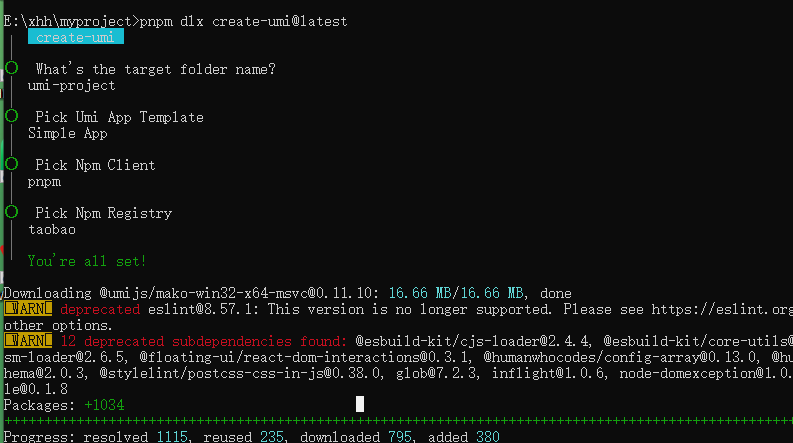
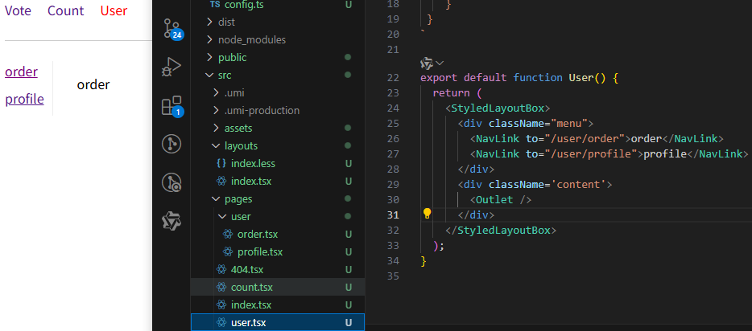
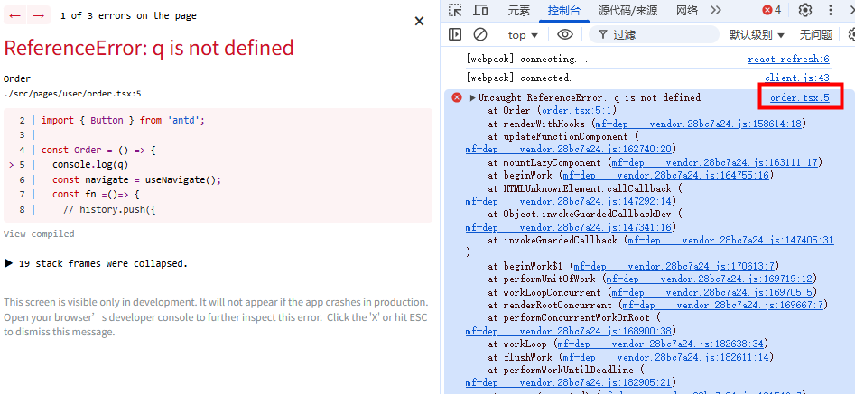
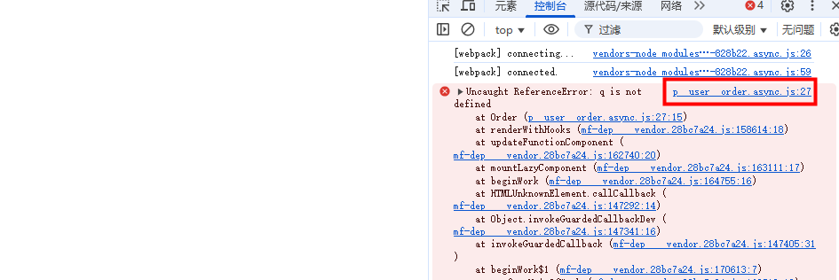
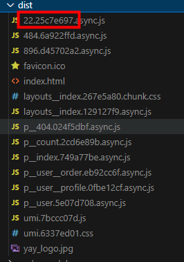

# umi

## 新建项目
```
pnpm dlx create-umi@latest
```


## 安装必要模块
```
pnpm i antd qs styled-components @umijs/plugins
```

## 配置环境变量
### 方式一

创建 .env 文件
```
HOST=127.0.0.1
PORT=3000
```

### 方式二
```
"dev": "cross-env PORT=3333 HOST=127.0.0.1 umi dev"
```

## 路由配置

### 约定式路由


### 配置式路由
config/routes.ts:
```
const routes = [
  {
    path: '/',
    component: 'index' // 自动去pages目录下查找，也可以指定目录
  },
  {
    path: '/count',
    component: 'count',
    title: '计数器'
  },
  {
    path: '/user',
    component: 'user',
    title: '个人中心',
    routes: [
      {
        path: '/user',
        redirect: '/user/order'
      },
      {
        path: '/user/order',
        component: 'user/order',
        title: '我的订单'
      },
      {
        path: '/user/profile',
        component: 'user/profile',
        title: '个人资料'
      }
    ]
  },
  {
    path: '*',
    component: '404'
  }
]

export default routes
```
config/config.ts:
```
import { defineConfig } from "umi";
import routes from './routes';

// webpack相关的配置
export default defineConfig({
  npmClient: 'pnpm',

  // 配置式路由
  routes
});
```

## 路由跳转传参

### 获取动态参数
```
{
  path: '/count/:name/:age',
  component: 'count',
  title: '计数器'
}
```
```
import { useParams, withRouter } from "umi";

const Count = (props) => {
  let params = useParams()
  console.log(params)
  // or
  console.log(props.params)
  return (
    <div>
      <p>count</p>
    </div>
  );
};

export default withRouter(Count);

```
### useNavigate跳转并传参
useNavigate是v6版本中的hook
```
import { useNavigate } from 'react-router-dom'
const navigate = useNavigate()
```
- navigate('/abc') // push跳转
- navigate(-1)
- navigate(1)
- navigate('/abc', { replace: true, state: { a: 1} })
- navigate(pathname: '/abc', search: '?a=1&b=2')

```
import { useNavigate, Navigate } from 'umi';
import { Button } from 'antd';

const Order = () => {
  const navigate = useNavigate();
  const fn =()=> {
    navigate({
      pathname: '/user/profile',
      search: 'name=xh&age=19'
    })
  }
  return (
    <div>
      <p>order</p>
      <Button type="primary" onClick={() => {
        fn()
      }}>
        去 profile
      </Button>
    </div>
  );
};
  
export default Order;
```
在目标组件获取参数：
```
import { withRouter, createSearchParams, useSearchParams } from "umi";

const Profile = (props) => {
  // let usp = new URLSearchParams(props.location.search) // 原生
  // or
  // let usp = createSearchParams(props.location.search)
  // or
  let [usp] = useSearchParams()
  console.log(usp.get('name'))
  console.log(usp.get('age'))
  return (
    <div>
      <p>profile</p>
    </div>
  );
};

export default withRouter(Profile);
```

### 隐式传参
```
const fn1 =()=> {
  navigate('/user/profile', {
    state: { name: 'xhh', age: 20 } // 隐式传参
  })
}
```
```
import { withRouter, useLocation } from "umi";

const Profile = (props) => {
  console.log(props.location.state) // v6 获取隐式传参（页面刷新依旧存在）

  const location = useLocation()
  console.log('location.state', location.state) // 页面刷新依旧存在
  ...
};

export default withRouter(Profile);
```
### history 跳转并传参
```
import {  history } from 'umi';

history.push({
  pathname: '/user/profile',
  search: '?name=xxh&age=23'
})

// 隐式传参
history.push('/user/profile', {
  name: 'xhh',
  age: 23
})
```
如果在 config.ts 中设置 historyWithQuery: {}，则可以使用 query 传参
```
history.push({
  pathname: '/user/profile',
  query: {
    name: 'xxh',
    age: 22
  }
})
```

## webpack 配置

### devtool
dev环境默认开启时：


config/config.ts文件中 关闭 devtool 时:
```
devtool: false
```


### hash
```
hash: true
```


### 图片转 base64
```
inlineLimit: 4 * 1024 // 默认 10000
```
小于这个值，打包成 base64

...

---

https://umijs.org/docs/api/config