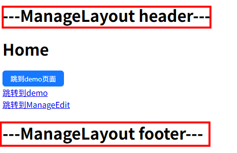
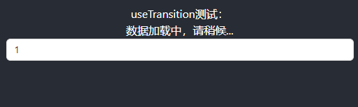

# create-react-app

## 项目环境

| 模块             | 版本 |
| ---------------- | ---- |
| node             | 18+  |
| react            | 18+  |
| react-dom        | 18+  |
| react-router-dom | 6+   |
| react-redux      | 9+   |
| @reduxjs/toolkit | 2+   |

## 新建项目

```
npx create-react-app react-project
```

## 配置路由
```
npm i react-router-dom
```

### 方式1

index.js:

```
import { BrowserRouter } from 'react-router-dom';

const root = ReactDOM.createRoot(document.getElementById('root'));
root.render(
  <React.StrictMode>
      <BrowserRouter>
        <App />
      </BrowserRouter>
  </React.StrictMode>
);
```

App.js:

```
import { useRoutes } from "react-router-dom"
import routes from './router/index.js'

function App() {
  const element = useRoutes(routes)
  return (
    <div className="App">
      <header className="App-header">
        {/* <Routes>
          <Route path="/" element={<Home />}></Route>
          <Route path="/login" element={<Login />}></Route>
        </Routes> */}
        {element}
      </header>
    </div>
  );
}
```

router/index.js:

```
import Home from '../pages/home.js'
import Login from '../pages/login.js'
import NotFound from '../pages/notFound.js'

let routes = [
    {
        path: '/',
        element: <Home />
    },
    {
        path: '/login',
        element: <Login />
    },
    {
        path: '*',
        element: <NotFound />
    }
]
export default routes
```

### 方式2

App.tsx:
```
import { RouterProvider } from 'react-router-dom'
import routerConfig from './router'

return (
    <RouterProvider router={routerConfig}>
      <div className="App"></div>
    </RouterProvider>
  )
```

router/index.tsx:
```
import React from 'react'
import { createBrowserRouter } from 'react-router-dom'

import ManageLayout from '../layouts/ManageLayout'
import Home from '../pages/Home'
import Demo from '../pages/Demo'
import NotFound from '../pages/NotFound'
import ManageList from '../pages/manage/List'
import ManageEdit from '../pages/manage/Edit'

const router = createBrowserRouter([
  {
    path: '/',
    element: <ManageLayout />,
    children: [
      {
        path: '/',
        element: <Home />
      },
      {
        path: 'demo',
        element: <Demo />
      }
    ]
  },
  {
    path: 'manage',
    children: [
      {
        path: 'list',
        element: <ManageList />
      },
      {
        path: 'edit/:id',
        element: <ManageEdit />
      }
    ]
  },
  {
    path: '*', // 以上路由都没有命中，写在最后
    element: <NotFound />
  }
])

export default router
```

## 路由鉴权

router/index.js:

```
const routes = [
  ...
]
import Auth from './authRouter.js'

const authRoutes = (routes) => {
    return routes.map((item) => {
        if (item.needAuth) {
            return {
                path: item.path,
                element: (
                    <Auth>
                        {item.element}
                    </Auth>
                )
            }
        } else {
            delete item.needAuth
            return item
        }
    })
}

export default authRoutes(routes)
```

authRouter.js:

```

import { getToken } from "../utils/storage";
import { Navigate, useLocation } from "react-router-dom";

const Auth = ({ children }) => {
    const hasToken = getToken()
    const location = useLocation()
    if (hasToken) {
        if (location.pathname === '/login') {
            return <Navigate to="/" replace />
        } else {
            return <>{children}</>
        }
    } else {
        // 未登录
        if (location.pathname === '/login') {
            return <>{children}</>
        } else {
            return <Navigate to="/login" replace />
        }
    }
}

export default Auth
```

## 路由传参

#### useSearchParams

```
import { useNavigate } from 'react-router-dom'
const navigate = useNavigate()
// 跳转页面
function jumpPage() {
  // navigate('/demo?a=20')
  // 或
  navigate({
    pathname: '/demo',
    search: 'a=20'
  })
  // navigate(-1) // 返回上一页
}

// 获取
import { useSearchParams } from "react-router-dom"
function Demo() {
    let [searchParams] = useSearchParams();
    console.log(searchParams.get('a'))
    ...
}
```

#### useParams

获取动态参数

```
<Link to="/manage/edit/666">跳转到ManageEdit</Link>


import React, { FC } from 'react'
import { useParams } from 'react-router-dom'

const ManageEdit: FC = () => {
  const { id } = useParams()
  return (
    <div>
      <h1>ManageEdit - {id}</h1>
    </div>
  )
}

export default ManageEdit
```

#### useLocation

```
// 携带参数
<Link to="/page1/111" state={{txt:777}}>go Page1</Link>

// 获取
import { useLocation } from "react-router-dom";
function Page1() {
  console.log('data:', useLocation().state.txt) // 777
  ...
}
```

## Layout

src/layouts/ManageLayout.tsx:
```
import React, { FC } from 'react'
import { Outlet } from 'react-router-dom'

const ManageLayout: FC = () => {
  return (
    <div>
      <h1>---ManageLayout header---</h1>
      <div>
        {/* 类似 vue 的 slot */}
        <Outlet />
      </div>
      <h1>---ManageLayout footer---</h1>
    </div>
  )
}

export default ManageLayout
```

router/index.tsx:
```
import ManageLayout from '../layouts/ManageLayout'
import Home from '../pages/Home'
import Demo from '../pages/Demo'

const router = createBrowserRouter([
  {
    path: '/',
    element: <ManageLayout />,
    children: [
      {
        path: '/',
        element: <Home />
      },
      {
        path: 'demo',
        element: <Demo />
      }
    ]
  }
])
```


## 样式使用

#### 直接在 JS 文件中引入样式文件

```
import './App.css';
```

#### inline 样式
style 是对象形式,其中的key是驼峰式

```
const divStyle = {
  color: 'red',
  marginBottom: '10px'
};

return <div style={divStyle}>content</div>
```

```
<div style={{ cursor: 'pointer',marginTop: '50px' }}>
  内容
</div>
```

## 使用 scss

create-react-app 原生支持 sass module，只需要安装

```
npm i sass -D
```

<!-- <font size=3 color=#ccc>要使用 less 的话，需要 npm run eject 暴露出 webpack 修改配置 或 使用其他工具。</font> -->

## CSS Module

解决className可能重复的问题；
create-react-app 内置了对 CSS Module 的支持。

‌1.更改文件名 ‌

将 CSS 文件名从 styles.css 更改为 styles.module.css
```
.color-yellow {
  color: #FFF766;
}
```

2.引入样式 ‌

在组件文件中，使用 ES6 模块语法引入样式文件

```
import styles from './styles.module.css';
```

‌3.使用样式 ‌

```
<div className={styles['color-yellow']}>
```

## 状态管理 Redux

#### 安装

```
npm install @reduxjs/toolkit react-redux -S
```

#### 为 React 提供 Redux Store

index.js:

```
import store from './store/index.js'
import { Provider } from 'react-redux'

const root = ReactDOM.createRoot(document.getElementById('root'));
root.render(
  <React.StrictMode>
    <Provider store={store}>
        <App />
    </Provider>
  </React.StrictMode>
);

```

#### 创建 Redux State Slice

store/counterSlice.js:

```
import { createSlice } from '@reduxjs/toolkit'

export const counterSlice = createSlice({
  name: 'counter',
  initialState: {
    value: 0
  },
  reducers: {
    increment: state => {
      state.value += 1
    },
    decrement: state => {
      state.value -= 1
    },
    incrementByAmount: (state, action) => {
      state.value += action.payload
    }
  }
})

export const { increment, decrement, incrementByAmount } = counterSlice.actions

export default counterSlice.reducer
```

#### 将 Slice Reducers 添加到 Redux Store 中

store/index.js:

```
import { configureStore } from '@reduxjs/toolkit'
import counterReducer from './counterSlice'

export default configureStore({
  reducer: {
    counter: counterReducer
  }
})
```

#### 在 React 组件中使用 Redux 状态和操作

```
import { useSelector, useDispatch } from 'react-redux'
import { decrement, increment, incrementByAmount } from '../store/counterSlice'

function Page2() {
  const count = useSelector(state => state.counter.value)
  const dispatch = useDispatch()

    return <div>
      <main>Welcome to Page2</main>
      <div>{count}</div>
      <div>
        <button
          onClick={() => dispatch(increment())}
        >
          Increment
        </button>
        <button
          onClick={() => dispatch(incrementByAmount(5))}
        >
          Increment 5
        </button>
        <button
          onClick={() => dispatch(decrement())}
        >
          Decrement
        </button>
      </div>
    </div>
}

export default Page2;
```

#### 页面效果


## 配置多环境

Create React App 搭建的项目，npm run start 指向 development，npm run build 指向 production，通过 process.env.NODE_ENV 获取。

#### 第一种方式：使用 cross-env

```
// 安装 cross-env
npm i cross-env -D

// 配置不同环境命令，REACT_APP_开头
"build:release": "cross-env REACT_APP_ENV=release react-scripts build"

// 获取
process.env.REACT_APP_ENV // release
```

#### 第二种方式：使用 dotenv

安装

```
npm install dotenv-cli -D
```

自定义环境变量名


```
// 配置
"start": "dotenv -e .env.release react-scripts start",

// 获取
process.env.REACT_APP_ENV // release
```

## 异步请求 axios

安装

```
npm i axios
```

config.js:

```
// 不同环境接口地址
const apiList = {
    development: "https://www.dev.com/",
    production: "https://www.prod.com/",
    release: "https://www.release.com/"
}
const env = process.env.REACT_APP_ENV
export const baseUrl = apiList[env]
```

axios.js:

```
import axios from 'axios'

import { baseUrl } from './config'

// 创建axios实例
const service = axios.create({
  baseURL: baseUrl,
  timeout: 30000 // 请求超时时间
})

// 请求拦截器
service.interceptors.request.use(
  config => {
    // config.headers['token'] = ''

    return config
  },
  error => {
    // 请求失败
    return error
  }
)

// 响应拦截器
service.interceptors.response.use(
  response => {
    const res = response.data || {}
    if (res.code !== 200) {

    }
    return res
  },
  // 处理错误响应
  error => {
    if (error.response && error.response.status === 401) {

    } else if (error.response && error.response.status === 403) {

    }
    return Promise.reject(error)
  }
)

export default service

```

api.js:

```
import request from '../axios/index'

export function getInitData(data) {
  return request({
    url: '/data',
    method: 'get',
    params: data
  })
}

export function setInitData(data) {
  return request({
    url: '/setdata',
    method: 'post',
    data
  })
}
```

## 受控组件
受控组件：值同步到 state，使用 value 属性
```
const [text, setText] = useState('hello')
function changeText(e: ChangeEvent<HTMLInputElement>) {
  setText(e.target.value)
}

<input type="text" onChange={changeText} value={text} />
<button onClick={() => console.log(text)}>打印input值</button>
```
非受控组件：值不同步 state，使用 defaultValue 属性
```
<input type="text" defaultValue="hello world" />
```
defaultValue 显示在页面中，但无法获取到

## 父子组件交互

父组件：

```
import Button from '../components/button'

function Page1() {
  const buttonObj = {
    title: '点击按钮',
    bgColor: 'red'
  }
  // 点击子组件按钮时触发
  function handleChildFn(msg) {
    console.log('父组件接收消息：', msg)
  }

  return <div>
    {/* <Button title={buttonObj.title} bgColor={buttonObj.bgColor} /> */}
    <Button {...buttonObj} onMessageChange={handleChildFn} />
  </div>
}

export default Page1;
```

子组件：

```
function Button(props) {
  const buttonStyle = {
    padding: '5px 10px',
    fontSize: '16px',
    lineHeight: '16px',
    border: '1px solid #ccc',
    borderRadius: '4px',
    cursor: 'pointer',
    marginTop: '15px',
    backgroundColor: props.bgColor
  }
  function clickFn() {
    props.onMessageChange('来自子组件')
  }

  return <div style={buttonStyle} onClick={clickFn}>
    <span>{props.title}</span>
  </div>
}

export default Button;
```

## React Hooks

使函数式组件能够拥有类组件的一些特性，例如状态管理和生命周期方法的使用。

  hooks 使用规则：
1. 必须使用 useXXX 格式命名
2. 只能在 函数式组件内或其他hook 内调用
3. 每次的调用顺序一致（不能放在for、if 内）

#### useState

向组件添加状态变量

```
const [count, setCount] = useState(0);

// setCount(count + 1) // 这种写法多次执行count只累加一次（合并更新）
// 或
setCount((count) => count + 1) // 如果页面中 count 是 6
console.log(count) // 那这里是 5，异步更新无法直接拿到最新的 state 值
// 如果 state 不用于 JSX 中显示，那就不要用 useState，用 useRef

// state 是不可变数据
// 对象-传入新值
setUserInfo({
  ...userInfo,
  age: 21
})
// 数组-传入新值
setList(list.concat('z')) // concat 能返回新数组
// 或
setList([...list, 'z'])

```
> 可以使用 **immer** 修改 state 不可变数据

#### useEffect

在组件渲染到屏幕之后异步执行。这意味着它不会阻塞浏览器的绘制和更新，适用于大多数不会直接影响页面布局和视觉呈现的操作，用于执行副作用操作，如数据获取、事件监听等‌，它与类组件中的 componentDidMount、componentDidUpdate 和 componentWillUnmount 生命周期类似。

<font size=2.5>注：react18 开始，useEffect 在开发环境下会执行两次，模拟组件创建、销毁、再创建的完整流程，及早暴露问题；生产环境下只执行一次。</font>

```
useEffect(() => {
  const connection = createConnection(serverUrl, roomId);
  connection.connect();
  return () => {
    // 清理操作
    connection.disconnect();
  };
}, [serverUrl, roomId]);
```

- ‌不传第二个参数‌：监测所有状态和属性，任何变化都会触发副作用函数。
- ‌第二个参数为空数组‌（[]）：表示不监测任何依赖项，副作用函数仅在组件挂载和卸载时执行一次。
- ‌第二个参数为具体依赖项数组‌：只有数组中的依赖项（任意一个）发生变化时，副作用函数才会重新执行。

#### useLayoutEffect‌

同步执行，会在DOM更新后、浏览器绘制之前进行操作，适用于那些需要直接修改DOM样式或结构以避免页面重绘和回流的操作‌。


#### useRef

访问 DOM 元素或保存不触发渲染的变量
```
const divRef = useRef(null);
let count = useRef(0);
useEffect(() => {
  console.log('divRef.current: ', divRef.current)
}, [])
function clickFn() {
  count.current = count.current + 1;
  console.log('count:', count.current)
}

return <div ref={divRef} onClick={clickFn}
    </div>
```

#### useContext

访问 React context 在组件树中传递的数据，而不必通过每个组件传递 props。
```
const ThemeContext = createContext(null)
<ThemeContext.Provider value={theme as any}>
  <Button themeContext={ThemeContext} />
</ThemeContext.Provider>

// Button 组件接收数据
const theme = useContext(props.themeContext);
```

#### useReducer

useState 的替代方案，适用于管理复杂和大型的状态逻辑。

```
function Counter() {
  const reducer = (state, action) => {
    switch (action.type) {
      case 'increment':
        return {count: state.count + 1}
      case 'decrement':
        return {count: state.count - 1}
      default:
        throw new Error()
    }
  }

  const [state, dispatch] = useReducer(reducer, {count: 0})

  return (
    <>
      <p>您点击了 {state.count} 次</p>
      <Button variant="outlined" onClick={() => dispatch({type: 'decrement'})}>递减</Button>
      <Button variant="outlined" onClick={() => dispatch({type: 'increment'})} style={{marginLeft: 15}}>递增</Button>
    </>
  )}
```

#### useMemo

用于缓存计算结果，避免在每次渲染时重复计算‌。（类似于Vue中的computed属性）
```
const filteredItems = useMemo(() => {
  return items.filter(item => item.includes(value))
}, [items, value]); // 依赖变化时重新计算
```

#### useCallback

用于记忆化回调函数，避免在每次渲染时重新创建函数‌。
```
const handleClick = useCallback(() => {
  ...
}, []) // 依赖数组为空表示函数不变化
```

#### useImperativeHandle

用于暴露子组件的属性和方法，实现父组件对子组件的控制

myInput.js
```
import { forwardRef, useRef, useImperativeHandle } from 'react';

// 需要结合 forwardRef 使用
const MyInput = forwardRef((props:any, ref:any) => {
  const inputRef = useRef<HTMLInputElement>(null);

  useImperativeHandle(ref, () => ({
    focus: ()=> {
      inputRef.current?.focus();
    },
    testValue: 123
  }));

  return (<input {...props} ref={inputRef} />)
});

export default MyInput;
```
父组件：
```
const compRef = useRef<any>(null);
function buttonClick() {
  if (compRef.current !== null) {
    compRef.current.focus();
    console.log(compRef.current.testValue)
  }
}
<form>
  <MyInput placeholder='please input' ref={compRef} />
  <button type="button" onClick={buttonClick}> Edit </button>
</form>
```

#### useTransition

useTransition 是在不阻塞 UI 的情况下更新状态的 React Hook。
```
const [isPending, startTransition] = useTransition()

// 紧急更新: 显示输入的内容
setInputValue(input);

startTransition(() => {
  // 过渡更新: 展示结果（低优先级，防止页面卡顿的情况）
  setResultList(input);
});

```




#### useDeferredValue

延迟更新 UI 的某些部分。
```
const deferredValue = useDeferredValue(value)

<SearchResults query={deferredValue} />
```

### 自定义 hooks
```
import { useState, useEffect, useCallback } from 'react'

// 获取鼠标位置
export function useMouse() {
  const [x, setX] = useState(0)
  const [y, setY] = useState(0)

  const updateMouse = useCallback((e: MouseEvent) => {
    setX(e.clientX)
    setY(e.clientY)
  }, [])

  useEffect(() => {
    window.addEventListener('mousemove', updateMouse)
    return () => {
      window.removeEventListener('mousemove', updateMouse)
    }
  }, [])

  return { x, y }
}

// 模拟异步数据
function getInfo(): Promise<string> {
  return new Promise((resolve) => {
    setTimeout(() => {
      resolve(Date.now().toString())
    }, 1500)
  })
}
export function useGetInfo() {
  const [loading, setLoading] = useState(true)
  const [info, setInfo] = useState('')

  useEffect(() => {
    getInfo().then((res) => {
      setLoading(false)
      setInfo(res)
    })
  }, [])

  return {
    loading,
    info
  }
}

// 引用
import { useMouse, useGetInfo } from './hook'
const { x, y } = useMouse()
const { loading, info } = useGetInfo()

<div>
  <div>鼠标位置：{x},{y}</div>
  <div>{loading ? '加载中' : info}</div>
</div>
```

### 第三方 hooks
https://ahooks.js.org/zh-CN

https://github.com/streamich/react-use

## Tailwind CSS

#### 安装

```
npm install tailwindcss postcss autoprefixer -D
```

#### npx tailwindcss init

生成 tailwind.config.js 并编辑

```
/** @type {import('tailwindcss').Config} */
module.exports = {
  content: ["./src/**/*.{js,jsx,ts,tsx}"],
  theme: {
    extend: {},
  },
  plugins: [],
}
```

#### 项目引入 tailwindcss

tailwind.css：

```
@tailwind base;
@tailwind components;
@tailwind utilities;
```

#### 新增 postcss.config.js

```
module.exports = {
  plugins: {
    tailwindcss: {},
    autoprefixer: {},
  }
}
```

#### 组件中使用

```
div className="flex">
  <p>内容</p>
  <p className="flex-1">显示</p>
</div>
```

## Ant Design

```
npm install antd

import { Button } from 'antd'

<Button type="primary">Primary Button</Button>
```

## TypeScript

安装：

```
npm install --save typescript @types/node @types/react @types/react-dom @types/jest
```

tsconfig.json:

```
{
  "compilerOptions": {
    "target": "es5",
    "lib": [
      "dom",
      "dom.iterable",
      "esnext"
    ],
    "allowJs": true,
    "skipLibCheck": true,
    "esModuleInterop": true,
    "allowSyntheticDefaultImports": true,
    "strict": true,
    "forceConsistentCasingInFileNames": true,
    "noFallthroughCasesInSwitch": true,
    "module": "esnext",
    "moduleResolution": "node",
    "resolveJsonModule": true,
    "isolatedModules": true,
    "noEmit": true,
    "jsx": "react-jsx"
  },
  "include": [
    "src"
  ]
}
```

声明文件 react-app-env.d.ts：

```
declare module '*.svg' {
  import * as React from 'react';

  export const ReactComponent: React.FunctionComponent<React.SVGProps<
    SVGSVGElement
  > & { title?: string }>;

  const src: string;
  export default src;
}

declare module '*.module.scss' {
  const classes: { readonly [key: string]: string };
  export default classes;
}
```

将文件重命名为 .tsx 或 .ts 文件

---

gitee 源码：

https://gitee.com/org-xhh/react-project
