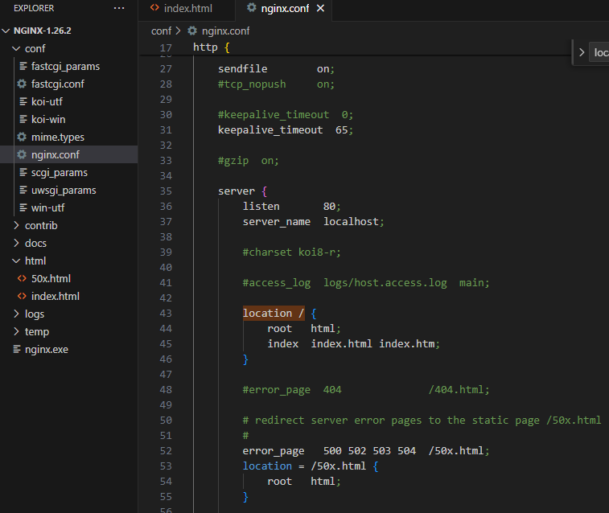

# [nginx](https://nginx.org/en/download.html)



在安装目录打开 cmd，输入命令：nginx.exe，浏览器输入 localhost:80 地址即可打开 html/index.html 页面。

### 查找文件

try_files 按顺序检查文件是否存在，返回第一个找到的文件，至少需要两个参数，但最后一个是内部重定向，也就是和 rewrite 效果一致。
可以用一个状态码 404 作为最后一个参数。

错误代码：

```
location ~.*\.(gif|jpg|jpeg|png)$ {
        root /web/wwwroot;
        try_files /static/$uri $uri;
}
```

原意图是访问 https://net.com/test.jpg 时，先去检查 /web/wwwroot/static/test.jpg 是否存在，不存在就取 /web/wwwroot/test.jpg。

但由于最后一个参数是一个内部重定向，所以并不会检查/web/wwwroot/test.jpg 是否存在，只要第一个路径不存在，就会重定向，然后再进入这个 location 造成死循环，结果出现 500 Internal Server Error

修改之后的代码：

```
location ~.*\.(gif|jpg|jpeg|png)$ {
    root /web/wwwroot;
    try_files /static/$uri $uri 404;
}
```

这样才会先检查 /web/wwwroot/static/test.jpg 是否存在，不存在就 /web/wwwroot/test.jpg，再不存在则返回 404

### 解决 Vue Router history 模式问题

```
location / {
    root   E:\xhh\myproject\xhh-project\dist;
    index  index.html index.htm;
    try_files $uri $uri/ /index.html;
}
```

Vue 是单页面应用（SPA），history 路由模式下，我们只需要将任意页面都重定向到 index.html，把路由交由前端router处理。

[vue 中 history 模式服务器配置示例](https://router.vuejs.org/zh/guide/essentials/history-mode.html#%E5%90%8E%E7%AB%AF%E9%85%8D%E7%BD%AE%E4%BE%8B%E5%AD%90)


### 静态资源缓存策略

```
server {
    # 入口index.html 文件不缓存
    location = /index.html {
        expires -1;
        add_header Cache-Control "no-cache, must-revalidate";
        add_header Pragma "no-cache";
        add_header Expires "0";
    }

    # 图片字体等缓存30天
    location ~* \.(jpg|jpeg|png|gif|ico|svg|woff|woff2|ttf)$ {
        expires 30d;
        add_header Cache-Control "public, no-transform";
        access_log off;  # 减少日志噪音
    }

    # 带8位hash的JS和CSS文件缓存1年（代码修改时hash自然会变）
    location ~* \.[a-f0-9]{8}\.(css|js)$ {
        expires 1y;
        add_header Cache-Control "public, immutable";
    }
}
```

### API代理配置、跨域配置
```
server {
    location /api/ {
        # 重写请求路径：去掉 /api 前缀 (根据后端要求调整)
        rewrite ^/api/(.*)$ /$1 break;

        # 代理到真实的后端服务器地址
        proxy_pass http://backend-server/;

        # 处理跨域相关头信息
        proxy_set_header Host $host;
        proxy_set_header X-Real-IP $remote_addr;
        proxy_set_header X-Forwarded-For $proxy_add_x_forwarded_for;
        proxy_set_header X-Forwarded-Proto $scheme;

        # 可选，WebSocket 代理支持
        proxy_http_version 1.1;
        proxy_set_header Upgrade $http_upgrade;
        proxy_set_header Connection "upgrade";

        # 跨域配置
        add_header 'Access-Control-Allow-Origin' $http_origin always;
        add_header 'Access-Control-Allow-Methods' 'GET, POST, OPTIONS' always;
        add_header 'Access-Control-Allow-Headers' 'DNT,Authorization,X-CustomHeader,Keep-Alive,Origin,X-Requested-With,Content-Type' always;

        # 预检请求处理
        if ($request_method = 'OPTIONS') {
            add_header 'Access-Control-Max-Age' 1728000;
            add_header 'Content-Type' 'text/plain charset=UTF-8';
            add_header 'Content-Length' 0;
            return 204;
        }
    }
}
```

### Gzip 压缩
```
http {
    gzip on; # 开启 Gzip
    gzip_min_length 1k; # 大于 1KB 的文件才压缩
    gzip_comp_level 6; # 压缩级别 (1-9, 6 是较好的平衡点)
    gzip_types text/plain text/css application/json application/javascript text/xml application/xml application/xml+rss text/javascript; # 压缩的文件类型
    gzip_vary on; # 告诉客户端支持 Gzip
    gzip_disable "msie6"; # 对旧 IE 不启用
}
```

### 强制 http 跳到 https
```
server {
    listen 80;
    server_name shop.com www.shop.com; # 域名
    return 301 https://$host$request_uri;
}
```

### HTTP/2 支持
```
server {
    listen 443 ssl http2; #启用 HTTP/2
    server_name your-domain.com;
    
    # SSL证书配置
    ssl_certificate /path/to/cert.pem;
    ssl_certificate_key /path/to/key.pem;
}
```

### 禁止访问敏感文件
```
server {
    location ~ /\.(env|git) {
        deny all;
        return 404;
    }
}
```

### 测试与重载配置
```
# 检查配置文件语法是否正确
sudo nginx -t

# 重新加载 Nginx (不中断服务)
sudo nginx -s reload
```