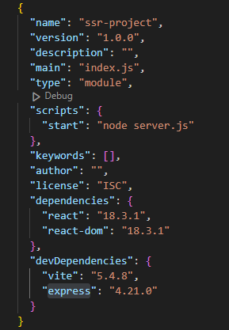
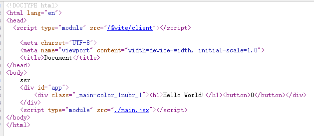

# SSR 服务端渲染

### 新建项目
```
npm init -y
```

### 安装依赖包



### 写一个demo功能
Hello.jsx:
```
import React, { useState } from 'react'

export const Hello = () => {
  const [count, setCount] = useState(0)
  return (
    <div>
      <h1>Hello World!</h1>
      <button onClick={() => setCount((count) => count+1)}>{count}</button>
    </div>
  );
};
```

### 服务端渲染模板
render.jsx:
```
import React from 'react'

// react 服务端渲染方法
import { renderToString } from 'react-dom/server'
import { Hello } from './Hello.jsx'

export const render = () => {
  // 将模板进行渲染
  const html = renderToString(<Hello />)
  return html
}
```

### 新建html页面
index.html:
```
<!DOCTYPE html>
<html lang="en">
<head>
    <meta charset="UTF-8">
    <meta name="viewport" content="width=device-width, initial-scale=1.0">
    <title>Document</title>
</head>
<body>
    ssr
    <div>
        <!--app-html-->
    </div>
</body>
</html>
```

### 创建express服务，返回带有Hello组件的html页面给浏览器
server.js:
```
import express from 'express'
import fs from 'node:fs'

// 创建 vite 服务
import { createServer } from 'vite'
const vite = await createServer({
  server: { middlewareMode: true },
  appType: 'custom'
})

const app = express()
app.use(vite.middlewares)

app.use('*', async (req, res) => {
  // 使用 vite 进行模板加载
  const template = await vite.transformIndexHtml(
    req.url,
    fs.readFileSync('index.html', 'utf-8')
  )
  // 加载 render 渲染器
  const { render } = await vite.ssrLoadModule('render.jsx')
  const html = render()
  res.send(template.replace(`<!--app-html-->`, html))
})

app.listen(3000, () => {
  console.log('Server listening on port 3000')
})
```
打开 localhost:3000:


此时点击事件不生效，需要客户端使用 hydrateRoot 进行水合

### 修改index.html
```
<body>
    ssr
    <div id="app">
        <!--app-html-->
    </div>
    <script type="module" src="./main.jsx"></script>
</body>
```

### 客户端水合
main.jsx:
```
// 客户端入口
import React from 'react'

import { hydrateRoot } from 'react-dom/client'

import { Hello } from './Hello.jsx'

// 客户端水合，否则 Hello 组件里的点击事件不会生效
hydrateRoot(
  document.getElementById('app'),
  <Hello />
)
```

### 添加样式
hello.module.css:
```
.main-color {
    color: red;
}
```
Hello.jsx:
```
import styles from './hello.module.css'

export const Hello = () => {
  ...
  return (
    <div className={styles['main-color']}>
      ...
    </div>
  );
};
```

### 功能展示

