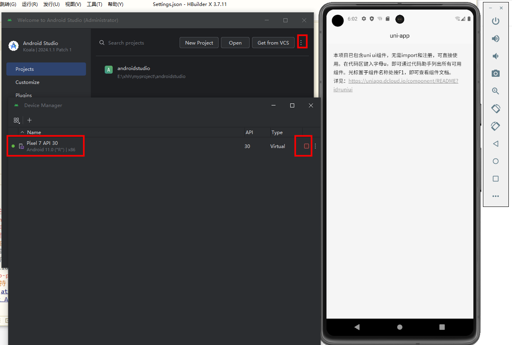
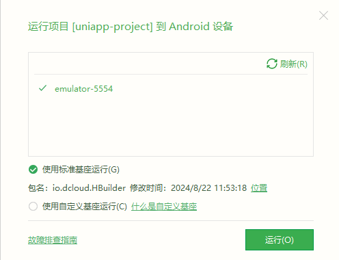
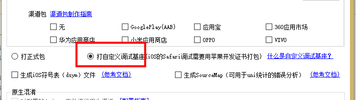
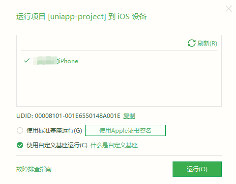
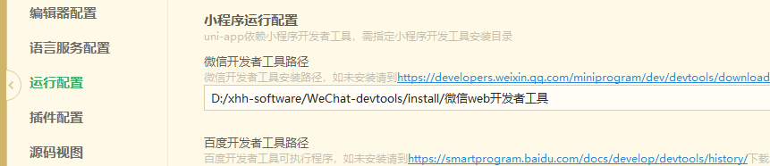
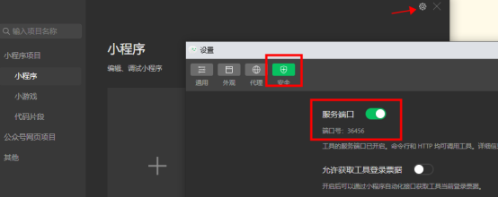

## 相关文档

- [uni-app](https://uniapp.dcloud.net.cn/)
- [HbuilderX](https://www.dcloud.io/hbuilderx.html)

## 开发者后台
https://dev.dcloud.net.cn/pages/app/list

## 运行

### 运行到浏览器

运行 - 运行到浏览器

### 运行到微信小程序

运行 - 运行到小程序模拟器 - 微信开发者工具

### 运行到Android模拟器

- 1. 下载Android Studio

- 2. 创建模拟器 (Virtual Device Manager)，运行模拟器

- 3. HBuilderX - 运行 - 运行到手机或模拟器 - 运行到Android App基座（先安装App真机运行插件，才有这个选项）

### 运行到iOS模拟器

https://uniapp.dcloud.net.cn/tutorial/run/installSimulator.html#ios

### 运行到iOS真机

- 1. 安装itunes连接真机

- 2. 制作自定义基座

运行 - 运行到手机或模拟器 - 制作自定义调试基座 - 选择iOS(ipa包)

- 3. HBuilderX - 运行 - 运行到手机或模拟器 - 运行到iOS App基座

选中上一步骤生成的基座

### 运行到Android真机

https://uniapp.dcloud.net.cn/tutorial/run/run-app.html

## 发布

### 发布为h5

发行 - 网站-PC Web或 手机 H5
打包文件目录：unpackage\dist\build\web

### 发布微信小程序
- 1. 配置微信开发者工具路径（工具-设置）
    
- 2. 微信小程序开启服务端口
    
- 3. (HBuilderX)mainfest.json -> 微信小程序配置 -> 填写AppId
- 4. (HBuilderX)发行 - 小程序-微信
- 5. 微信开发者工具 “上传”

### App云打包和本地打包

https://uniapp.dcloud.net.cn/tutorial/app-env.html
