## 相关文档

- [uni-app](https://uniapp.dcloud.net.cn/)
- [uni-app x](https://doc.dcloud.net.cn/uni-app-x/)
- [HbuilderX](https://www.dcloud.io/hbuilderx.html)
- [开发者后台](https://dev.dcloud.net.cn/pages/app/list)

## 新建项目
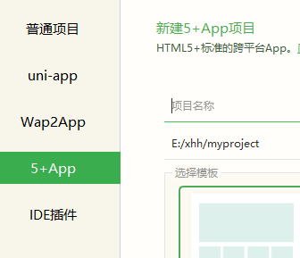

### uni-app 和 uni-app X 区别：
- **uni-app（老版）**

App 端：WebView(.vue)/Weex(.nvue) 渲染，JS 代码跑在 V8/JSC 引擎，靠**JSBridge**和原生通信，属于 Web 套壳 App； 页面文件：`.vue`，Vue2/Vue3 都支持；

- **uni-app X（新版）**

App 端：**UVue 原生渲染**，无 JS 引擎，逻辑用**UTS 强类型语言**直接编译成 Kotlin（Android）、Swift（iOS）、ArkTS（鸿蒙），真正原生 App； 页面文件：`.uvue`后缀，仅兼容Vue3； 禁用 plus.xxx，全部 uni.xxx；

---

| 判断点 | 传统 uni-app（老版） | uni-app X |
|--------|----------------------|-----------|
| manifest.json | 无 `uni-app-x` 字段 | 顶层有 `"uni-app-x":{}` |
| 文件后缀 | `.vue`、可能有`.nvue` | `.uvue`，无nvue；脚本会出现 `<script lang="uts">` |
| plus API | App端大量使用`plus.xxx` | 完全禁用plus |
| 条件编译 | `#ifdef APP-PLUS` 注释宏 | 运行时平台判断 `uni.getSystemInfoSync()` |
| 页面语法 | Vue2/Vue3双支持，文字可不套text | 仅Vue3 setup，文字必须`<text>`包裹 |
| 原生调用 | plus模块 / 5+Runtime | UTSAndroid/UTSiOS 直接调系统 |
| 新建页面 | 默认新建 `.vue`，可选`.nvue` | 默认新建 `.uvue` |


### 新建 uni-app 项目和 5+App 项目区别：

- 技术栈‌：uni-app 强制使用 ‌Vue.js；5+App 使用传统 ‌HTML+CSS+JS‌ (.html 入口)。
- API 调用‌：uni-app 主用 uni.xxx 通用 API（底层兼容 5+）；5+App 直接调用 plus.xxx 原生 API。
- 跨端能力‌：uni-app 一套代码编译至 ‌iOS/Android/H5/多端小程序‌；5+App ‌仅能打包为 App‌。


## 构建配置

`manifest.json`

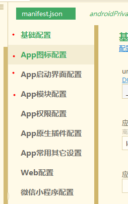

## 插件

1.菜单 => 工具 => 插件安装

安装的是【HBuilderX 编辑器本身】的插件，作用于整个软件，所有项目生效


2.插件市场

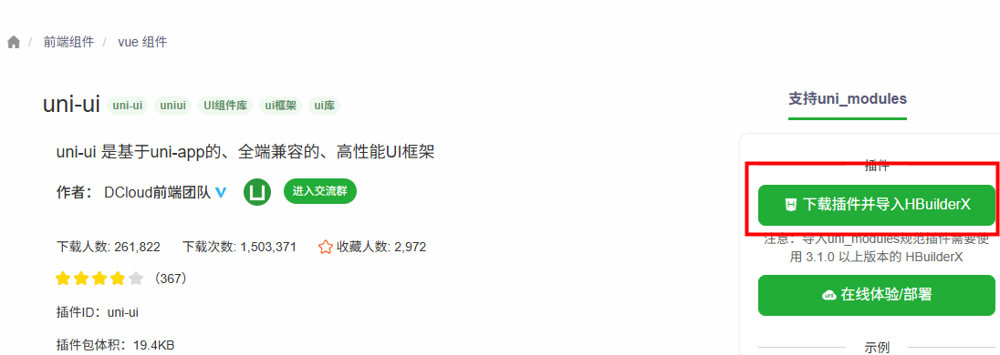
会导入到 uni_modules 中。

---

|项目|node_modules(npm)|uni_modules (uni插件规范)|
|---|---|---|
|安装方式|npm install|HBuilderX 插件市场一键安装|
|组件自动扫描 easycom(autoscan)|❌ 默认不支持 autoscan 自动扫描；可手动写custom正则实现easycom自动引入|✅ 支持 autoscan自动扫描；目录符合规范无需手写custom规则|
|是否需要手动配置 easycom|Vue组件库一般需要手动在pages.json编写custom正则；纯JS工具库不需要|不需要手写custom easycom配置，autoscan=true开箱生效|
|原生插件 (aar/framework/UTS)|❌ 不支持，放这里打包无效|✅ 支持；manifest识别、编译进基座|
|git提交|一般.gitignore忽略，协作要重新 install|✅ 目录提交进 git，直接可用|
|导入写法|`import xx from 'pkgname'`|组件直接写标签；js用 `@/uni_modules/xxx/...`|
|兼容性风险|⚠️ web npm库容易带window/document，App / 小程序报错|插件市场一般经过跨端适配；但也要看插件说明|

## 云函数
1.在HBuilder X，右键项目根目录，创建uniCloud云开发环境-阿里云，项目根目录会自动生成 uniCloud -> cloudfunctions 目录

2.右键 uniCloud -> 关联云服务空间

3.右键 cloudfunctions 新建云函数，函数名例如 hello，HBuilderX 自动生成模板 `index.js`
```
'use strict';
/**
 * 云函数 hello
 * @param {Object} event 前端传过来的参数
 * @param {Object} context 运行上下文
 */
exports.main = async (event, context) => {
	console.log('云函数收到前端参数：', event);

	let { name } = event;

	// 返回数据给客户端
	return {
		code: 200,
		msg: '云函数调用成功',
		data: {
			helloWord: `你好 ${name}！这是来自云函数的返回`
		}
	}
}
```

4.右键云函数文件夹`hello` → 上传部署

5.前端调用云函数
```
let res = await uniCloud.callFunction({
    name: 'hello',
    data: {
        name: 'xx'
    }
})
console.log("云函数返回结果", res.result);
```

## 运行

### 运行到浏览器

运行 - 运行到浏览器

### 运行到微信小程序

运行 - 运行到小程序模拟器 - 微信开发者工具

### 运行到Android模拟器

1. 下载Android Studio

2. 创建模拟器 (Virtual Device Manager)，运行模拟器

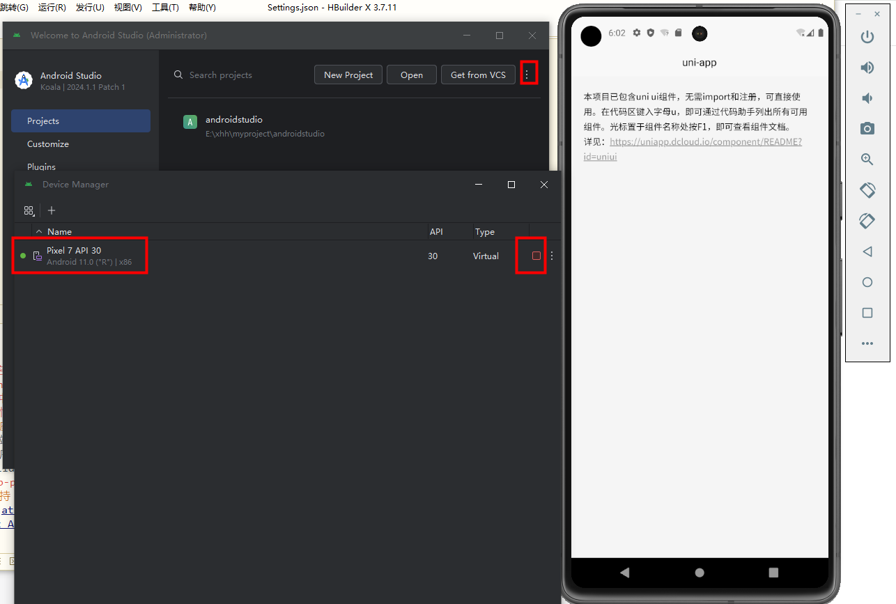

3. HBuilderX - 运行 - 运行到手机或模拟器 - 运行到Android App基座（先安装App真机运行插件，才有这个选项）

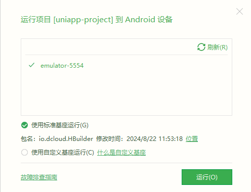

### 运行到Android真机

https://uniapp.dcloud.net.cn/tutorial/run/run-app.html

制作自定义调试基座 => 运行到Android App基座，选择刚才打的自定义基座

备注：引入原生(市场)插件必须使用自定义基座。

### 运行到iOS模拟器

https://uniapp.dcloud.net.cn/tutorial/run/installSimulator.html#ios

### 运行到iOS真机

1. 安装itunes连接真机

2. 制作自定义基座

运行 - 运行到手机或模拟器 - 制作自定义调试基座 - 选择iOS(ipa包)

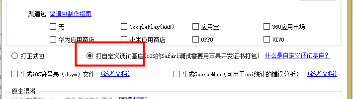

3. HBuilderX - 运行 - 运行到手机或模拟器 - 运行到iOS App基座

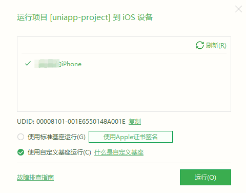

选中上一步骤生成的基座。


## 发行

### 发布为h5

发行 - 网站-PC Web或 手机 H5
打包文件目录：unpackage\dist\build\web


### 发布微信小程序
1. 配置微信开发者工具路径（工具-设置）

    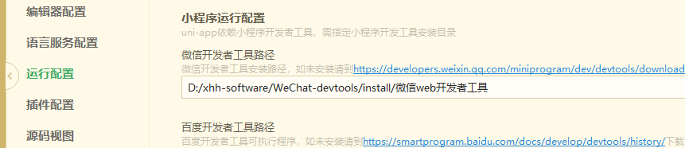
2. 微信小程序开启服务端口

    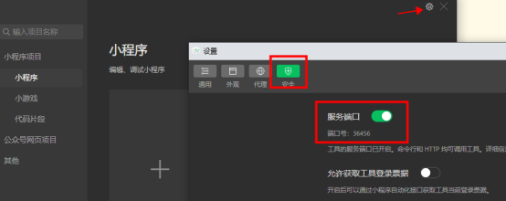
3. (HBuilderX)mainfest.json -> 微信小程序配置 -> 填写AppId
4. (HBuilderX)发行 - 小程序-微信
5. 微信开发者工具 “上传”

### Android云打包

<!-- 
Android平台签名证书(.keystore)生成指南：
https://ask.dcloud.net.cn/article/35777 
-->

发行 => 原生App云打包

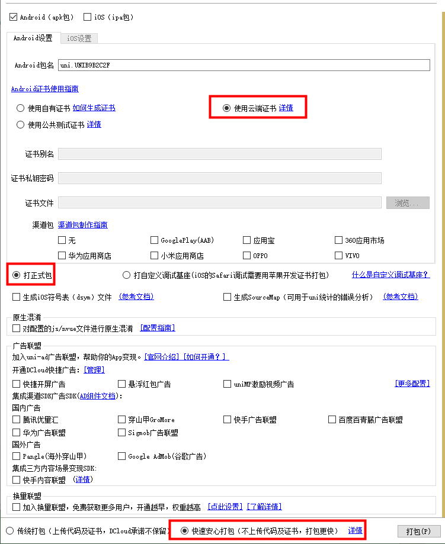

使用云端证书打包时DCLOUD开发者后台会自动创建证书。

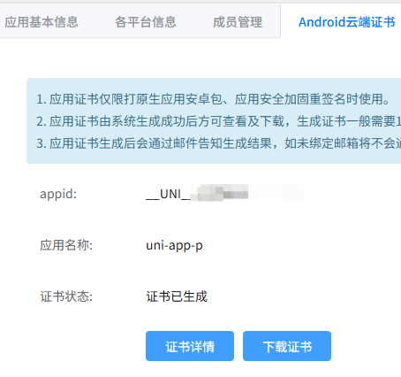

包所在目录：/unpackage/release/apk/__UNI__1BB5B53__20260918173349.apk

### iOS云打包
申请ios证书教程：https://ask.dcloud.net.cn/article/152

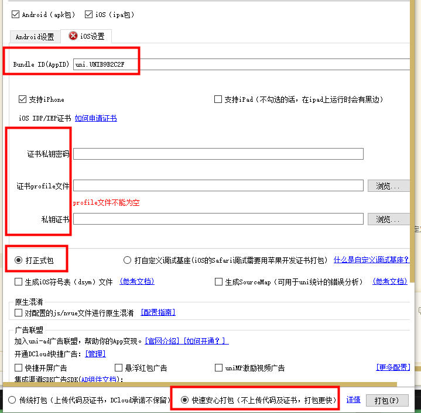

---
Apple开发者后台(证书、描述文件、设备 UDID 管理): https://developer.apple.com/account/

苹果上架后台：https://appstoreconnect.apple.com/

<!--
掘金教程参考：

https://juejin.cn/post/7392535991973511219?searchId=20260811112141318A43FE6558DCBCB2C8

https://juejin.cn/post/7426916970661281802?searchId=202608261705422EBAF93C97C87C285713
-->
