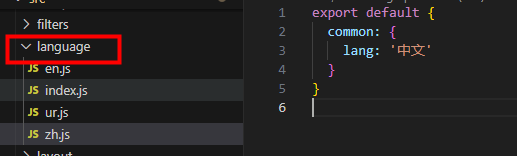

# 国际化

### 1. npm i vue-i18n@8 --save

### 2. 配置多语言


### 3. 创建 i18n 实例
```
import Vue from 'vue'
import VueI18n from 'vue-i18n'

import enLocale from 'element-ui/lib/locale/lang/en'
import zhLocale from 'element-ui/lib/locale/lang/zh-CN'
import ElementLocale from 'element-ui/lib/locale'

// 语言包
import zh from './zh'
import en from './en'

Vue.use(VueI18n)

const messages = {
  zh: {
    ...zh,
    ...zhLocale
  },
  en: {
    ...en,
    ...enLocale
  }
}
const i18n = new VueI18n({
  messages,
  locale: localStorage['internationLang'] || 'zh' // navigator.language
})
ElementLocale.i18n((key, value) => i18n.t(key, value)) // element-ui 组件配置多语言切换
export default i18n
```

### 4. 引入
```
import i18n from './language'

new Vue({
  el: '#app',
  router,
  store,
  i18n,
  render: h => h(App)
})
```

### 5. 切换语言
```
<div>
    <button @click="translateLang('zh')">切换为中文</button>
    <button @click="translateLang('en')">切换为英文</button>
    <span>{{ $t('common.lang') }}</span>
</div>

translateLang(lang) {
    this.$i18n.locale = lang
}
```
---
参考文档：
https://element.eleme.cn/#/zh-CN/component/i18n