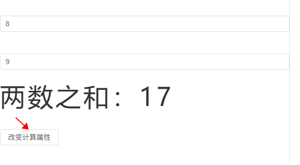

# vue3

## toRefs, toRef
```
let person = reactive({
  name: '张三',
  age: 19
})
// 解构出来的name不是响应式的，修改name不会触发person.name改变
let { name, age } = person
function changeName() {
  name += '~'
}
```
```
let { name } = toRefs(person)
console.log('name---', name) // ObjectRefImpl
function changeName() {
  name.value += '~' // person.name 会改变
}
// or
let name = toRef(person, 'name')
console.log('name---', name) // ObjectRefImpl
function changeName() {
  name.value += '~'
}
```

## computed
```
let num1 = ref(0)
let num2 = ref(0)
// let sum = computed(() => {
//   return (parseFloat(num1.value) || 0) + (parseFloat(num2.value) || 0)
// })
// // computed 计算有缓存，只读
// function changeComputedValue() {
//   sum.value = 222 // computed value is readonly
// }
let sum = computed({
  get() {
    return (parseFloat(num1.value) || 0) + (parseFloat(num2.value) || 0)
  },
  set(val) {
    // console.log('value', val)
    const [n1, n2] = val.split('-')
    num1.value = n1
    num2.value = n2
  }
})
function changeComputedValue() {
  sum.value = '8-9' // 触发 set 方法, num1,num2和sum都改变
}
```


## watch
watch 可以监听：
1. ref定义的数据
2. reactive定义的数据
3. 函数返回一个值(getter函数)
4. 一个包含上述内容的数组

### ref定义的基本类型
```
let val1 = ref(0)
const stopWatch = watch(val1, (newValue, oldValue) => {
  console.log(newValue, oldValue)
  if (newValue >= 10) {
    stopWatch() // 移除监听
  }
})
function changeSum() {
  val1.value += 1
}
```

### ref定义的对象类型
```
let val2 = ref({
  name: 0
})
// val2对象的地址值变化才能监听到；只改name监听不到
watch(val2, (newValue) => {
  console.log('监听val2变化', newValue)
})
function changeVal2Name() {
  // val2.value.name += '~' // 监听不到
  val2.value = { name: 1 }
}
```
优化：
```
let val2 = ref({
  name: 0
})
watch(
  val2,
  (newValue, oldValue) => {
    // val2.value.name += '~' => newValue, oldValue 都是新值，因为它们是同一个对象 (true)
    console.log('监听val2变化', newValue, oldValue, newValue === oldValue)
    // val2.value = { name: 1 } => newValue是新值，oldValue是旧值，不是一个对象了 (false)
  },
  { deep: true } // 需要开启deep才能监听到ref定义的对象属性变化
  // immediate: true
)
function changeVal2Name() {
  val2.value.name += '~'
  // val2.value = { name: 1 }
}
```

### reactive定义的对象类型
```
let val3 = reactive({
  name: 0
})
// reactive定义的对象类型监听时默认开启了深度监听deep，且无法关闭
watch(val3, (newValue) => {
  console.log('监听val3变化', newValue)
})
function changeVal3Name() {
  // val3.name = 888
  Object.assign(val3, { name: 999 })
}
```

### 一个函数返回一个值(getter函数)

#### 监听响应式对象某个属性，且该属性是基本类型：
```
let val3 = reactive({
  name: 0,
  age: 18
})
watch(
  () => val3.name,
  (newValue) => {
    console.log('监听val3.name变化', newValue)
  }
)
function changeVal3Name() {
  val3.name = 888
}
```

#### 监听响应式对象某个属性，且该属性是对象类型：
这种写法兼听不到对象整体改变：
```
let val3 = reactive({
  name: 0,
  age: 18,
  obj: {
    count: 1
  }
})
watch(val3.obj, (newValue) => {
  console.log('监听val3.obj变化', newValue)
})
function changeVal3Name() {
  val3.obj.count = 2
  // val3.obj = { count: 3 } // 整体改变，这个监听obj监听不到
}
```
这种写法监听不到属性改变：
```
let val3 = reactive({
  name: 0,
  age: 18,
  obj: {
    count: 1
  }
})
watch(
  () => val3.obj,
  (newValue) => {
    console.log('监听val3.obj变化', newValue)
  }
)
function changeVal3Name() {
  // val3.obj.count = 2 // 这个写法属性改变监听不到
  val3.obj = { count: 3 }
}
```
优化：

就采用这种写法：<font color=red>getter函数并且加上deep</font>
```
let val3 = reactive({
  name: 0,
  age: 18,
  obj: {
    count: 1
  }
})
watch(
  () => val3.obj,
  (newValue) => {
    console.log('监听val3.obj变化', newValue)
  },
  {
    deep: true
  }
)
function changeVal3Name() {
  // val3.obj.count = 2 // 2种写法都能监听到
  val3.obj = { count: 3 }
}

```

### 监听一个包含上述内容的数组
```
watch(
  [val2, () => val3.obj],
  (newValue, oldValue) => {
    console.log('监听', newValue, oldValue)
  },
  {
    deep: true
  }
)
```

## watchEffect
watchEffect 响应式地追踪其依赖，并在依赖更改时重新执行该函数
```
watchEffect(() => {
  console.log('一上来就执行一次watchEffect')
  // num1、num2 任何一个发生变化都会执行
  if (num1.value >= 10 || num2.value >= 10) {
    console.log('超过10')
  }
})
```