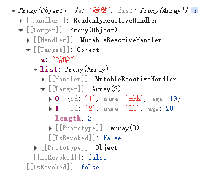
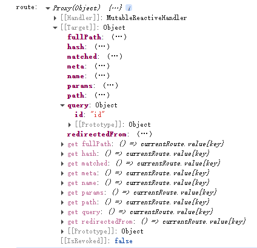
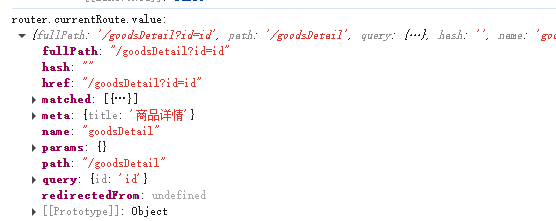
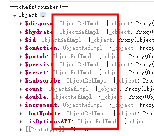
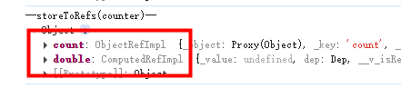
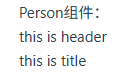
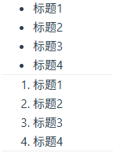
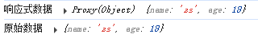
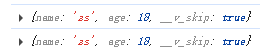
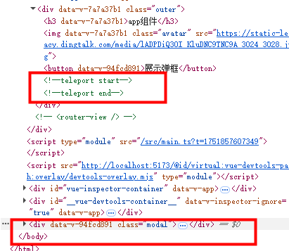

# vue3 部分知识点

## toRefs, toRef

```
let person = reactive({
  name: '张三',
  age: 19
})
// 解构出来的name不是响应式的，因为响应式代理的是对象本身，解构赋值相当于把值 复制 出来了，脱离了响应式系统，修改name不会触发person.name改变。
let { name, age } = person
function changeName() {
  name += '~'
}
```

```
let { name } = toRefs(person)
console.log('name---', name) // ObjectRefImpl
function changeName() {
  name.value += '~' // person.name 会改变
}
// or
let name = toRef(person, 'name')
console.log('name---', name) // ObjectRefImpl
function changeName() {
  name.value += '~'
}
```

## computed

```
let num1 = ref(0)
let num2 = ref(0)
// let sum = computed(() => {
//   return (parseFloat(num1.value) || 0) + (parseFloat(num2.value) || 0)
// })
// // computed 计算有缓存，只读
// function changeComputedValue() {
//   sum.value = 222 // computed value is readonly
// }
let sum = computed({
  get() {
    return (parseFloat(num1.value) || 0) + (parseFloat(num2.value) || 0)
  },
  set(val) {
    // console.log('value', val)
    const [n1, n2] = val.split('-')
    num1.value = n1
    num2.value = n2
  }
})
function changeComputedValue() {
  sum.value = '8-9' // 触发 set 方法, num1,num2和sum都改变
}
```


## watch

watch 可以监听：

1. ref 定义的数据
2. reactive 定义的数据
3. 函数返回一个值(getter 函数)
4. 一个包含上述内容的数组

### ref 定义的基本类型

```
let val1 = ref(0)
const stopWatch = watch(val1, (newValue, oldValue) => {
  console.log(newValue, oldValue)
  if (newValue >= 10) {
    stopWatch() // 移除监听
  }
})
function changeSum() {
  val1.value += 1
}
```

### ref 定义的对象类型

```
let val2 = ref({
  name: 0
})
// val2对象的地址值变化才能监听到；只改name监听不到
watch(val2, (newValue) => {
  console.log('监听val2变化', newValue)
})
function changeVal2Name() {
  // val2.value.name += '~' // 监听不到
  val2.value = { name: 1 }
}
```

优化：

```
let val2 = ref({
  name: 0
})
watch(
  val2,
  (newValue, oldValue) => {
    // val2.value.name += '~' => newValue, oldValue 都是新值，因为它们是同一个对象 (true)
    console.log('监听val2变化', newValue, oldValue, newValue === oldValue)
    // val2.value = { name: 1 } => newValue是新值，oldValue是旧值，不是一个对象了 (false)
  },
  { deep: true } // 需要开启deep才能监听到ref定义的对象属性变化
  // immediate: true
)
function changeVal2Name() {
  val2.value.name += '~'
  // val2.value = { name: 1 }
}
```

### reactive 定义的对象类型

```
let val3 = reactive({
  name: 0
})
// reactive定义的对象类型监听时默认开启了深度监听deep，且无法关闭
watch(val3, (newValue) => {
  console.log('监听val3变化', newValue)
})
// reactive定义的对象或数组不能直接修改(否则会失去响应式)
function changeVal3Name() { 
  // val3.name = 888
  Object.assign(val3, { name: 999 })
}
```

### 一个函数返回一个值(getter 函数)

#### 监听响应式对象某个属性，且该属性是基本类型：

```
let val3 = reactive({
  name: 0,
  age: 18
})
watch(
  () => val3.name,
  (newValue) => {
    console.log('监听val3.name变化', newValue)
  }
)
function changeVal3Name() {
  val3.name = 888
}
```

#### 监听响应式对象某个属性，且该属性是对象类型：

这种写法兼听不到对象整体改变：

```
let val3 = reactive({
  name: 0,
  age: 18,
  obj: {
    count: 1
  }
})
watch(val3.obj, (newValue) => {
  console.log('监听val3.obj变化', newValue)
})
function changeVal3Name() {
  val3.obj.count = 2
  // val3.obj = { count: 3 } // 整体改变，这个监听obj监听不到
}
```

这种写法监听不到属性改变：

```
let val3 = reactive({
  name: 0,
  age: 18,
  obj: {
    count: 1
  }
})
watch(
  () => val3.obj,
  (newValue) => {
    console.log('监听val3.obj变化', newValue)
  }
)
function changeVal3Name() {
  // val3.obj.count = 2 // 这个写法属性改变监听不到
  val3.obj = { count: 3 }
}
```

优化：

就采用这种写法：<font color=red>getter 函数并且加上 deep</font>

```
let val3 = reactive({
  name: 0,
  age: 18,
  obj: {
    count: 1
  }
})
watch(
  () => val3.obj,
  (newValue) => {
    console.log('监听val3.obj变化', newValue)
  },
  {
    deep: true
  }
)
function changeVal3Name() {
  // val3.obj.count = 2 // 2种写法都能监听到
  val3.obj = { count: 3 }
}

```

### 监听一个包含上述内容的数组

```
watch(
  [val2, () => val3.obj],
  (newValue, oldValue) => {
    console.log('监听', newValue, oldValue)
  },
  {
    deep: true
  }
)
```

## watchEffect

watchEffect 响应式地追踪其依赖，并在依赖更改时重新执行该函数

```
watchEffect(() => {
  console.log('一上来就执行一次watchEffect')
  // num1、num2 任何一个发生变化都会执行
  if (num1.value >= 10 || num2.value >= 10) {
    console.log('超过10')
  }
  return () => {
    console.log('Cleaning up...')
  }
})
```
```
watchEffect((onInvalidate) => {
  const timer = setInterval(() => {
    ...
  }, 1000)

  // 清理函数：组件卸载或依赖变化时执行
  onInvalidate(() => {
    clearInterval(timer)
  })
})
```

## 标签 ref 属性

用在 html 标签上：

```
<template>
  <div>
    <div ref="refEle">dom</div>
  </div>
</template>

<script setup>
import { ref, onMounted } from 'vue'

const refEle = ref(null)
onMounted(() => {
  console.log(refEle.value)
})
</script>
```

用在子组件上：

如果不用 defineExpose 暴露出去，父组件无法访问子组件内容

```
// 父组件
<CommonHeader ref="compRef" />

let compRef = ref()
onMounted(() => {
  console.log(compRef.value, compRef.value.keywords)
  ...
}

// 子组件
import { ref, defineExpose } from 'vue'
let keywords = ref('test')
defineExpose({ keywords })
```


## 组件 props

父组件：

```
<template>
  <Person a="哈哈" :list="personList" />
</template>

<script setup lang="ts">
import Person from './components/Person.vue'
import { reactive } from 'vue'
import { type Persons } from './types'

// const personList: Persons = reactive([
//   {
//     id: '1',
//     name: 'xhh',
//     age: 19,
//   },
//   {
//     id: '2',
//     name: 'lb',
//     age: 20,
//   },
// ])
// or 泛型
const personList = reactive<Persons>([
  {
    id: '1',
    name: 'xhh',
    age: 19,
  },
  {
    id: '2',
    name: 'lb',
    age: 20,
  },
])
</script>
```

src/types/index.ts:

```
// 接口
export interface PersonInter {
  id: string
  name: string
  age: number
}

// 自定义类型
// export type Persons = Array<PersonInter>
// or
export type Persons = PersonInter[]

```

子组件：

```
const x = defineProps(['a', 'list'])
console.log(x, x.a, x.list)
```



加上类型校验：

```
import { type Persons } from '@/types'

defineProps<{ list: Persons }>()
```

类型校验+可选传参：

父组件不传 list 也可以

```
import { type Persons } from '@/types'

defineProps<{ list?: Persons }>()
```

类型校验+可选传参+默认值：

```
// [@vue/compiler-sfc] `withDefaults` is a compiler macro and no longer needs to be imported.
// import { withDefaults } from 'vue'
import { type Persons } from '@/types'

withDefaults(defineProps<{ list?: Persons }>(), {
  list: () => [
    {
      id: '2-2',
      name: 'haha',
      age: 24,
    },
  ],
})
```

defineEmits类型校验：
```
const emit = defineEmits<{
  change: [id: number]
  update: [value: string]
}>()
```

## Router

创建路由：

```
import { createRouter, createWebHistory } from 'vue-router'

const router = createRouter({
  history: createWebHistory(import.meta.env.BASE_URL),
  routes: [
    {
      path: '/login',
      name: 'login',
      meta: {
        title: '登录'
      },
      component: () => import('../views/login') // import 路由懒加载
    },
    ...
  ],
  scrollBehavior: () => {
    // 新开页面滚动条回到顶部
    return { top: 0 }
  }
})

export default router
```

挂载路由：

```
import { createApp } from 'vue'
import router from './router'

const app = createApp(App)
app.use(router)
```

渲染出匹配到的路由：

```
<RouterView :key="$route.fullPath" />
```

### 接收参数

```
import { useRouter, useRoute } from 'vue-router'
const router = useRouter()
const route = useRoute()

console.log('route:', route)
```



```
console.log('router.currentRoute.value:', router.currentRoute.value)
```



### 路由规则的 props 配置

```
{
  path: '/waterfallPage',
  name: 'waterfallPage',
  meta: {
    title: '瀑布流'
  },
  component: () => import('../views/waterfallPage'),
  children: [
    // 嵌套路由 /waterfallPage/waterfall
    {
      path: 'waterfall/:a?/:b?',
      name: 'waterfall',
      meta: {
        title: '瀑布流子页面'
      },
      component: () => import('../views/waterfall'),
      // <waterfall a="" b="" />
      // props: true // 写法一、将路由收到的所有params参数作为props传递给路由组件
      props(route) {
        // 写法二、自己决定将什么作为props传递给路由组件
        // return route.query
        return route.params
      }
      // props: {
      //   // 写法三
      //   a: 100
      // }
    }
  ]
}
```

页面接收：

```
defineProps(['a', 'b'])
```

### replace

```
<RouterLink replace to="/goodsDetail?id=2">goodsDetail</RouterLink>

router.replace({
  name: 'confirmOrder'
})
```

### 重定向

```
{
  path: '/',
  redirect: '/home'
}
```

## defineAsyncComponent
仅在路由匹配或交互触发时加载组件，避免加载未使用的组件资源。
```
// 懒加载路由组件：仅当访问 /about 时才加载 About.vue
const About = defineAsyncComponent(() => import('../About.vue'))
```
```
const MyComponent = defineAsyncComponent({
  loader: () => import('./MyComponent.vue'),
  loadingComponent: LoadingComponent, // 加载中的组件
  errorComponent: ErrorComponent,     // 错误时的组件
  delay: 200,                        // 延迟显示加载组件，单位为毫秒
  timeout: 3000,                     // 超时时间，单位为毫秒
  // 其他选项...
});
```


## pinia

引入 pinia

```
import { createPinia } from 'pinia'
const pinia = createPinia()
app.use(pinia)
```

创建 store（目录 src/store）:

```
import { defineStore } from 'pinia'

// 官方推荐命名格式
export const useCounterStore = defineStore('counter', {
  state() {
    // 存储数据
    return {
      count: 0
    }
  },
  getters: {
    double: (state) => state.count * 2
  },
  actions: {
    increment(value) {
      this.count += value
    }
  }
})
```

使用 store:

```
import { useCounterStore } from '@/store/counter'
const counter = useCounterStore()
console.log('获取 store count:', counter.count, counter.$state.count)

function addShopCart() {
  // pinia
  // counter.count += 1
  // or
  counter.$patch({
    count: counter.count + 1
  })
  // or
  // counter.$patch((state) => {
  //   state.count = counter.count + 1
  // })
  // or
  // counter.increment(1)
}
```

### 持久化存储
localStorage 或 pinia-plugin-persistedstate 插件

### storeToRefs

```
// 这种写法不是响应式数据，修改了count页面上的countValue不更新
let countValue = counter.count

console.log('--toRefs(counter)--', toRefs(counter)) // 不建议这么写
```

```
// storeToRefs 获取响应式数据，只会关注store中的数组，不会对方法进行ref包裹
let countValue = storeToRefs(counter).count
```


### $subscribe

```
counter.$subscribe((mutate, state) => {
  // store中的数据发生了变化
  console.log('$subscribe:', mutate, state.count)
})
```

### 组合式写法

```
// store 组合式写法
import { ref, computed } from 'vue'
export const useCounterStore = defineStore('counter', () => {
  const count = ref(localStorage.getItem('storeCount') || 0)
  const double = computed(() => count.value * 2)
  function increment(value) {
    count.value += value
  }
  return { count, double, increment }
})


counter.$subscribe((mutate, state) => {
  // store中的数据发生了变化
  localStorage.setItem('storeCount', state.count)
  console.log('$subscribe:', mutate, state.count)
})
```

## v-model

### 用在 input 等标签上

```
<input v-model="keyword" />
// or
<input
  :value="keyword"
  @input="keyword = (<HTMLInputElement>$event.target).value"
  placeholder="请输入"
/>
```

### 用在自定义组件上

```
// 父组件
keyword: {{ keyword }}
<XhhInput v-model="keyword" />
// 等同于
<XhhInput :modelValue="keyword" @update:modelValue="keyword = $event" />
<!-- 对于自定义事件，$event就是触发事件时所传递的数据，不能 .target -->

// 子组件
<template>
  <input
    :value="modelValue"
    @input="emit('update:modelValue', (<HTMLInputElement>$event.target).value)"
    placeholder="请输入"
  />
  <!-- 原生事件，$event就是事件对象，$event.target就是input元素 -->
</template>

<script lang="ts" setup>
defineProps(['modelValue'])
const emit = defineEmits(['update:modelValue'])
</script>
```
或 子组件使用 v-model 绑定传来的变量：
```
<template>
  <input v-model="newValue" placeholder="请输入" />
</template>

<script lang="ts" setup>
import { computed } from 'vue'
const props = defineProps(['modelValue'])
const emit = defineEmits(['update:modelValue'])

const newValue = computed({
  get() {
    return props.modelValue
  },
  set(val) {
    emit('update:modelValue', val)
  },
})
</script>
```
或 Vue3.4+ defineModel:
```
<template>
  <input v-model="model" />
</template>

<script lang="ts" setup>
const model = defineModel()
</script>
```

v-model 修改绑定的变量

```
<XhhInput v-model:modelValueOther="keyword" />
<XhhInput v-model:modelValueOther="keyword" v-model:xyz="abc" />

<template>
  <input
    :value="modelValueOther"
    @input="emit('update:modelValueOther', (<HTMLInputElement>$event.target).value)"
    placeholder="请输入"
  />
</template>

<script lang="ts" setup>
defineProps(['modelValueOther'])
const emit = defineEmits(['update:modelValueOther'])
</script>
```

## 插槽

### 默认插槽

在子组件

```
<slot></slot>
// 等同于
<slot name="default"></slot>
```

### 具名插槽

```
<Person>
  <template v-slot:title>
    <div>this is title</div>
  </template>
  <template #header>
    <div>this is header</div>
  </template>
</Person>


<div>
  <div>Person组件：</div>
  <slot name="header"></slot>
  <slot name="title"></slot>
</div>
```



### 作用域插槽

```
<Person>
  <template v-slot="params">
    <ul>
      <li v-for="(item, index) in params.listP" :key="index">
        {{ item.title }}
      </li>
    </ul>
  </template>
</Person>
<Person>
  <template v-slot="{ listP }">
    <ol>
      <li v-for="(item, index) in listP" :key="index">
        {{ item.title }}
      </li>
    </ol>
  </template>
</Person>

// Person.vue
<slot :listP="list"></slot>
import { reactive } from 'vue'
const list = reactive([
  {
    title: '标题1',
  },
  {
    title: '标题2',
  },
  {
    title: '标题3',
  },
  {
    title: '标题4',
  },
])
```



和具名插槽结合在一起

```
<template v-slot:listcon="{ listP }">
// or
<template #listcon="{ listP }">

// Person.vue
<slot name="listcon" :listP="list"></slot>
```

## shallowRef, shallowReactive

浅代理，只代理对象属性，不代理对象属性的属性

```
import { shallowRef } from 'vue'
const sum = shallowRef(0)
const person = shallowRef({
  // 只能处理第一层的响应式
  name: 'zs',
  age: 29,
})
function changeSum() {
  sum.value += 1
}
function changePersonName() { // ref定义的生效，shallowRef定义的修改不生效
  person.value.name = 'ls'
}
function changePersonAge() { // ref定义的生效，shallowRef定义的修改不生效
  person.value.age += 1
}
function changePerson() {
  person.value = {
    name: 'new name',
    age: 99,
  }
}
```

```
import { shallowReactive } from 'vue'
const person = shallowReactive({
  // 只能处理第一层的响应式
  name: 'zs',
  inner: {
    age: 18,
  },
})
function changePersonName() {
  person.name = 'ls'
}
function changePersonAge() { // 不生效
  person.inner.age += 1
}
```

## readonly, shallowReadonly

readonly 只读，不可修改

sum 可以改，改了 sum2 也跟着变；
但是 sum2 无法修改，数据保护

```
const sum = ref(0)
const sum2 = readonly(sum)
```

shallowReadonly: 只作用于对象的顶层属性

```
const person = reactive({
  name: 'zs',
  inner: {
    age: 18,
  },
})
// person2的name不能改，person2.inner.age可以改
const person2 = shallowReadonly(person)
```

## toRaw, markRaw

toRaw: 获取响应式对象的原始对象，返回的对象不再响应式

```
let newPerson = toRaw(person)
```



markRaw: 标记对象，使其永远不会成为响应式对象

```
import { reactive, markRaw } from 'vue'
const person = markRaw({ // 不是响应式
  name: 'zs',
  age: 18,
})
const person2 = reactive(person) // 不会成为响应式
```



使用场景: 为了防止误把第三方库变为响应式对象

```
import mockjs from 'mockjs'

let mockJs = markRaw(mockjs)
```

## customRef

作用：创建一个自定义的 ref，并对其依赖项跟踪和更新触发进行逻辑控制。

使用 Vue 提供的 ref 定义的响应式数据，数据一变，页面立即更新。如果想过几秒再更新页面，ref 就做不到了。

```
<template>
  <div>
    <div>{{ msg }}</div>
    <input type="text" v-model="msg" placeholder="请输入" />
  </div>
</template>

<script setup lang="ts">
import { customRef } from 'vue'

let initialValue = ''
let timer: number
const msg = customRef((track, trigger) => {
  return {
    get() {
      track() // 告诉Vue追踪这个值，一旦msg变化就更新页面
      return initialValue
    },
    set(newValue) {
      clearTimeout(timer)
      timer = setTimeout(() => {
        initialValue = newValue
        trigger() // 通知vue数据msg变化了
      }, 1000)
    },
  }
})
</script>
```

封装优化：

useMsgRef.ts:

```
import { customRef } from 'vue'

export default function (initialValue: string, delay: number) {
  let timer: number
  const msg = customRef((track, trigger) => {
    return {
      get() {
        track() // 告诉Vue追踪这个值，一旦msg变化就更新页面
        return initialValue
      },
      set(newValue) {
        clearTimeout(timer)
        timer = setTimeout(() => {
          initialValue = newValue
          trigger() // 通知vue数据msg变化了
        }, delay)
      },
    }
  })

  return {
    msg,
  }
}
```

```
import useMsgRef from './useMsgRef'

const { msg } = useMsgRef('Hello', 1000)
```

## Teleport

父组件：

```
<div class="outer">
    
    <Modal />
</div>

.outer {
  background-color: #ddd;
  width: 400px;
  height: 400px;
  filter: saturate(200%);
}
```

当父元素（如 body 或 div）开启 filter 效果时，CSS 会为该元素创建一个新的包含块。此时，使用 position: fixed 样式的元素的定位基准会从浏览器视窗（viewport）切换到该父元素，即子组件 fixed 会相对于父元素进行定位。

子组件 Modal：

为了使该组件还是相对于浏览器定位，需要使用 Teleport 组件。

```
<template>
  <button @click="isShow = true">展示弹框</button>
  <Teleport to="body">
    <div v-if="isShow" class="modal">
      <div>modal</div>
      <button @click="isShow = false">关闭弹框</button>
    </div>
  </Teleport>
</template>
```



## Suspense
```
import { defineAsyncComponent } from 'vue'
const AsyncComponent = defineAsyncComponent({
  loader: () => import('./components/AsyncComponent.vue'),
  onError: (error, retry, fail, attempts) => {
    // 处理错误逻辑
  },）
  timeout: 3000 // 可选，超时时间（毫秒）
})

<Suspense>
  <template #default>
     <AsyncComponent />
  </template>
  <template v-slot:fallback>
    <h3>加载中...</h3>
  </template>
</Suspense>
```

## 全局 API 转移到应用对象

- app.component
- app.config
- app.directive
- app.mount
- app.unmount
- app.use

## 非兼容性改变

https://v3-migration.vuejs.org/zh/breaking-changes/
