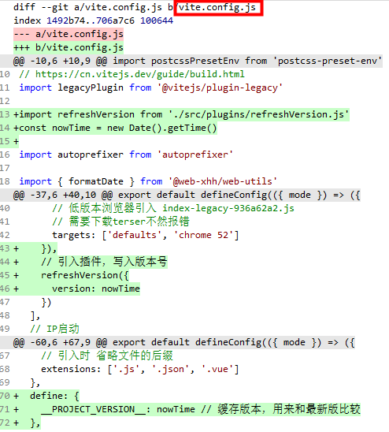

# 检测项目是否有新版发布

在Vue项目中，判断是否发布新包通常涉及到比较项目的某个版本号与服务器上的版本号是否一致，如果不一致就刷新页面更新为最新发布的代码。

## vue2 检测新包

package.json:

```
"scripts": {
    build": "node ./src/utils/version/dynamicVersion.js && vue-cli-service build",
}
```

src/utils/version/dynamicVersion.js:
```
const fs = require('fs')
const path = require('path')

let versionPath = path.resolve(__dirname, '../../../public/version.json')

let versionData = {}
versionData.version = new Date().getTime()
// 写入
fs.writeFile(versionPath, JSON.stringify(versionData, null, '\t'), err => {
  err && console.log('记录打包', err)
})
```
在router.beforeEach时检测：
```
import axios from 'axios'

let VERSION_NAME
let url = ''

VERSION_NAME = 'test-version'
url = `//${window.location.host}/version.json`

axios.get(url + `?t=${new Date().getTime()}`).then(res => {
  if (res.status === 200) {
    let vueVersion = res.data.version
    let localVueVersion = localStorage.getItem(VERSION_NAME)
    localStorage.setItem(VERSION_NAME, vueVersion)
    if (localVueVersion && localVueVersion + '' !== 'undefined' && localVueVersion + '' !== vueVersion + '') {
      // alert('检测到新版本，请点击确认刷新页面哦')
      window.location.reload(true)
      return
    }
  }
})
```


## vue3+vite 检测新包

vite.config.js:



src/plugins/refreshVersion.js:

```
import path from 'path'
import fs from 'fs'

const writeVersion = async (versionFile, content) => {
  fs.writeFile(versionFile, content, (err) => {
    if (err) throw err
  })
}

export default (options) => {
  // version.json 存储在public目录下
  let configPath
  return {
    name: 'refreshVersion',
    configResolved(resolvedConfig) {
      // version.json路径  ../xhh-project/public
      // console.log('运行环境', resolvedConfig.mode)
      configPath = resolvedConfig.publicDir
    },
    async buildStart() {
      // path.sep \
      const file = configPath + path.sep + 'version.json'
      const content = JSON.stringify({ version: options.version })
      // version.json已存在，修改
      if (fs.existsSync(configPath)) {
        writeVersion(file, content)
      } else {
        // 创建
        fs.mkdir(configPath, (err) => {
          if (err) throw err
          writeVersion(file, content)
        })
      }
    }
  }
}

```

src/permission.js:
```
router.beforeEach(async (to, from, next) => {
  // 是否上传了新版本
  await versionIsUpdate()

  ...
})
 
const versionIsUpdate = async () => {
  if (process.env.NODE_ENV === 'production') {
    const response = await axios.get(`//${window.location.host}/version.json`)
    // console.log('版本比较', __PROJECT_VERSION__, response.version)
    // 发布新版，页面刷新前__PROJECT_VERSION__是上个版本的version，response.version是最新打包的version
    if (__PROJECT_VERSION__ !== response.version) {
      console.log('检测到有新版本')
      setTimeout(() => {
        window.location.reload()
      })
    }
  }
}
```

