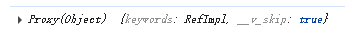

# 通信

## vue3

### <font color=red>父子通信</font>

```
defineProps

const emitEvent = defineEmits(['emitCarousel'])
function emitCarousel(item) {
  emitEvent('emitCarousel', item)
}
```

### <font color=red>defineExpose</font>

父组件通过 ref 获取子组件实例，调用子组件defineExpose暴露的方法。

```
子组件：
const list = ref(['html','css'])
defineExpose({list})

父组件：
<child ref="childRef"></child>

const childRef = ref(null)
onMounted(()=>{
    console.log(childRef.value.list)
})
```

### <font color=red>跨级组件通信</font>

provide 用于提供可以被后代组件注入的值。

inject 注入一个由祖先组件或整个应用 (通过 app.provide()) 提供的值

```
import { provide, ref } from 'vue'
const val = ref(100)
function updateVal(value: number) {
  val.value -= value
}
provide('commonObj', { val, updateVal })

// 接收
import { inject } from 'vue'
const { val, updateVal } = inject('commonObj', { val: 0, updateVal: (x: number) => {} })

<div>{{ val }}</div>
<button @click="updateVal(5)">修改</button>
```
为注入值设置默认值：
```
inject('testValue', 'defaultValue');
```

### <font color=red>attrs</font>

属性透传

包含父作用域里除 class 和 style 除外的非 props 属性集合

在js中使用：
```
import { useAttrs } from "vue"

const attrs = useAttrs()
console.log(attrs)
```
在template中使用：
```
{{ $attrs }}
```
多层透传，当前组件的子组件subComp就能获取到$attrs，defineProps也能接收到透传的属性：
```
<subComp v-bind="$attrs" />
```

### <font color=red>pinia</font>

状态管理

```
import { defineStore } from 'pinia'

export const useCounterStore = defineStore('counter', {
  state: () => {
    return {
      count: 0
    }
  },
  // 也可以定义为
  // state: () => ({ count: 0 })
  getters: {
    double: (state) => state.count * 2
  },
  actions: {
    increment() {
      this.count++
    }
  }
})

import { useCounterStore } from '@/store/counter'
const counter = useCounterStore()
counter.$patch({
  count: counter.count + 1
})
// 或
// counter.$patch((state) => {
//   state.count = counter.count + 1
// })
// counter.increment()
```

### <font color=red>事件总线（Mitt）</font>
适用于无直接关系的组件，支持TS
```
npm install mitt


// eventBus.js
import mitt from 'mitt';
export default mitt();

// 组件A 发送消息
import bus from '../utils/eventBus';
bus.emit('bus-message', { username: 'xhh' });

// 组件B 监听消息
import bus from '../utils/eventBus';
onMounted(() => {
  bus.on('bus-message', (data) => {
    console.log('接收消息:', data);
  });
});
onUnmounted(() => {
  bus.off('bus-message');
  // bus.all.clear() // 解绑所有事件
});
```

### $refs, $parent
$refs获取通过ref属性定义的组件实例：
```
// 父
<div @click="fn($refs)">所有带ref的组件实例</div>

function fn(refs:{[key:string]:any}) {
  for (let key in refs) {
    console.log(refs[key])
    refs[key].keywords = 'test data' // 子组件的keywords改变了
  }
}

// 子
let keywords = ref('')
defineExpose({ keywords })
```


$parent获取父组件实例：
```
// 父
let name = ref('xhh')
defineExpose({ name })


// 子
<div @click="fn($parent)">获取父</div>
function fn(parent:any) {
  parent.name = 'x-h-h' // 父组件name改变了
}
```

补充：
```
let obj = reactive({
  a: 1,
  b: ref(6)
})
console.log(obj.a) // 1

// 当访问obj.b时，底层会自动读取value属性，因为b是在obj这个响应式对象中
console.log(obj.b) // 6
```

### <font color=red>localStorage、sessionStorage</font>

都遵循同源策略：只有在相同的协议、域名和端口下，数据才能被访问。

```
window.addEventListener('storage', function(e) {
    console.log('监听storage变化:', e.key, e.newValue, e.oldValue)
})
```

### <font color=red>app.config.globalProperties</font>

```
import { createApp } from 'vue'
const app = createApp(App)
app.config.globalProperties.msg = 'test'

// js中使用
import { getCurrentInstance } from "vue"
const { proxy, appContext } = getCurrentInstance()
console.log(proxy.msg) // test
// 或
console.log(appContext.config.globalProperties.msg) // test

// 直接在模板中使用
{{ msg }}
```

### <font color=red>BroadcastChannel API</font>

‌BroadcastChannel API‌ 是 HTML5 引入的一个 Web API，允许同一源（同一域名、协议和端口）下的多个浏览器窗口、标签页、iframe 或服务工作线程之间进行消息传递。

```
const sendMessage = () => {
  // 创建 BroadcastChannel 实例
  const channel = new BroadcastChannel("channelName")

  // 发送消息
  channel.postMessage("origin Message")
}

// 接收消息
channel.onmessage = (event) => {
  console.log("收到的消息:", event.data)
}
```

## vue2

### <font color=red>父子通信</font>

```
props
$emit()
```

### <font color=red>ref</font>

```
<child ref="child"></child>

const child = this.$refs.child
child.someMethod("调用子组件的方法")
```

### <font color=red>$attrs / $listeners</font>

$attrs：包含父作用域里除 class 和 style 除外的非 props 属性集合。通过 this.$attrs 获取父作用域中所有符合条件的属性集合，然后还要继续传给子组件内部的其他组件，就可以通过 v-bind="$attrs"

$listeners：包含父作用域里 .native 除外的监听事件集合。如果还要继续传给子组件内部的其他组件，就可以通过 v-on="$linteners"

```
// 父组件
<template>
    <child :name="name" title="123"></child>
</template
export default{
    data() {
        return {
            name: "xhh"
        }
    }
}

// 子组件
<template>
    // 继续传给孙组件
    <sun-child v-bind="$attrs"></sun-child>
</template>
export default{
    props: ["name"], // 这里可以接收，也可以不接收
    mounted(){
        // 如果props接收了 name 就是 { title: 123 }，否则就是{ name: "xhh", title: 123 }
        console.log(this.$attrs)
    }
}
```

### <font color=red>$children / $parent</font>

### <font color=red>provide / inject</font>

### <font color=red>中央事件总线 EventBus</font>

```
Vue.prototype.$bus = new Vue()

$bus.$emit()
$bus.$on()
$bus.$off()
```

### <font color=red>$root</font>

### <font color=red>Vuex</font>

状态管理

### <font color=red>slot</font>

```
// 子组件
<template>
    <div>
        <slot :user="user"></slot>
    </div>
</template>
export default{
    data(){
        return {
            user: {
                name: "xhh"
            }
        }
    }
}

// 父组件
<template>
    <div>
        <child v-slot="slotProps">
            {{ slotProps.user.name }}
        </child>
    </div>
</template>
```

### <font color=red>localStorage、sessionStorage</font>
