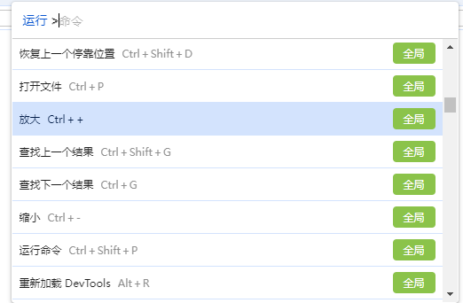
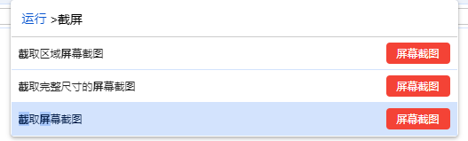
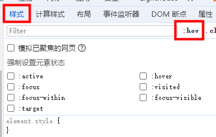
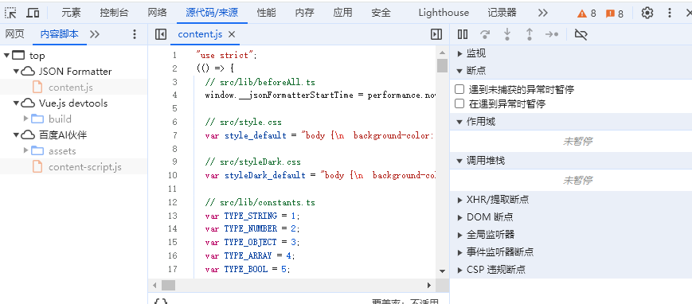
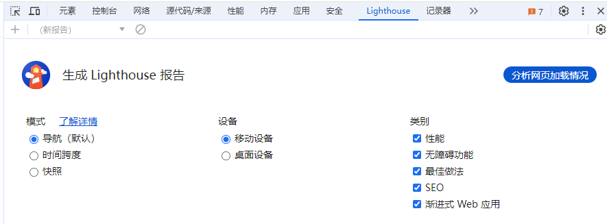

### 切换浏览器标签

Ctrl + 1 到 8 切换到对应序号的浏览器标签 

Ctrl + PgUp / PgDn 标签页左右切换

### 浏览器全屏

F11

### 打开调试模式

1. F12

2. Ctrl + Shift + I (Windows) 或 Command + Option + I (Mac)

3. 页面右键菜单-检查

4. 浏览器菜单-开发者工具(DevTools)

### 切换 DevTools 的面板标签

ctrl + [ 和 ctrl + ] 左右切换

### 查找内容

Ctrl + F

### 命令Command面板

Windows：Ctrl + Shift + P 

Mac：Command + Shift + P

如下图：

### 页面截屏

### 元素 Element 面板

- 强制激活伪类
    1. 选择Dom节点右键 - 强制执行状态
    2. 样式-启用/停用元素状态
    

- DOM断点

    选中Dom右击-发生中断的条件

### 控制台 Console 面板 

    console函数(console.time()、console.timeEnd()等)

### 源代码 Sources 面板

### Lighthouse

### Performance
点击左上角的灰色圆点，变成红色就可以开始记录了，这时可以模仿用户使用网站，使用完毕后点击 stop，然后就能看到网站运行期间的性能报告。如果有红色的块，代表有掉帧的情况；如果是绿色，则代表 FPS 很好。