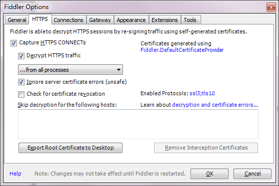
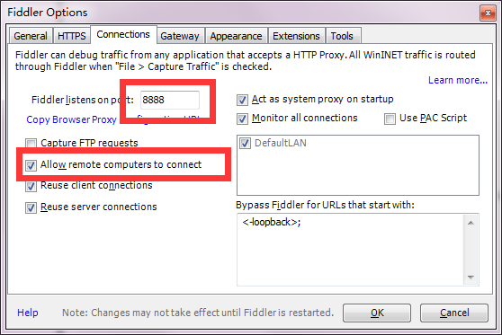
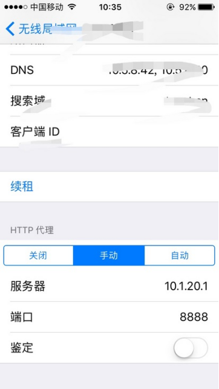
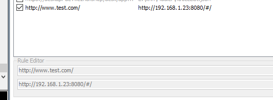
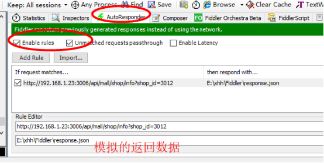

# Fiddler使用

## Fiddler设置

打开Fiddler,配置fiddler允许监听到https（fiddler默认只抓取http格式的）：

Tools -> Options -> HTTPS:

配置fiddler允许远程连接：

Tools -> Options -> Connections:

重启Fiddler。

## 查看电脑ip地址
cmd -> ipconfig -> IPv4地址

以10.1.20.1为例。

## 手机代理
首先确保手机和电脑连接同一个网络，打开手机浏览器，输入 

http://10.1.20.1:8888

提示下载Fiddler证书，安装FiddlerRootcertificate即可。

然后设置当前网络HTTP代理：

## iphone授权

（1）通用 - VPN与设备管理 - 验证DO_NOT_TRUST_FiddlerRoot

（2）通用 - 关于本机 - 信任Fiddler

操作手机，浏览百度等网页，fiddler就可以抓到包了。

## PC端安装证书

1.Fiddler -Tools -Options - HTTPS - Actions - Export Root Certificate to Desktop

2.chrome浏览器 - 隐私设置和安全 - 安全 - 管理证书

3.受信任的根证书颁发机构 - 导入 - 选择证书

4.Fiddler -Tools - Options- HTTPS - Actions - Trust Root Certificate

5.重新打开fiddler

## AutoResponder 环境代理

## 模拟接口返回数据
