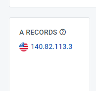
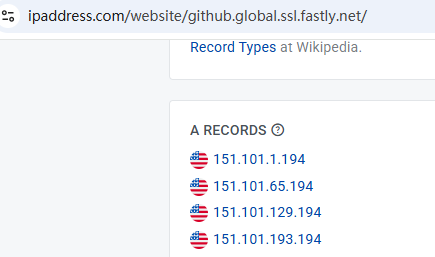
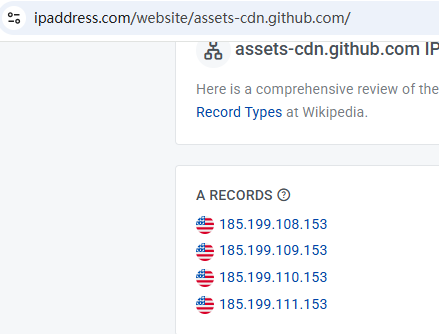
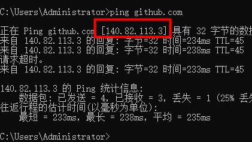

一、绕过 DNS 解析

1. 查看ip地址

https://www.ipaddress.com/

在页面头部搜索框输入 github.com







2. 修改 hosts 文件

Windows 位置：C:\Windows\System32\drivers\etc\hosts

Mac 位置：/etc/hosts

```
140.82.113.3 github.com
151.101.1.194 github.global.ssl.fastly.net
151.101.65.194 github.global.ssl.fastly.net
151.101.129.194 github.global.ssl.fastly.net
151.101.193.194 github.global.ssl.fastly.net
185.199.108.153 assets-cdn.github.com
185.199.109.153 assets-cdn.github.com
185.199.110.153 assets-cdn.github.com
185.199.111.153 assets-cdn.github.com
```


3. 刷新 DNS 缓存

windows：ipconfig /flushdns

Mac：sudo killall -HUP mDNSResponder​

二、dev-sidecar

三、VPN
