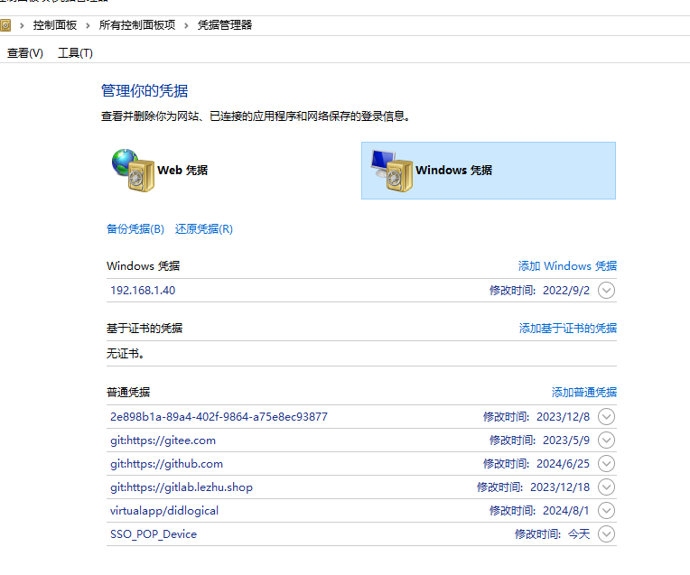

# git配置

### 一、查看SSH_Key
git bash 命令行
```
ls -al ~/.ssh
```

本地没有生成的SSH Key的话，顺序执行
如果存在，直接第四步


### 二、生成新的SSH Key
```
ssh-keygen -t rsa -C "184243xxxx@qq.com"

ssh-keygen -t rsa -C "184243xxxx@qq.com" -f ~/.ssh/xx_id-rsa
```


### 三、生成并添加SSH Key

（默认只读取 id_rsa，为了让 SSH 识别新的私钥，需要将新的私钥加入到 SSH agent 中）
```
ssh-add ~/.ssh/id_rsa

ssh-add ~/.ssh/xx_id-rsa
```

若执行ssh-add ~/.ssh/xx_id-rsa出现这个错误:
```
Could not open a connection to your authentication agent，
```
则先执行如下命令即可：
```
ssh-agent bash
```


### 四、查看SSH Key

Windows:
```
cat /Users/xhh/.ssh
```
Mac:
```
cd ~/.ssh 
```
.ssh 目录下


复制生成好的SSH Key, 即 rsa 私钥文件里的内容（带.pub的是公钥）添加到 GitLab 或者 GitHub 中settings的SSH Key中即可


### 五、验证ssh连接是否匹配成功
```
ssh -T git@github.com
```


### 六、用户名，邮箱配置
创建一个全局用户名、全局邮箱作为配置信息
```
git config --global user.name "xhh"

git config --global user.email "184243xxxx@qq.com"
```

本地仓库
```
git config --local 
```


不同邮箱：必须删除该设置
```
git config --global --unset user.name "你的名字"

git config --global --unset user.email "你的邮箱"
```


备注：一个邮箱要同时配置gitlab、github和gitee，那么ssh key的名字要进行区分：
```
ssh-keygen -t rsa -C "184243xxxx@qq.com" -f ~/.ssh/github_id-rsa
```


### 七、.ssh目录下配置config文件

gitlab
```
Host gitlab.com
HostName gitlab.com
PreferredAuthentications publickey
IdentityFile ~/.ssh/id_rsa
```

GitHub
```
Host github.com
HostName github.com
PreferredAuthentications publickey
IdentityFile ~/.ssh/github_id-rsa
```

gitee
```
Host gitee.com
HostName gitee.com
PreferredAuthentications publickey
IdentityFile ~/.ssh/gitee_id-rsa
```


### 八、远程仓库url地址变更

更新 ~/.ssh/known_hosts

1.项目.git 的config文件：remote "origin" 修改 url

2.拉取代码时发出警告，Host key verification failed，输入yes


### 九、sourcetree使用https方式拉取代码时，一直提示密码输入解决办法
进入项目目录：
```
git config --global credential.helper osxkeychain
```


### 十、gitee公开仓库clone出现 fatal: unable to access 的错误
这个错误不是因为没有权限，而是因为本地的git可能使用了代理，操作步骤如下：

取消代理
```
git config --global --unset http.proxy
git config --global --unset https.proxy
```


---

### 十一、windows更改git push时用到的用户信息

控制面板 => 凭证管理器 => Windows 凭据



删除 git 相关信息，下次 git push 时就会重新提示输入用户名和密码

---

参考文档：

https://help.gitee.com/enterprise/code-manage/%E6%9D%83%E9%99%90%E4%B8%8E%E8%AE%BE%E7%BD%AE/%E9%83%A8%E7%BD%B2%E5%85%AC%E9%92%A5%E7%AE%A1%E7%90%86/%E7%94%9F%E6%88%90%E6%88%96%E6%B7%BB%E5%8A%A0SSH%E5%85%AC%E9%92%A5


